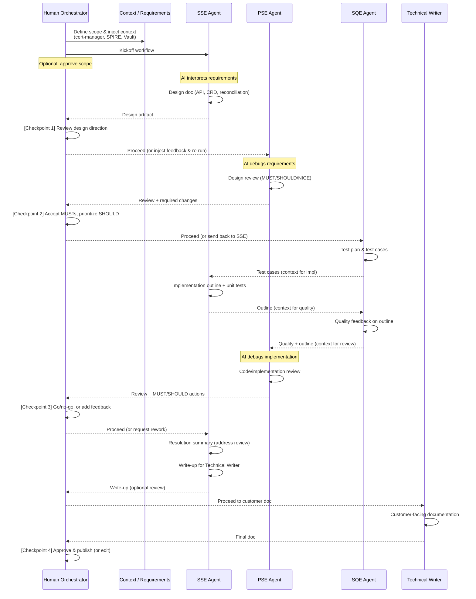
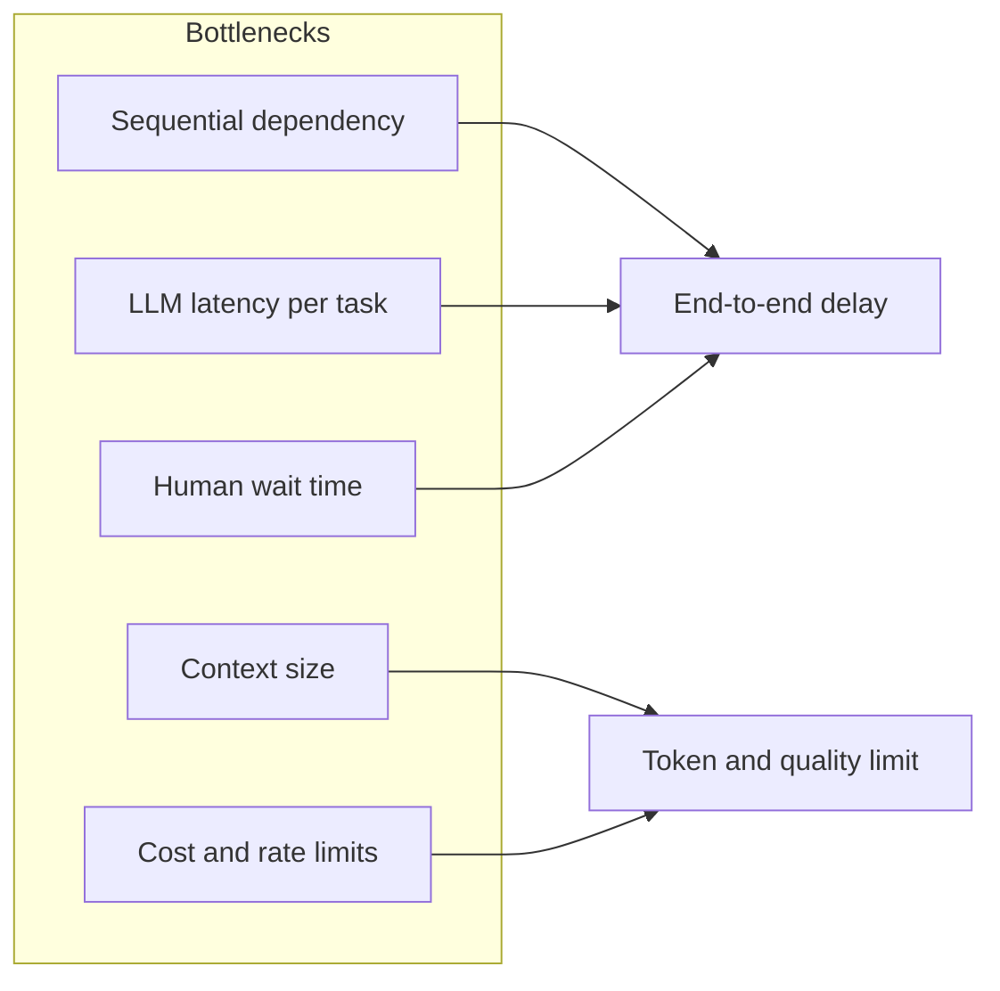
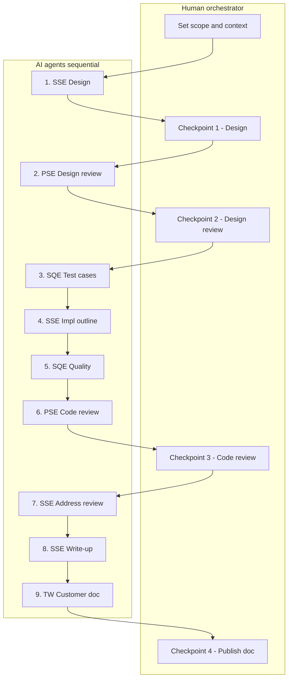

# Multi-Agent Orchestration: Vision and Goals

**Audience:** Dev team building a POC in this space (engineers, tech lead)  
**Purpose:** Align the team on what we’re building, how the workflow and roles work, and how to develop the POC—without locking to any specific AI agent framework.

---

## What We Want to Achieve

We want to use **AI agents in well-defined roles** to collaborate on software feature work in a **repeatable, traceable way**: from design and review through implementation planning, quality feedback, and customer-facing documentation.

The goal is not to replace engineers, but to:

- **Standardize the process** — Design → review → test design → implementation outline → quality feedback → code review → resolution → write-up → customer docs.
- **Encode team roles** — Each “agent” acts as a persona (e.g. Senior Engineer, Principal Engineer, Quality Engineer, Technical Writer) with clear responsibilities and quality bar.
- **Improve consistency and traceability** — Same workflow and prompts every time; outputs that align with our conventions (e.g. MUST/SHOULD/NICE-TO-HAVE, structured docs).
- **Speed up early phases** — First-cut design docs, test plans, implementation outlines, and draft docs generated in one run, then refined by humans.

We aim to prove that this **orchestration pattern** (roles + sequential tasks + shared context) is valuable, and that the **same idea** can be implemented with different AI agent stacks.

---

## Why This Approach

| Benefit | Description |
|--------|-------------|
| **Consistent process** | Every feature run goes through the same gates: design, design review, test cases, implementation outline, quality pass, code review, resolution, write-up, customer doc. |
| **Role-based quality** | PSE-style review (MUST/SHOULD/NICE-TO-HAVE), SQE-style test and quality feedback, Technical Writer–style customer docs—all driven by prompts and context, not ad hoc. |
| **Reusable and adaptable** | Once the workflow and personas are defined, they can be re-run for other features or products by changing scope and context. |
| **Auditable** | With tracing and logs, we can see which agent produced what, and refine prompts or add/remove steps. |

---

## Current POC: ZTWIM Upstream Authority

To validate the idea, we built a **proof of concept** around one concrete feature:

- **Feature:** Add **upstream authority** plugin support to the SPIRE server in [ZTWIM](https://github.com/anirudhAgniRedhat/openshift-zero-trust-workload-identity-manager) (Zero Trust Workload Identity Manager).
- **Scope:** Exactly three plugin types — **cert-manager**, **SPIRE** (nested), and **Vault** — using upstream SPIRE docs and our own context for semantics.
- **Workflow:** A 9-step pipeline with four personas:
  - **SSE (Senior Software Engineer):** Design doc, implementation outline, addressing review feedback, write-up for docs.
  - **PSE (Principal Software Engineer):** Design review and code/implementation review with MUST/SHOULD/NICE-TO-HAVE.
  - **SQE (Senior Quality Engineer):** Test cases, quality feedback, write-up for docs.
  - **Technical Writer:** Customer-facing documentation from the write-ups.

Each step consumes the outputs of previous steps, so the final artifact (e.g. customer doc) is grounded in design, review, and quality feedback. The POC shows that we can get end-to-end, structured output in one run that humans can then refine.

---

## Framework-Agnostic: Not Tied to One AI Stack

**Important:** The POC is implemented today using one multi-agent framework (e.g. CrewAI) as an **example**. The **concept** we care about is:

- **Defined roles** (personas) with clear goals and responsibilities.
- **Sequential (or otherwise orchestrated) tasks** with shared context and handoffs.
- **Structured prompts and scope** so outputs are deterministic and aligned with our standards.

The same workflow and outcomes can be achieved with:

- **Other agent frameworks** — e.g. AutoGen, LangGraph, CrewAI, or similar.
- **IDE- or tool-centric agents** — e.g. Cursor or other AI-assisted dev tools, used in a process that follows the same steps (design → review → implementation outline → …).
- **Open-source or in-house agents** — any stack that can run role-based, multi-step workflows with context and tracing.

As a dev team we’re focused on:

- Proving the **orchestration pattern and the value of the workflow**, not endorsing a single vendor or framework.
- Keeping the POC **reimplementable** with a different agent stack (Cursor, open-source, etc.) if that fits our environment or preferences better.

---

## What Success Looks Like

- **Short term:** The dev team has a working POC and shared understanding of the workflow; we optionally try the same flow with another agent stack (e.g. Cursor or an open-source framework).
- **Medium term:** We run the pattern on one or two more features or use cases; we tune roles and tasks from feedback and plug into our existing tools (e.g. Jira, docs, CI).
- **Long term:** Multi-agent orchestration is a repeatable option for first-cut design, review, implementation outline, and docs, with a human in the loop at key checkpoints.

---

## Real use cases to consider

Below are **concrete use cases** where the same orchestration pattern (roles + sequential tasks + human checkpoints) can be applied. These can be piloted after or alongside the ZTWIM POC.

| Use case | What it is | Roles / agents | Why it fits |
|----------|------------|----------------|-------------|
| **New operator or controller feature** | Add a new CRD, reconciliation logic, or integration (e.g. another SPIRE plugin, new Observability API). | SSE (design, impl outline, address review, write-up), PSE (design + code review), SQE (test cases, quality), Technical Writer (customer doc). | Same 9-step flow as current POC; only scope and context change. |
| **Bug triage and fix workflow** | From a reported bug: reproduce steps → root cause → fix strategy → implementation outline → test plan → release note / doc. | Engineer (repro, fix strategy, impl), Architect/PSE (review approach), QE (test plan, verification), Tech Writer (release note). | Sequential, role-based; human checkpoint after root cause and after review. |
| **RFC or design doc for a new capability** | Problem statement → proposed design → review → open questions → implementation outline (no code yet). | SSE (problem + design), PSE (review, MUST/SHOULD), optional SQE (acceptance criteria). | Lighter than full 9-step; good for “design-only” runs. |
| **Security or compliance-sensitive change** | Feature or config change that touches auth, secrets, or compliance: design → security review → threat/risk notes → implementation with guardrails → audit trail / doc. | SSE (design, impl), Security/PSE (review, MUST/SHOULD), QE (security test cases), Tech Writer (runbook / compliance doc). | Same gates with a security-focused reviewer persona. |
| **Documentation refresh or release notes** | Product/version update: list of changes → categorization → draft release note → review → customer-facing doc + upgrade notes. | SSE (scope, list of changes), Tech Writer (draft, final doc), optional PSE (accuracy review). | Fewer steps; strong fit for doc-only workflows. |
| **Migration or upgrade runbook** | e.g. OCP upgrade, operator migration, config migration: design migration steps → review → test plan (canary, rollback) → runbook + verification. | SRE/SSE (migration design, steps), PSE (review), QE (test plan, rollback), Tech Writer (runbook, verification). | Same pattern; output is operational runbook instead of feature doc. |
| **API or contract change** | New or changed API (REST, gRPC, CRD): design → compatibility review → test cases (contract tests) → implementation outline → doc. | SSE (design, impl), PSE (backward compatibility, review), SQE (contract tests), Tech Writer (API doc). | Fits design → review → test → impl → doc flow. |
| **Incident post-mortem and follow-up** | After an incident: timeline + root cause → action items → design for fixes → review → implementation outline + runbook updates. | SRE/SSE (timeline, fixes), PSE (review), QE (tests to prevent recurrence), Tech Writer (runbook / post-mortem doc). | Structured output for blameless post-mortems and follow-up work. |

**How to pick:** Start with one that is close to the current POC (e.g. another operator feature or an RFC) to reuse personas and task definitions with minimal change. Then try a different type (e.g. bug fix workflow or release notes) to validate that the pattern generalizes.

---

## Workflow diagram, human orchestration & bottlenecks

### Sequential diagram (full flow with human checkpoints)

Human sets context and can intervene at **Checkpoints 1–4**. AI runs the 9 tasks in sequence; **PSE** and **SQE** act as requirement debuggers (design review, code review, quality pass).

### Where the AI “debugs” requirements

| Step | Agent | What is debugged / validated | Output that feeds next steps |
|------|--------|------------------------------|------------------------------|
| **1. Design** | SSE | Interprets scope (context) into a concrete design. First place where ambiguity in requirements can surface. | Design doc (API, CRD, reconciliation) |
| **2. Design review** | PSE | **Debugs requirements vs design:** correctness vs SPIRE semantics, scope creep (cert-manager/SPIRE/Vault only), completeness, security. Classifies gaps as MUST/SHOULD/NICE-TO-HAVE. | MUST/SHOULD/NICE list; Approved / Changes required |
| **3. Test cases** | SQE | **Validates design is testable:** traceability to design, coverage of the three plugin types, clear preconditions/steps/expected results. Surfaces missing scenarios. | Test plan + test cases |
| **4. Implementation outline** | SSE | Turns design + review into concrete implementation steps. Any unclear requirement shows up here. | Implementation outline + unit test plan |
| **5. Quality feedback** | SQE | **Debugs implementation outline:** alignment with design, testability, edge cases, security. | Quality recommendations |
| **6. Code review** | PSE | **Debugs implementation vs requirements:** config generation, reconciliation, secrets, RBAC, alignment with design. Again MUST/SHOULD/NICE. | Code review + required actions |
| **7. Address review** | SSE | Closes the loop: maps each MUST/SHOULD to a resolution (fix, document, or defer). | Resolution summary |
| **8. Write-up** | SSE | Structures content for docs; can surface missing “how to” or troubleshooting. | Write-up for Technical Writer |
| **9. Customer doc** | Technical Writer | Final consistency check: steps, examples, verification, troubleshooting. | Customer-facing doc |

Requirement debugging is strongest in **PSE design review (2)**, **SQE test cases (3)**, **SQE quality (5)**, and **PSE code review (6)**. The human orchestrator can use these outputs to correct scope or inject new requirements and re-run from the right step.

### Human orchestrator: where and how they help

| Checkpoint | After which step | What the human can do |
|------------|------------------|------------------------|
| **Before kickoff** | — | Set scope (e.g. cert-manager, SPIRE, Vault only), inject context or links (SPIRE doc, ZTWIM repo), approve initial requirements. |
| **Checkpoint 1** | After Task 1 (Design) | Approve design direction; reject and re-run with clarified scope; add constraints in the next prompt or in context. |
| **Checkpoint 2** | After Task 2 (Design review) | Accept MUST fixes and prioritize SHOULD; decide “proceed as-is” vs “send back to SSE” with specific instructions; narrow or expand scope. |
| **Checkpoint 3** | After Task 6 (Code review) | Go/no-go for implementation phase; add review comments or override MUST/SHOULD; request rework (e.g. re-run Task 4–7 with new instructions). |
| **Checkpoint 4** | After Task 9 (Customer doc) | Approve and publish; edit and republish; or send back to Technical Writer with audience/tone changes. |

**Implementation options for “human in between”:** (1) **Manual** — human reads output after selected steps, edits a prompt or context file, then re-runs from a given task. (2) **Semi-automated** — pipeline pauses and calls e.g. `request_human_input(...)`; result is injected as context for the next step. (3) **Async** — artifacts in Confluence/Git; human reviews and adds comments; next run pulls “human feedback” into context.

### Bottlenecks and limitations

| Bottleneck | Description | Mitigation ideas |
|------------|-------------|------------------|
| **Sequential dependency** | Every task waits for the previous one. No parallelization of the 9 steps in the current design. | Accept for POC; later, split independent branches (e.g. test cases and implementation outline in parallel where safe). |
| **LLM latency per task** | Each task = one or more LLM calls (often 30s–2+ min per task depending on model and length). 9 tasks → 5–20+ minutes end-to-end. | Use faster/smaller models for simple steps; cache repeated context; stream output so humans can read while next step prepares. |
| **Human-in-the-loop wait** | If the pipeline pauses for human approval, end-to-end time depends on human response. | Make checkpoints optional (e.g. auto-proceed in dev, require approval in prod); time-box feedback; async review with “human feedback” injected in next run. |
| **Context window growth** | All prior task outputs are passed forward. By task 9, context can be large (tens of thousands of tokens). | Summarize older outputs; pass only “last N” full artifacts + short summaries; use a context budget per task. |
| **Token cost and rate limits** | Long context + many steps = high token usage; API rate limits can throttle. | Shorter prompts where possible; summarize; use batch or queue with backoff; consider cheaper/smaller models for non-critical steps. |
| **Single point of failure** | One failing task (e.g. malformed output, timeout) can block the rest. | Retry with clearer prompt; allow “skip and inject manual artifact”; validate outputs before passing to next step. |

### One-page flow (overview)

*PSE requirement-debugging steps: T2, T6. SQE validation steps: T3, T5.*

Diagrams are in **Mermaid** (GitHub, GitLab, and many Markdown viewers render them; [Mermaid Live](https://mermaid.live) for export).

---

## Action items to develop this

Concrete work items to move from vision and POC to a reusable, team-adopted capability. Grouped by area; order within each group can be adjusted by priority.

### 1. Team alignment and scope

| # | Action item | Owner (suggested) | Done |
|---|-------------|-------------------|------|
| 1.1 | Align the dev team on this doc (vision, workflow, use cases) and on POC goals and scope. | Tech lead / Dev team | |
| 1.2 | Pick a concrete feature or repo (e.g. ZTWIM, another operator) as the pilot for the next 1–2 use cases. | Dev team | |
| 1.3 | Decide whether to keep the current POC framework or add a second stack (e.g. Cursor, open-source agent) and who owns it. | Tech lead / Dev team | |

### 2. POC hardening and reuse

| # | Action item | Owner (suggested) | Done |
|---|-------------|-------------------|------|
| 2.1 | Add optional human checkpoints to the POC (e.g. pause after design review and after code review for human input before proceeding). | Engineer | |
| 2.2 | Define and document definition of done per task (e.g. design doc sections, review MUST/SHOULD format, customer doc template). | Tech lead / QE | |
| 2.3 | Run the POC for a second use case (e.g. another operator feature or an RFC) reusing the same personas and task flow; capture gaps. | Engineer | |
| 2.4 | Add basic output validation (e.g. structure check or rubric) after key tasks so bad outputs can be retried or flagged. | Engineer | |

### 3. Platform and tooling

| # | Action item | Owner (suggested) | Done |
|---|-------------|-------------------|------|
| 3.1 | Document runbook: env setup, model choice, how to run the POC, and how to interpret traces/logs. | Engineer | |
| 3.2 | Decide where outputs live (e.g. Confluence, Git repo, shared drive) and how the human orchestrator injects feedback (manual edit, form, comment). | Tech lead / Dev team | |
| 3.3 | If scaling: add support for re-running from a specific task (e.g. resume from task 4) and for passing in human feedback as context. | Engineer | |
| 3.4 | Evaluate cost and latency (tokens, time per run); set a simple budget or SLA for one full run to guide model and prompt choices. | Engineer / Ops | |

### 4. Use case expansion

| # | Action item | Owner (suggested) | Done |
|---|-------------|-------------------|------|
| 4.1 | Pick one additional use case from Real use cases to consider (e.g. bug fix workflow, release notes, or migration runbook) and define scope and success criteria. | Tech lead / Dev team | |
| 4.2 | Adapt personas and task list for that use case; run a first end-to-end and document differences from the ZTWIM flow. | Engineer | |
| 4.3 | Capture reusable templates (persona prompts, task order, checkpoint placement) so a new use case can be onboarded with minimal custom code. | Engineer | |

### 5. Process and adoption

| # | Action item | Owner (suggested) | Done |
|---|-------------|-------------------|------|
| 5.1 | Integrate with existing tools where useful (e.g. Jira: create epic/tasks from workflow output; or link run artifacts to a ticket). | Engineer / Dev team | |
| 5.2 | Define who acts as human orchestrator per use case and how checkpoints are used (e.g. mandatory for prod, optional for dev). | Tech lead / Dev team | |
| 5.3 | Schedule a short retrospective after 2–3 runs (different use cases or features) to tune prompts, roles, and bottlenecks. | Tech lead | |

### 6. Risk and compliance (if applicable)

| # | Action item | Owner (suggested) | Done |
|---|-------------|-------------------|------|
| 6.1 | Confirm that use of external LLMs/APIs and storage of prompts/outputs is acceptable for the pilot (security, privacy, export). | Security / Legal | |
| 6.2 | If required: add redaction or in-house-only model option for sensitive context (e.g. customer names, internal only). | Engineer | |

---

## Next Steps (for discussion)

1. **Review this doc as a team** — Align on goals, workflow, and what done looks like for the POC.
2. **Decide on framework** — Stay on current POC stack or try the same workflow with another agent (Cursor, open-source, etc.).
3. **Run one more use case** — Use the action items above (e.g. 4.1, 4.2) to validate the pattern on another feature.
4. **Capture definition of done** — Per action item 2.2; use it to measure and improve output quality.

---

## Summary

We want to achieve **repeatable, role-based collaboration** on feature work (design → review → implementation outline → quality → docs) using AI agents, with **clear process and traceability**. The current ZTWIM upstream-authority POC demonstrates that this is feasible; the **orchestration idea and workflow are independent of the specific AI framework** and can be implemented with CrewAI, Cursor, open-source agents, or future tools. This document is for the dev team building the POC: shared context, workflow, and next steps.
