# OpenShift Service Mesh + ZTWIM Cross-Cluster mTLS Guide

**Version:** 1.0  
**Date:** January 2026  
**Environment:** OpenShift 4.x, OSSM 3.2.1 (Istio v1.24.3), ZTWIM Operator

## Overview

This guide explains how to set up cross-cluster mutual TLS (mTLS) communication between two OpenShift clusters using:
- **ZTWIM (Zero Trust Workload Identity Manager)** - Manages SPIRE deployment
- **SPIRE** - Issues SPIFFE-based workload identities (SVIDs)
- **OpenShift Service Mesh 3.x** - Istio-based service mesh
- **SPIRE Federation** - Enables trust between different SPIRE trust domains

## Mermaid Diagrams - Complete End-to-End Picture

This section provides detailed diagrams showing the complete granularity of how SPIRE and OSSM work together.

---

### PART A: SPIRE System - Certificate Authority & Identity

#### A1. SPIRE Server - What It Does

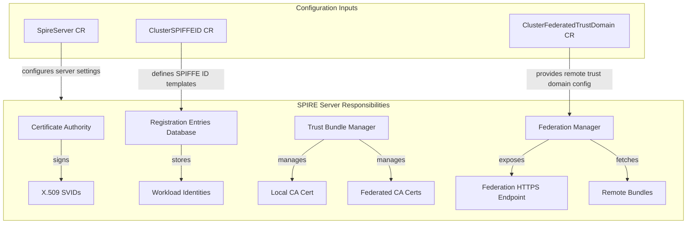

#### A2. SPIRE Agent - What It Does

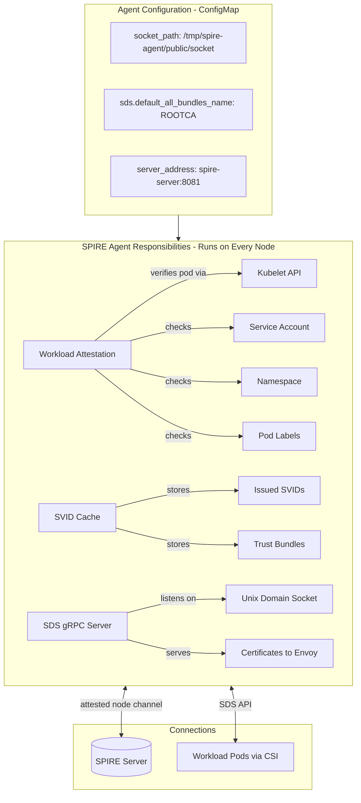

#### A3. Federation - Trust Bundle Exchange

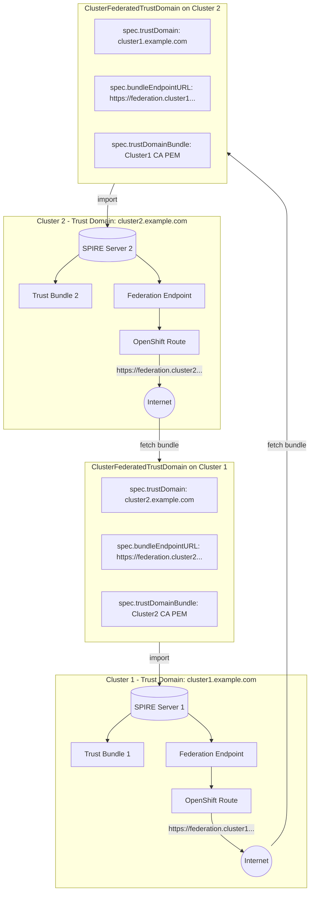

#### A4. SVID Issuance - Complete Flow

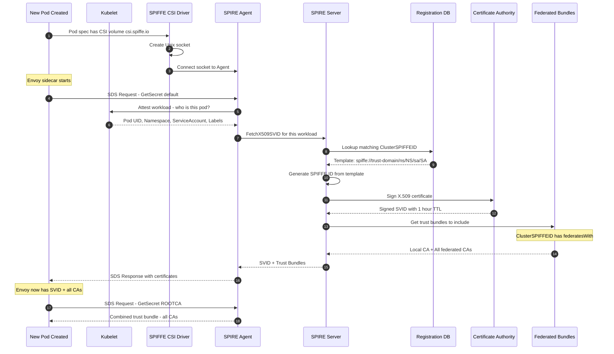

---

### PART B: OSSM/Istio System - Service Mesh & Traffic Management

#### B1. Istio Control Plane - Istiod

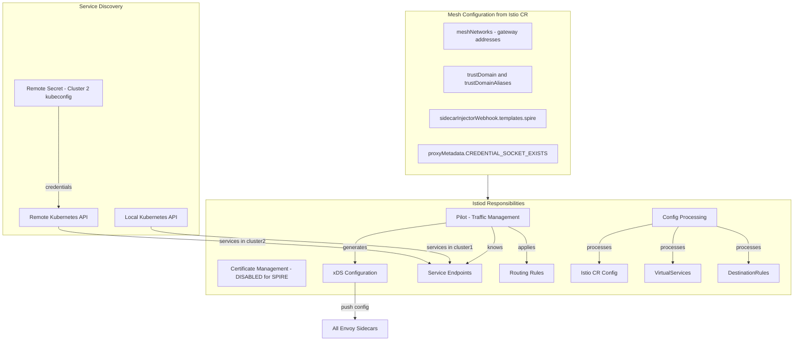

#### B2. Envoy Sidecar - Detailed View

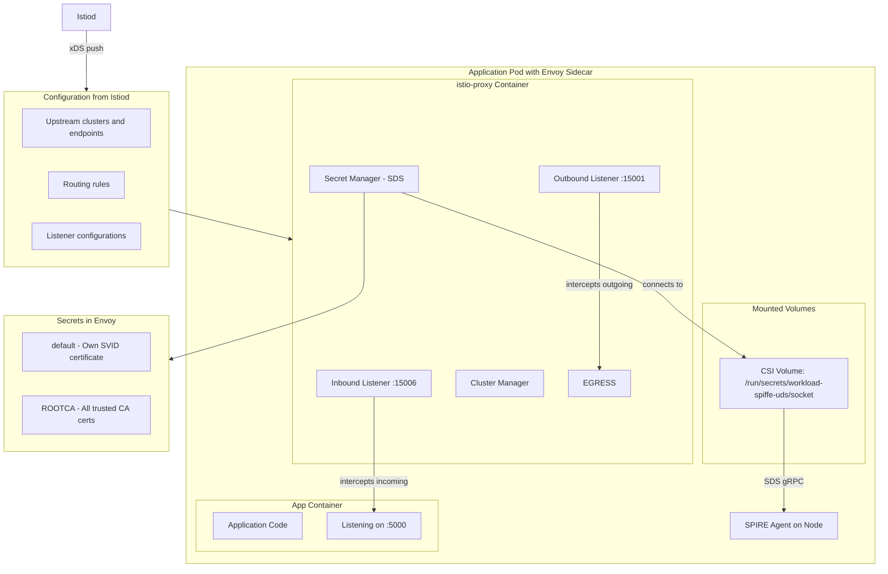

#### B3. East-West Gateway - Cross-Cluster Traffic

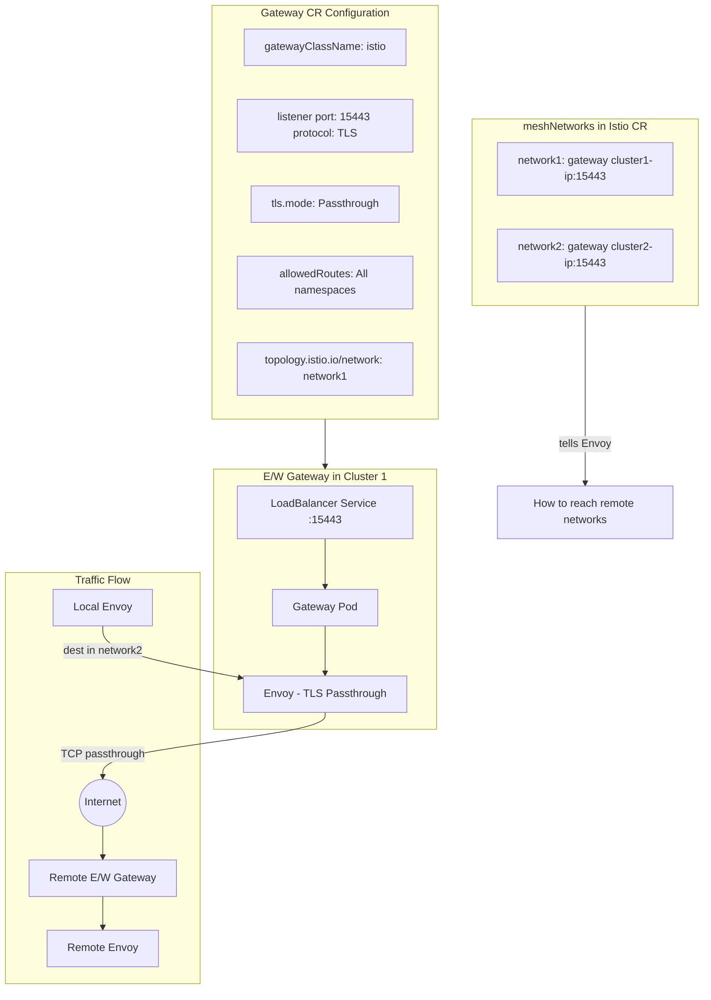

---

### PART C: Complete End-to-End Request Flow

#### C1. Request: curl in Cluster1 calls helloworld

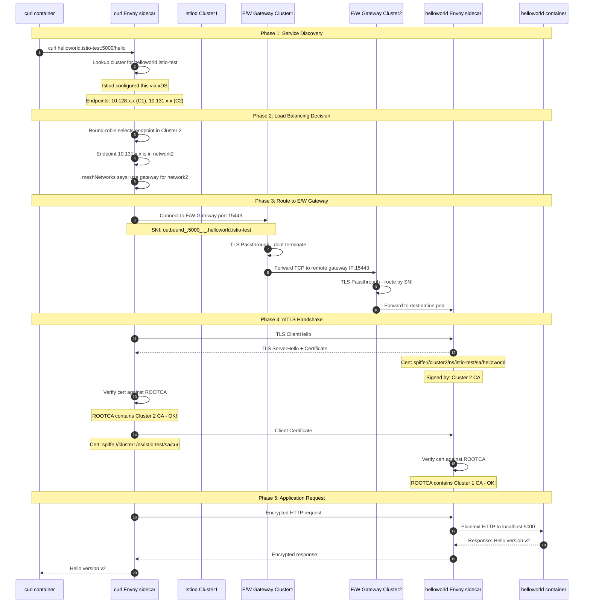

#### C2. Certificate Verification Detail

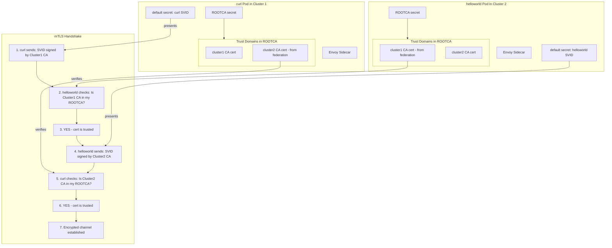

---

### PART D: Configuration Dependencies

#### D1. What Configures What

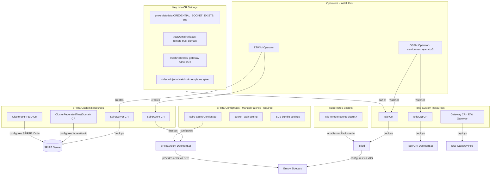

#### D2. Data Flow Summary

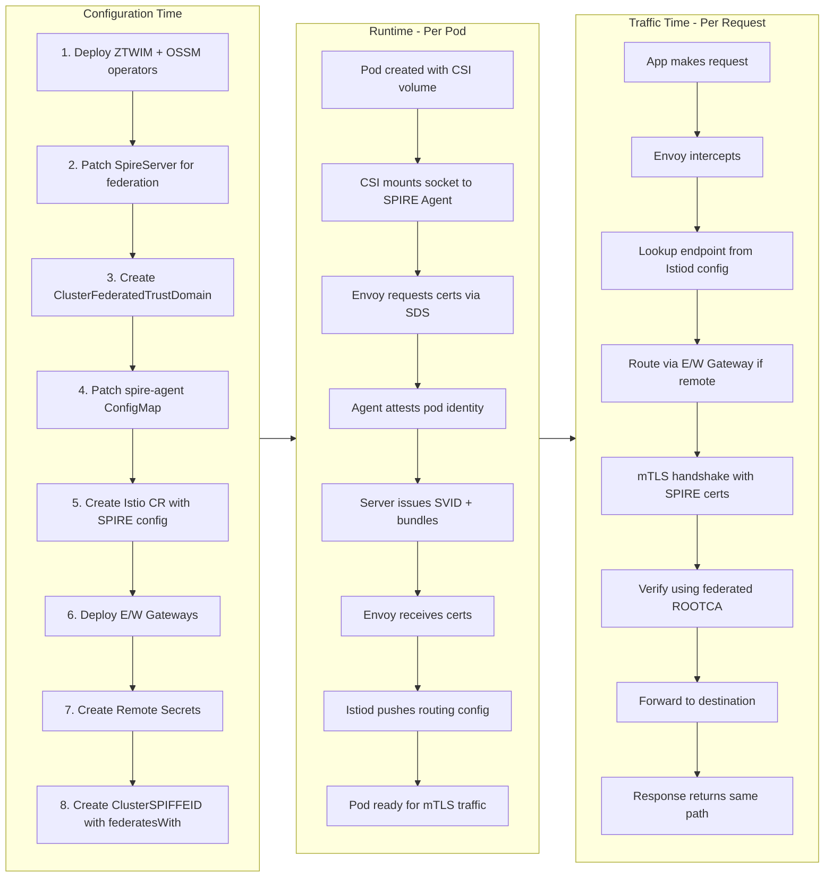

---

## Architecture - Complete Picture

This section explains the complete flow of how cross-cluster mTLS works with SPIRE federation.

---

### Part 1: What Gets Deployed on Each Cluster

Each OpenShift cluster has these components:

```
CLUSTER 1                                    CLUSTER 2
=========                                    =========

┌─────────────────────────────────┐          ┌─────────────────────────────────┐
│ CONTROL PLANE                   │          │ CONTROL PLANE                   │
│                                 │          │                                 │
│  ┌───────────────────────────┐  │          │  ┌───────────────────────────┐  │
│  │ SPIRE Server              │  │          │  │ SPIRE Server              │  │
│  │ - Issues certificates     │  │          │  │ - Issues certificates     │  │
│  │ - Manages trust bundles   │  │          │  │ - Manages trust bundles   │  │
│  │ - Trust Domain: cluster1  │  │          │  │ - Trust Domain: cluster2  │  │
│  └───────────────────────────┘  │          │  └───────────────────────────┘  │
│                                 │          │                                 │
│  ┌───────────────────────────┐  │          │  ┌───────────────────────────┐  │
│  │ Istiod                    │  │          │  │ Istiod                    │  │
│  │ - Knows endpoints in BOTH │  │          │  │ - Knows endpoints in BOTH │  │
│  │   clusters via Remote     │  │          │  │   clusters via Remote     │  │
│  │   Secrets                 │  │          │  │   Secrets                 │  │
│  └───────────────────────────┘  │          │  └───────────────────────────┘  │
└─────────────────────────────────┘          └─────────────────────────────────┘

┌─────────────────────────────────┐          ┌─────────────────────────────────┐
│ EVERY WORKER NODE               │          │ EVERY WORKER NODE               │
│                                 │          │                                 │
│  ┌───────────────────────────┐  │          │  ┌───────────────────────────┐  │
│  │ SPIRE Agent (DaemonSet)   │  │          │  │ SPIRE Agent (DaemonSet)   │  │
│  │ - Talks to SPIRE Server   │  │          │  │ - Talks to SPIRE Server   │  │
│  │ - Provides certs via SDS  │  │          │  │ - Provides certs via SDS  │  │
│  │ - Exposes Unix socket     │  │          │  │ - Exposes Unix socket     │  │
│  └───────────────────────────┘  │          │  └───────────────────────────┘  │
└─────────────────────────────────┘          └─────────────────────────────────┘

┌─────────────────────────────────┐          ┌─────────────────────────────────┐
│ APPLICATION POD                 │          │ APPLICATION POD                 │
│                                 │          │                                 │
│  ┌─────────────┐ ┌───────────┐  │          │  ┌─────────────┐ ┌───────────┐  │
│  │ App         │ │ Envoy     │  │          │  │ App         │ │ Envoy     │  │
│  │ Container   │ │ Sidecar   │  │          │  │ Container   │ │ Sidecar   │  │
│  │             │ │           │  │          │  │             │ │           │  │
│  │ helloworld  │ │ Gets cert │  │          │  │ helloworld  │ │ Gets cert │  │
│  │ v1          │ │ from      │  │          │  │ v2          │ │ from      │  │
│  │             │ │ SPIRE     │  │          │  │             │ │ SPIRE     │  │
│  └─────────────┘ └───────────┘  │          │  └─────────────┘ └───────────┘  │
│         ▲              │        │          │         ▲              │        │
│         │    CSI Volume Mount   │          │         │    CSI Volume Mount   │
│         │    (Unix Socket)      │          │         │    (Unix Socket)      │
└─────────┼───────────────────────┘          └─────────┼───────────────────────┘
          │                                            │
          └──── Connected to SPIRE Agent ──────────────┘


┌─────────────────────────────────┐          ┌─────────────────────────────────┐
│ EAST-WEST GATEWAY               │          │ EAST-WEST GATEWAY               │
│ - LoadBalancer on port 15443    │          │ - LoadBalancer on port 15443    │
│ - Routes cross-cluster traffic  │◄────────►│ - Routes cross-cluster traffic  │
│ - TLS Passthrough mode          │  Internet│ - TLS Passthrough mode          │
└─────────────────────────────────┘          └─────────────────────────────────┘
```

---

### Part 2: How SPIRE Federation Works (Trust Establishment)

**Problem:** Cluster 1 and Cluster 2 have different Certificate Authorities (CAs).  
**Solution:** Federation - exchange CA certificates so both clusters trust each other.

```
BEFORE FEDERATION:
==================

Cluster 1 SPIRE Server                    Cluster 2 SPIRE Server
┌─────────────────────────┐               ┌─────────────────────────┐
│ Trust Bundle:           │               │ Trust Bundle:           │
│ - Cluster 1 CA cert ✓   │               │ - Cluster 2 CA cert ✓   │
│                         │               │                         │
│ Can verify: cluster1    │               │ Can verify: cluster2    │
│ workloads only          │               │ workloads only          │
└─────────────────────────┘               └─────────────────────────┘

        ❌ Cannot verify each other's certificates!


AFTER FEDERATION:
=================

Cluster 1 SPIRE Server                    Cluster 2 SPIRE Server
┌─────────────────────────┐               ┌─────────────────────────┐
│ Trust Bundle:           │               │ Trust Bundle:           │
│ - Cluster 1 CA cert ✓   │◄─── swap ───►│ - Cluster 2 CA cert ✓   │
│ - Cluster 2 CA cert ✓   │    bundles   │ - Cluster 1 CA cert ✓   │
│                         │               │                         │
│ Can verify: BOTH        │               │ Can verify: BOTH        │
│ cluster1 AND cluster2   │               │ cluster1 AND cluster2   │
└─────────────────────────┘               └─────────────────────────┘

        ✓ Now both can verify each other's certificates!


HOW BUNDLE EXCHANGE HAPPENS:
============================

1. Each SPIRE Server exposes a "Federation Endpoint" (HTTPS route)
   - Cluster 1: https://federation.apps.cluster1.example.com
   - Cluster 2: https://federation.apps.cluster2.example.com

2. ClusterFederatedTrustDomain resource tells SPIRE:
   "Fetch the CA bundle from the other cluster's federation endpoint"

3. SPIRE Servers periodically refresh bundles (every 5 minutes)
```

---

### Part 3: How Envoy Gets Certificates from SPIRE (SDS Flow)

**SDS = Secret Discovery Service** - Envoy's protocol to dynamically fetch certificates.

```
WHEN A POD STARTS:
==================

1. Pod is created with Envoy sidecar (istio-proxy)

2. CSI Driver mounts a Unix socket into the pod at:
   /run/secrets/workload-spiffe-uds/socket
   
   This socket connects to SPIRE Agent on the node.

3. Envoy connects to the socket and requests certificates:


   ┌─────────────────────────────────────────────────────────────────────┐
   │                        APPLICATION POD                              │
   │  ┌──────────────┐      ┌──────────────────────────────────────┐    │
   │  │              │      │ Envoy Sidecar (istio-proxy)          │    │
   │  │  App         │      │                                      │    │
   │  │  Container   │◄────►│  1. "I need my certificate!"         │    │
   │  │              │      │     (SDS Request via socket)         │    │
   │  │              │      │                                      │    │
   │  └──────────────┘      └──────────────┬───────────────────────┘    │
   │                                       │                             │
   │                        ┌──────────────▼───────────────┐             │
   │                        │ CSI Volume Mount             │             │
   │                        │ /run/secrets/.../socket      │             │
   │                        └──────────────┬───────────────┘             │
   └───────────────────────────────────────┼─────────────────────────────┘
                                           │
   ┌───────────────────────────────────────▼─────────────────────────────┐
   │                        SPIRE AGENT (on node)                        │
   │                                                                     │
   │  2. Agent attests the pod (verifies it's legitimate)                │
   │  3. Agent asks SPIRE Server for certificate                         │
   │                                                                     │
   └───────────────────────────────────────┬─────────────────────────────┘
                                           │
   ┌───────────────────────────────────────▼─────────────────────────────┐
   │                        SPIRE SERVER                                 │
   │                                                                     │
   │  4. Server issues X.509 certificate (SVID) with:                    │
   │     - SPIFFE ID: spiffe://cluster1/ns/istio-test/sa/helloworld      │
   │     - Short TTL (1 hour)                                            │
   │     - Signed by Cluster 1 CA                                        │
   │                                                                     │
   │  5. Server also returns Trust Bundles:                              │
   │     - Cluster 1 CA (local)                                          │
   │     - Cluster 2 CA (from federation) ← THIS IS KEY!                 │
   │                                                                     │
   └───────────────────────────────────────┬─────────────────────────────┘
                                           │
                                           ▼
   ┌─────────────────────────────────────────────────────────────────────┐
   │                        ENVOY NOW HAS:                               │
   │                                                                     │
   │  "default" secret:  My certificate (SVID)                           │
   │  "ROOTCA" secret:   CA certs for Cluster1 AND Cluster2              │
   │                                                                     │
   │  → Can present my cert to prove identity                            │
   │  → Can verify certs from BOTH clusters                              │
   └─────────────────────────────────────────────────────────────────────┘
```

---

### Part 4: How Cross-Cluster Traffic Actually Flows

**Scenario:** curl pod in Cluster 1 calls `helloworld.istio-test:5000/hello`

```
STEP 1: curl makes request
==========================

Cluster 1:
┌─────────────────────────────────────────────────────────────────┐
│  curl Pod                                                       │
│  ┌─────────────┐      ┌─────────────────────────────────┐      │
│  │ curl        │─────►│ Envoy sidecar                   │      │
│  │ container   │      │                                 │      │
│  │             │      │ "Where is helloworld service?"  │      │
│  └─────────────┘      └─────────────────────────────────┘      │
└─────────────────────────────────────────────────────────────────┘


STEP 2: Istiod tells Envoy where endpoints are
==============================================

Istiod has "Remote Secrets" - credentials to query Cluster 2's API server.
So Istiod knows about services in BOTH clusters.

┌─────────────────────────────────────────────────────────────────┐
│  Istiod (Cluster 1)                                             │
│                                                                 │
│  Service: helloworld.istio-test                                 │
│  Endpoints:                                                     │
│    - 10.128.2.15:5000  (Cluster 1, helloworld-v1) ← local      │
│    - 10.131.0.22:5000  (Cluster 2, helloworld-v2) ← remote     │
│                                                                 │
│  Envoy is configured to load-balance between both!              │
└─────────────────────────────────────────────────────────────────┘


STEP 3: Envoy decides to send to remote endpoint (v2)
=====================================================

Load balancer picks the Cluster 2 endpoint.
But Cluster 2's pod IP (10.131.0.22) is not directly reachable!

Solution: Route through East-West Gateway.

Istio config says:
  "For network2 (Cluster 2), use gateway: <cluster2-gateway-address>:15443"


STEP 4: Traffic goes through East-West Gateways
===============================================

┌─────────────────┐    ┌─────────────────┐    ┌─────────────────┐
│ Cluster 1       │    │    INTERNET     │    │ Cluster 2       │
│                 │    │                 │    │                 │
│ curl Pod        │    │                 │    │ helloworld-v2   │
│     │           │    │                 │    │     ▲           │
│     ▼           │    │                 │    │     │           │
│ Envoy ─────────────► E/W Gateway ◄─────────► E/W Gateway      │
│ (encrypt with   │    │  :15443         │    │ (TLS passthru)  │
│  SPIRE cert)    │    │                 │    │     │           │
│                 │    │                 │    │     ▼           │
│                 │    │                 │    │ Envoy ──► App   │
└─────────────────┘    └─────────────────┘    └─────────────────┘


STEP 5: mTLS Handshake between Envoys
=====================================

This is where SPIRE federation pays off!

┌────────────────────────────────────────────────────────────────────────┐
│                         mTLS HANDSHAKE                                 │
│                                                                        │
│  Envoy (Cluster 1)                         Envoy (Cluster 2)           │
│  ┌────────────────┐                        ┌────────────────┐          │
│  │                │   1. ClientHello       │                │          │
│  │ "Here's my     │ ───────────────────►   │                │          │
│  │  certificate"  │                        │                │          │
│  │                │   Certificate:         │                │          │
│  │ SPIFFE ID:     │   spiffe://cluster1/   │ "Let me verify │          │
│  │ cluster1/ns/   │   ns/istio-test/       │  this cert..." │          │
│  │ istio-test/    │   sa/curl              │                │          │
│  │ sa/curl        │                        │ I have Cluster1│          │
│  │                │                        │ CA in my trust │          │
│  │ Signed by:     │                        │ bundle (from   │          │
│  │ Cluster1 CA    │                        │ federation)    │          │
│  │                │                        │                │          │
│  │                │                        │ ✓ VERIFIED!    │          │
│  └────────────────┘                        └────────────────┘          │
│                                                                        │
│  ┌────────────────┐                        ┌────────────────┐          │
│  │                │   2. ServerHello       │                │          │
│  │ "Let me verify │ ◄───────────────────   │ "Here's my     │          │
│  │  this cert..." │                        │  certificate"  │          │
│  │                │   Certificate:         │                │          │
│  │ I have Cluster2│   spiffe://cluster2/   │ SPIFFE ID:     │          │
│  │ CA in my trust │   ns/istio-test/       │ cluster2/ns/   │          │
│  │ bundle (from   │   sa/helloworld        │ istio-test/    │          │
│  │ federation)    │                        │ sa/helloworld  │          │
│  │                │                        │                │          │
│  │ ✓ VERIFIED!    │                        │ Signed by:     │          │
│  │                │                        │ Cluster2 CA    │          │
│  └────────────────┘                        └────────────────┘          │
│                                                                        │
│  3. Both sides verified! Encrypted channel established.               │
│     Traffic flows securely between clusters.                          │
└────────────────────────────────────────────────────────────────────────┘


STEP 6: Response returns
========================

helloworld-v2 responds: "Hello version: v2"
Response travels back through the same encrypted path.
curl receives: "Hello version: v2"

Since Envoy load-balances, next request might go to v1 (local).
```

---

### Part 5: Key Configuration That Makes This Work

| Component | Critical Config | What It Does |
|-----------|----------------|--------------|
| **SpireServer** | `federation.federatesWith` | Tells SPIRE to fetch other cluster's CA bundle |
| **ClusterFederatedTrustDomain** | `trustDomainBundle` | Contains the remote cluster's CA certificate |
| **ClusterSPIFFEID** | `federatesWith` | Includes federated CAs when issuing SVIDs |
| **SPIRE Agent ConfigMap** | `socket_path` | Must be `/tmp/spire-agent/public/socket` for Istio |
| **Istio CR** | `CREDENTIAL_SOCKET_EXISTS: "true"` | Tells Envoy to get certs from SPIRE, not Istio CA |
| **Istio CR** | `trustDomainAliases` | Accept certs from the other trust domain |
| **Istio CR** | `meshNetworks` | Routes remote traffic through E/W gateways |
| **Remote Secret** | Contains kubeconfig | Lets Istiod discover services in other cluster |
| **Gateway CR** | `mode: Passthrough` | Don't terminate TLS at gateway, pass it through |

---

## How It Works

### 1. SPIRE Issues Workload Certificates (SVIDs)
- Each workload gets a SPIFFE ID: `spiffe://<trust-domain>/ns/<namespace>/sa/<service-account>`
- Certificates have `O=SPIRE` in the subject (not Istio CA)
- Short-lived certificates (1 hour) automatically rotated

### 2. SPIRE Federation Establishes Trust
- Each SPIRE server exposes a federation endpoint (`https://federation.<trust-domain>`)
- Trust bundles (CA certificates) are exchanged between clusters
- Both SPIRE servers know each other's CA, enabling cross-trust-domain verification

### 3. Istio Uses SPIRE via SDS (Secret Discovery Service)
- Envoy proxies connect to SPIRE Agent via Unix Domain Socket
- SPIRE Agent provides certificates dynamically via SDS API
- `CREDENTIAL_SOCKET_EXISTS=true` tells Envoy to use external SDS

### 4. Cross-Cluster Traffic Flow
1. Client in Cluster 1 calls `helloworld.istio-test:5000`
2. Istiod (via remote secrets) knows about endpoints in both clusters
3. Envoy proxy load-balances to local (v1) or remote (v2) endpoints
4. For remote endpoints, traffic goes through East-West Gateway on port 15443
5. mTLS handshake succeeds because both clusters trust each other's SPIRE CA

---

## Prerequisites

1. Two OpenShift clusters with:
   - ZTWIM Operator installed
   - SPIRE operands deployed (SpireServer, SpireAgent, etc.)
2. `oc` / `kubectl` CLI
3. `istioctl` CLI (matching OSSM version)
4. Network connectivity between clusters on port 15443

---

## Step-by-Step Setup

### Step 1: Identify Trust Domains

Each cluster has a trust domain (typically the apps domain):
```bash
# Cluster 1
TRUST_DOMAIN_1=$(oc get spireserver spire-server -n zero-trust-workload-identity-manager -o jsonpath='{.spec.trustDomain}')

# Cluster 2  
TRUST_DOMAIN_2=$(oc get spireserver spire-server -n zero-trust-workload-identity-manager -o jsonpath='{.spec.trustDomain}')
```

### Step 2: Enable Federation on SPIRE Servers

Patch SpireServer on **Cluster 1**:
```yaml
apiVersion: spire.openshift.io/v1alpha1
kind: SpireServer
metadata:
  name: spire-server
  namespace: zero-trust-workload-identity-manager
spec:
  federation:
    bundleEndpoint:
      profile: https_spiffe
      refreshHint: 300
    federatesWith:
      - trustDomain: <TRUST_DOMAIN_2>
        bundleEndpointUrl: https://federation.<TRUST_DOMAIN_2>
        bundleEndpointProfile: https_spiffe
        endpointSpiffeId: spiffe://<TRUST_DOMAIN_2>/spire/server
    managedRoute: "true"
```

Patch SpireServer on **Cluster 2** (mirror with opposite trust domains).

### Step 3: Extract and Exchange Trust Bundles

```bash
# On Cluster 1 - Get bundle
SPIRE_POD=$(oc get pod -n zero-trust-workload-identity-manager -l app.kubernetes.io/name=spire-server -o jsonpath='{.items[0].metadata.name}')
oc exec -n zero-trust-workload-identity-manager $SPIRE_POD -c spire-server -- \
  /opt/spire/bin/spire-server bundle show -socketPath /tmp/spire-server/private/api.sock -format spiffe > cluster1-bundle.json

# On Cluster 2 - Get bundle  
# (same command, save to cluster2-bundle.json)
```

### Step 4: Create ClusterFederatedTrustDomain Resources

On **Cluster 1** (to trust Cluster 2):
```yaml
apiVersion: spire.spiffe.io/v1alpha1
kind: ClusterFederatedTrustDomain
metadata:
  name: cluster2-federation
spec:
  trustDomain: <TRUST_DOMAIN_2>
  bundleEndpointURL: https://federation.<TRUST_DOMAIN_2>
  bundleEndpointProfile:
    type: https_spiffe
    endpointSPIFFEID: spiffe://<TRUST_DOMAIN_2>/spire/server
  trustDomainBundle: |
    <CLUSTER_2_BUNDLE_JSON>
```

On **Cluster 2** (to trust Cluster 1) - mirror with opposite values.

### Step 4b: Manually Load Federated Bundles into SPIRE Server (CRITICAL)

**IMPORTANT:** The `ClusterFederatedTrustDomain` CR does NOT automatically load bundles into the SPIRE server. You must manually load them.

```bash
# Extract CA cert from the bundle JSON
echo '<CLUSTER_2_BUNDLE_JSON>' | jq -r '.keys[] | select(.use == "x509-svid") | .x5c[0]' | \
  base64 -d > /tmp/cluster2-ca.der
openssl x509 -in /tmp/cluster2-ca.der -inform DER -out /tmp/cluster2-ca.pem

# Copy to SPIRE server pod
oc cp /tmp/cluster2-ca.pem zero-trust-workload-identity-manager/spire-server-0:/tmp/federated-ca.pem -c spire-server

# Load the bundle into SPIRE server
oc exec -n zero-trust-workload-identity-manager spire-server-0 -c spire-server -- \
  /spire-server bundle set \
  -id spiffe://<TRUST_DOMAIN_2> \
  -path /tmp/federated-ca.pem \
  -socketPath /tmp/spire-server/private/api.sock

# Verify bundle is loaded
oc exec -n zero-trust-workload-identity-manager spire-server-0 -c spire-server -- \
  /spire-server bundle list -socketPath /tmp/spire-server/private/api.sock
```

Repeat for Cluster 2 (load Cluster 1's bundle).

### Step 5: Enable CREATE_ONLY_MODE on ZTWIM

This prevents the operator from overwriting manual changes:
```bash
oc -n zero-trust-workload-identity-manager patch subscription openshift-zero-trust-workload-identity-manager \
  --type='merge' -p '{"spec":{"config":{"env":[{"name":"CREATE_ONLY_MODE","value":"true"}]}}}'
```

### Step 6: Patch SPIRE Agent ConfigMap

Critical fix for socket path to match Istio CSI expectations:
```bash
oc get cm spire-agent -n zero-trust-workload-identity-manager -o json | jq '
  .data["agent.conf"] = (.data["agent.conf"] | fromjson | 
    .agent.sds.default_bundle_name = "null" |
    .agent.sds.default_all_bundles_name = "ROOTCA" |
    .agent.socket_path = "/tmp/spire-agent/public/socket" |
    tojson)
' | oc apply -f -

# Restart SPIRE agents
oc delete pod -n zero-trust-workload-identity-manager -l app.kubernetes.io/name=spire-agent
```

### Step 6b: Fix OIDC Discovery Provider Socket Path (If Using OIDC)

The OIDC Discovery Provider also needs the correct socket path:
```bash
oc get cm spire-spiffe-oidc-discovery-provider -n zero-trust-workload-identity-manager -o json | jq '
  .data["oidc-discovery-provider.conf"] = (.data["oidc-discovery-provider.conf"] | fromjson | 
    .workload_api.socket_path = "/spiffe-workload-api/socket" | 
    tojson)
' | oc apply -f -

# Restart OIDC pod
oc delete pod -n zero-trust-workload-identity-manager -l app.kubernetes.io/name=spiffe-oidc-discovery-provider
```

### Step 7: Install OpenShift Service Mesh 3.x

```yaml
apiVersion: operators.coreos.com/v1alpha1
kind: Subscription
metadata:
  name: servicemeshoperator3
  namespace: openshift-operators
spec:
  channel: stable
  installPlanApproval: Automatic
  name: servicemeshoperator3
  source: redhat-operators
  sourceNamespace: openshift-marketplace
```

### Step 8: Create IstioCNI

```yaml
apiVersion: sailoperator.io/v1
kind: IstioCNI
metadata:
  name: default
  namespace: istio-cni
spec:
  namespace: istio-cni
  version: v1.24.3
```

### Step 9: Create Istio CR with SPIRE Integration

**Cluster 1:**
```yaml
apiVersion: sailoperator.io/v1
kind: Istio
metadata:
  name: default
  namespace: istio-system
spec:
  namespace: istio-system
  version: v1.24.3
  values:
    global:
      meshID: mesh1
      multiCluster:
        clusterName: cluster1
      network: network1
      meshNetworks:
        network1:
          endpoints:
            - fromRegistry: cluster1
          gateways:
            - address: <CLUSTER1_EW_GATEWAY_ADDRESS>
              port: 15443
        network2:
          endpoints:
            - fromRegistry: cluster2
          gateways:
            - address: <CLUSTER2_EW_GATEWAY_ADDRESS>
              port: 15443
    meshConfig:
      defaultConfig:
        proxyMetadata:
          CREDENTIAL_SOCKET_EXISTS: "true"
      trustDomain: <TRUST_DOMAIN_1>
      trustDomainAliases:
        - <TRUST_DOMAIN_2>
    sidecarInjectorWebhook:
      templates:
        spire: |
          spec:
            containers:
            - name: istio-proxy
              env:
              - name: ISTIO_META_TLS_CLIENT_ROOT_CERT
                value: ""
              volumeMounts:
              - name: workload-socket
                mountPath: /run/secrets/workload-spiffe-uds
                readOnly: true
            volumes:
            - name: workload-socket
              csi:
                driver: "csi.spiffe.io"
                readOnly: true
        spire-gateway: |
          spec:
            containers:
            - name: istio-proxy
              env:
              - name: ISTIO_META_TLS_CLIENT_ROOT_CERT
                value: ""
              volumeMounts:
              - name: workload-socket
                mountPath: /run/secrets/workload-spiffe-uds
                readOnly: true
            volumes:
            - name: workload-socket
              csi:
                driver: "csi.spiffe.io"
                readOnly: true
```

### Step 10: Create ClusterSPIFFEID for istio-system

```yaml
apiVersion: spire.spiffe.io/v1alpha1
kind: ClusterSPIFFEID
metadata:
  name: istio-system-spiffeid
spec:
  spiffeIDTemplate: "spiffe://{{ .TrustDomain }}/ns/{{ .PodMeta.Namespace }}/sa/{{ .PodSpec.ServiceAccountName }}"
  podSelector:
    matchLabels: {}
  namespaceSelector:
    matchLabels:
      kubernetes.io/metadata.name: istio-system
  federatesWith:
    - "<TRUST_DOMAIN_2>"
```

### Step 11: Deploy East-West Gateway

```yaml
apiVersion: gateway.networking.k8s.io/v1
kind: Gateway
metadata:
  name: cross-network-gateway
  namespace: istio-system
  labels:
    topology.istio.io/network: network1  # or network2
  annotations:
    networking.istio.io/service-type: LoadBalancer
spec:
  gatewayClassName: istio
  listeners:
  - name: cross-network
    port: 15443
    protocol: TLS
    tls:
      mode: Passthrough
    allowedRoutes:
      namespaces:
        from: All
```

### Step 12: Create Remote Secrets

```bash
# On Cluster 1 - create secret for Cluster 2
istioctl create-remote-secret --kubeconfig=$KUBECONFIG_CLUSTER2 --name=cluster2 | \
  oc apply -f - --kubeconfig=$KUBECONFIG_CLUSTER1

# On Cluster 2 - create secret for Cluster 1  
istioctl create-remote-secret --kubeconfig=$KUBECONFIG_CLUSTER1 --name=cluster1 | \
  oc apply -f - --kubeconfig=$KUBECONFIG_CLUSTER2
```

### Step 13: Deploy Test Workloads

Create namespace with injection enabled:
```yaml
apiVersion: v1
kind: Namespace
metadata:
  name: istio-test
  labels:
    istio-injection: enabled
```

Deploy helloworld (v1 on Cluster 1, v2 on Cluster 2):
```yaml
apiVersion: apps/v1
kind: Deployment
metadata:
  name: helloworld-v1  # or helloworld-v2
  namespace: istio-test
spec:
  replicas: 1
  selector:
    matchLabels:
      app: helloworld
      version: v1  # or v2
  template:
    metadata:
      labels:
        app: helloworld
        version: v1  # or v2
      annotations:
        inject.istio.io/templates: "sidecar,spire"
    spec:
      containers:
      - name: helloworld
        image: docker.io/istio/examples-helloworld-v1  # or v2
        ports:
        - containerPort: 5000
---
apiVersion: v1
kind: Service
metadata:
  name: helloworld
  namespace: istio-test
spec:
  ports:
  - port: 5000
    name: http
  selector:
    app: helloworld
```

Deploy curl client:
```yaml
apiVersion: apps/v1
kind: Deployment
metadata:
  name: curl
  namespace: istio-test
spec:
  replicas: 1
  selector:
    matchLabels:
      app: curl
  template:
    metadata:
      labels:
        app: curl
      annotations:
        inject.istio.io/templates: "sidecar,spire"
    spec:
      containers:
      - name: curl
        image: curlimages/curl
        command: ["sleep", "infinity"]
```

### Step 14: Create ClusterSPIFFEID for Test Namespace

```yaml
apiVersion: spire.spiffe.io/v1alpha1
kind: ClusterSPIFFEID
metadata:
  name: istio-test-spiffeid
spec:
  spiffeIDTemplate: "spiffe://{{ .TrustDomain }}/ns/{{ .PodMeta.Namespace }}/sa/{{ .PodSpec.ServiceAccountName }}"
  podSelector:
    matchLabels: {}
  namespaceSelector:
    matchLabels:
      kubernetes.io/metadata.name: istio-test
  federatesWith:
    - "<REMOTE_TRUST_DOMAIN>"
```

---

## Verification

### Check SPIRE Certificates
```bash
CURL_POD=$(oc get pod -n istio-test -l app=curl -o jsonpath='{.items[0].metadata.name}')

# Check SPIFFE ID
oc exec -n istio-test $CURL_POD -c istio-proxy -- \
  curl -s localhost:15000/config_dump | \
  jq -r '.configs[] | select(.["@type"] | contains("SecretsConfigDump")) | 
    .dynamic_active_secrets[] | select(.name == "default") | 
    .secret.tls_certificate.certificate_chain.inline_bytes' | \
  base64 -d | openssl x509 -noout -ext subjectAltName

# Check issuer (should be O=SPIRE)
# Same command but with: openssl x509 -noout -subject -issuer
```

### Test Cross-Cluster Traffic
```bash
oc exec -n istio-test $CURL_POD -c curl -- \
  curl -s helloworld.istio-test:5000/hello

# Run multiple times - should see both v1 and v2 responses
```

---

## Troubleshooting

### Pods Stuck in Init
- Check IstioCNI is installed: `oc get istiocni`
- Verify CNI pods are running: `oc get pods -n istio-cni`

### Envoy Can't Connect to SPIRE
- Check socket path in SPIRE agent ConfigMap
- Verify CSI driver pods: `oc get pods -n zero-trust-workload-identity-manager -l app.kubernetes.io/name=spiffe-csi-driver`

### Cross-Cluster Traffic Not Working
- Check remote secrets exist: `oc get secrets -n istio-system -l istio/multiCluster=true`
- Verify E/W Gateway has external IP: `oc get svc -n istio-system cross-network-gateway-istio`
- Check meshNetworks configuration in Istio CR

### Certificate Errors
- Verify ClusterFederatedTrustDomain has correct bundle
- Check SPIRE server federation status: `spire-server bundle list`

### FederatesWith Not Working (Critical Bug)
**Symptom:** ClusterSPIFFEID has `federatesWith` configured but SPIRE entries show `federates_with: []`

**Root Cause:** The SPIRE controller manager requires `className` in ClusterSPIFFEID for `federatesWith` to work.

**Fix:** Add `className: zero-trust-workload-identity-manager-spire` to your ClusterSPIFFEID:

```yaml
apiVersion: spire.spiffe.io/v1alpha1
kind: ClusterSPIFFEID
metadata:
  name: istio-test-spiffeid
spec:
  className: zero-trust-workload-identity-manager-spire  # REQUIRED for federatesWith!
  federatesWith:
    - remote.trust.domain.com
  # ... rest of spec
```

**Verification:** Check entries have federation:
```bash
kubectl exec -n zero-trust-workload-identity-manager spire-server-0 -c spire-server -- \
  /spire-server entry show -output json -socketPath /tmp/spire-server/private/api.sock | \
  jq '.entries[] | {path: .spiffe_id.path, federates_with}'
```

---

## Key Configuration Summary

| Component | Critical Setting | Purpose |
|-----------|-----------------|---------|
| SPIRE Agent | `socket_path: /tmp/spire-agent/public/socket` | Match Istio CSI expectations |
| SPIRE Agent | `sds.default_all_bundles_name: ROOTCA` | Provide federated bundles to Envoy |
| Istio | `CREDENTIAL_SOCKET_EXISTS: "true"` | Tell Envoy to use external SDS |
| Istio | `trustDomainAliases` | Accept certificates from federated domains |
| ClusterSPIFFEID | `className: zero-trust-workload-identity-manager-spire` | **REQUIRED** for federatesWith to work |
| ClusterSPIFFEID | `federatesWith` | Include federated bundles in SVID response |
| Gateway | `mode: Passthrough` | Pass TLS through for mTLS termination at destination |

---

## Frequently Asked Questions (FAQ)

### Q1: Are userVolume/userVolumeMount annotations required for SPIRE integration?

**Answer: It depends on the Istio version.**

| Approach | Istio v1.24.3 (OSSM 3.2.1) | Istio v1.27.3+ |
|----------|---------------------------|----------------|
| **Template approach** (`inject.istio.io/templates: "sidecar,spire"`) | ✅ Works | ❌ Causes duplicate container errors |
| **userVolume/userVolumeMount annotations** | ✅ Works | ✅ Required |

**For OSSM 3.2.1 (Istio v1.24.3)**, use the template approach:

```yaml
metadata:
  annotations:
    inject.istio.io/templates: "sidecar,spire"
```

**For Istio v1.27.3+**, use pod annotations:

```yaml
metadata:
  annotations:
    sidecar.istio.io/userVolume: '[{"name":"workload-socket","csi":{"driver":"csi.spiffe.io","readOnly":true}}]'
    sidecar.istio.io/userVolumeMount: '[{"name":"workload-socket","mountPath":"/run/secrets/workload-spiffe-uds","readOnly":true}]'
```

---

### Q2: Is PILOT_ENABLE_XDS_IDENTITY_CHECK required?

**Answer: NO** - This is an optional security enhancement.

`PILOT_ENABLE_XDS_IDENTITY_CHECK` validates that proxies connecting to Istiod have valid SPIFFE identities. It's not required for basic SPIRE integration but adds an extra layer of security.

```yaml
# Optional - add to Istiod deployment if needed
env:
- name: PILOT_ENABLE_XDS_IDENTITY_CHECK
  value: "true"
```

**When to use:**
- Production environments requiring strict identity validation
- Zero-trust architectures where all connections must be authenticated

**Not required for:**
- Basic SPIRE integration
- Development/testing environments

---

### Q3: Can SPIRE be used for control plane (Istiod) certificates?

**Answer: NOT in current OSSM** - `pilotCertProvider: spire` is not implemented.

| Certificate Type | SPIRE Support in OSSM |
|-----------------|----------------------|
| **Workload certificates** (Envoy sidecars) | ✅ Supported via SDS |
| **Control plane certificates** (Istiod) | ❌ Not implemented |
| **Gateway certificates** | ✅ Supported via SDS |

**Current behavior:**
- Istiod uses its own self-signed CA or configured cert-manager
- Workload proxies get certificates from SPIRE via SDS
- This is a hybrid model where control plane and data plane use different CAs

**Future:** The upstream Istio community is working on full SPIRE integration for control plane.

---

### Q4: What's the difference between single-cluster and cross-cluster SPIRE setup?

| Feature | Single-Cluster | Cross-Cluster (Federation) |
|---------|---------------|---------------------------|
| **Trust Domain** | Single domain | Multiple domains (one per cluster) |
| **Bundle Exchange** | Not needed | Required - manual or via `ClusterFederatedTrustDomain` |
| **ClusterSPIFFEID** | Basic config | Requires `federatesWith` and `className` |
| **SPIRE Server** | Standalone | Federation endpoint configured |
| **Istio Config** | Standard | Requires `trustDomainAliases` and `meshNetworks` |
| **Remote Secrets** | Not needed | Required for service discovery |
| **East-West Gateway** | Not needed | Required for cross-cluster traffic |

**Single-cluster setup only needs:**
```yaml
apiVersion: spire.spiffe.io/v1alpha1
kind: ClusterSPIFFEID
metadata:
  name: workload-spiffeid
spec:
  spiffeIDTemplate: "spiffe://{{ .TrustDomain }}/ns/{{ .PodMeta.Namespace }}/sa/{{ .PodSpec.ServiceAccountName }}"
```

**Cross-cluster setup additionally needs:**
```yaml
apiVersion: spire.spiffe.io/v1alpha1
kind: ClusterSPIFFEID
metadata:
  name: workload-spiffeid
spec:
  className: zero-trust-workload-identity-manager-spire  # REQUIRED!
  spiffeIDTemplate: "spiffe://{{ .TrustDomain }}/ns/{{ .PodMeta.Namespace }}/sa/{{ .PodSpec.ServiceAccountName }}"
  federatesWith:
    - remote.trust.domain.com  # Federated trust domain
```

---

### Q5: Why doesn't the template approach work in newer Istio versions?

**Answer: Template merging behavior changed between versions.**

| Version | Template Behavior |
|---------|------------------|
| **Istio v1.24.3** | Templates are merged additively |
| **Istio v1.27.3+** | Templates can cause duplicate container definitions |

**The error in v1.27.3+:**
```
duplicate container "istio-proxy" in pod spec
```

**Root cause:** The `spire` template tries to add/modify the `istio-proxy` container, but the merging logic creates a duplicate instead of modifying the existing one.

**Solution for v1.27.3+:** Use pod-level annotations instead of templates:

```yaml
apiVersion: apps/v1
kind: Deployment
spec:
  template:
    metadata:
      annotations:
        sidecar.istio.io/userVolume: '[{"name":"workload-socket","csi":{"driver":"csi.spiffe.io","readOnly":true}}]'
        sidecar.istio.io/userVolumeMount: '[{"name":"workload-socket","mountPath":"/run/secrets/workload-spiffe-uds","readOnly":true}]'
        proxy.istio.io/config: |
          proxyMetadata:
            CREDENTIAL_SOCKET_EXISTS: "true"
```

---

### Q6: How do I verify SPIRE certificates are being used (not Istio CA)?

**Answer:** Check the certificate issuer in the proxy:

```bash
# Get certificate chain from proxy
SLEEP_POD=$(kubectl get pod -n test-ns -l app=sleep -o jsonpath='{.items[0].metadata.name}')
istioctl proxy-config secret $SLEEP_POD.test-ns -o json | \
  jq -r '.dynamicActiveSecrets[0].secret.tlsCertificate.certificateChain.inlineBytes' | \
  base64 -d | openssl x509 -text -noout | grep -E "Subject:|Issuer:|URI:"
```

**SPIRE-issued certificate shows:**
```
Issuer: C=US, O=RH, CN=<trust-domain>
Subject: C=US, O=SPIRE
URI:spiffe://<trust-domain>/ns/<namespace>/sa/<service-account>
```

**Istio CA-issued certificate shows:**
```
Issuer: O=cluster.local
Subject: (empty or cluster.local)
```

---

### Q7: How do I verify federated trust bundles are present?

**Answer:** Check the proxy secrets:

```bash
istioctl proxy-config secret $POD_NAME.namespace
```

**Expected output for federated setup:**
```
RESOURCE NAME   TYPE         STATUS   TRUST DOMAIN
default         Cert Chain   ACTIVE   local.trust.domain.com
ROOTCA          CA           ACTIVE   local.trust.domain.com      # Local
ROOTCA          CA           ACTIVE   remote.trust.domain.com     # Federated
```

If you only see one ROOTCA, federation is not working. Check:
1. `ClusterFederatedTrustDomain` exists with valid bundle
2. `ClusterSPIFFEID` has `className` and `federatesWith`
3. SPIRE entries have `federates_with` populated

---

## Version Compatibility Matrix

| OSSM Version | Istio Version | Template Approach | userVolume Annotations | SPIRE Integration |
|-------------|---------------|-------------------|----------------------|-------------------|
| OSSM 3.2.1 | v1.24.3 | ✅ Works | ✅ Works | ✅ SDS only |
| OSSM 3.3.x | v1.27.3 | ❌ Broken | ✅ Required | ✅ SDS only |

**Recommendation:** Always check your Istio version and use the appropriate injection method.

---

## Observability Setup (Kiali & Prometheus)

### Deploy Prometheus

```yaml
apiVersion: v1
kind: ConfigMap
metadata:
  name: prometheus
  namespace: istio-system
data:
  prometheus.yml: |
    global:
      scrape_interval: 15s
    scrape_configs:
      - job_name: 'istiod'
        kubernetes_sd_configs:
        - role: pod
          namespaces:
            names: ['istio-system']
        relabel_configs:
        - source_labels: [__meta_kubernetes_pod_label_app]
          action: keep
          regex: istiod
        - source_labels: [__meta_kubernetes_pod_container_port_number]
          action: keep
          regex: "15014"
      - job_name: 'envoy-stats'
        metrics_path: /stats/prometheus
        kubernetes_sd_configs:
        - role: pod
        relabel_configs:
        - source_labels: [__meta_kubernetes_pod_container_name]
          action: keep
          regex: istio-proxy
        - source_labels: [__address__, __meta_kubernetes_pod_annotation_prometheus_io_port]
          action: replace
          regex: ([^:]+)(?::\d+)?;(\d+)
          replacement: $1:15090
          target_label: __address__
---
apiVersion: apps/v1
kind: Deployment
metadata:
  name: prometheus
  namespace: istio-system
spec:
  replicas: 1
  selector:
    matchLabels:
      app: prometheus
  template:
    metadata:
      labels:
        app: prometheus
    spec:
      serviceAccountName: prometheus
      containers:
      - name: prometheus
        image: prom/prometheus:v2.47.0
        args:
        - --config.file=/etc/prometheus/prometheus.yml
        ports:
        - containerPort: 9090
        volumeMounts:
        - name: config
          mountPath: /etc/prometheus
      volumes:
      - name: config
        configMap:
          name: prometheus
---
apiVersion: v1
kind: Service
metadata:
  name: prometheus
  namespace: istio-system
spec:
  ports:
  - port: 9090
  selector:
    app: prometheus
```

### Deploy Kiali

```yaml
apiVersion: v1
kind: ConfigMap
metadata:
  name: kiali
  namespace: istio-system
data:
  config.yaml: |
    auth:
      strategy: anonymous
    deployment:
      accessible_namespaces:
        - "**"
    external_services:
      prometheus:
        url: http://prometheus.istio-system:9090
      istio:
        root_namespace: istio-system
        config_map_name: istio
        istiod_deployment_name: istiod
        istio_sidecar_injector_config_map_name: istio-sidecar-injector
    istio_namespace: istio-system
    server:
      port: 20001
      web_root: /kiali
---
apiVersion: apps/v1
kind: Deployment
metadata:
  name: kiali
  namespace: istio-system
spec:
  replicas: 1
  selector:
    matchLabels:
      app: kiali
  template:
    metadata:
      labels:
        app: kiali
    spec:
      serviceAccountName: kiali
      containers:
      - name: kiali
        image: quay.io/kiali/kiali:v1.76
        command:
        - /opt/kiali/kiali
        - -config
        - /kiali-configuration/config.yaml
        env:
        - name: LOGIN_TOKEN_SIGNING_KEY
          value: "kiali-signing-key-1234567890123456"
        ports:
        - containerPort: 20001
        volumeMounts:
        - name: kiali-config
          mountPath: /kiali-configuration
      volumes:
      - name: kiali-config
        configMap:
          name: kiali
---
apiVersion: v1
kind: Service
metadata:
  name: kiali
  namespace: istio-system
spec:
  ports:
  - port: 20001
    name: http
  selector:
    app: kiali
```

### Required RBAC for Kiali

```yaml
apiVersion: rbac.authorization.k8s.io/v1
kind: ClusterRole
metadata:
  name: kiali
rules:
- apiGroups: [""]
  resources: ["configmaps", "endpoints", "pods", "pods/log", "pods/proxy", "namespaces", "services", "replicationcontrollers", "secrets"]
  verbs: ["get", "list", "watch"]
- apiGroups: [""]
  resources: ["pods/portforward"]
  verbs: ["create", "post"]
- apiGroups: ["apps"]
  resources: ["deployments", "replicasets", "statefulsets", "daemonsets"]
  verbs: ["get", "list", "watch"]
- apiGroups: ["networking.istio.io", "security.istio.io", "telemetry.istio.io", "extensions.istio.io"]
  resources: ["*"]
  verbs: ["get", "list", "watch"]
- apiGroups: ["gateway.networking.k8s.io"]
  resources: ["*"]
  verbs: ["get", "list", "watch"]
```

### Add Debug Port to Istiod Service (Required for Kiali)

Kiali needs access to Istiod's debug endpoint on port 8080:

```bash
oc patch svc istiod -n istio-system --type='json' \
  -p='[{"op": "add", "path": "/spec/ports/-", "value": {"name": "http-debug", "port": 8080, "protocol": "TCP", "targetPort": 8080}}]'
```

### Create Routes for Observability

```yaml
apiVersion: route.openshift.io/v1
kind: Route
metadata:
  name: kiali
  namespace: istio-system
spec:
  to:
    kind: Service
    name: kiali
  port:
    targetPort: http
  tls:
    termination: edge
---
apiVersion: route.openshift.io/v1
kind: Route
metadata:
  name: prometheus
  namespace: istio-system
spec:
  to:
    kind: Service
    name: prometheus
  port:
    targetPort: 9090
  tls:
    termination: edge
```

### Understanding the Kiali Traffic Graph

When viewing cross-cluster traffic in Kiali, you'll see:

```
┌─────────────────────────────────────────────────────────────────────────────┐
│                           Kiali Graph View                                  │
│                                                                             │
│    ┌──────┐      ┌────────────┐      ┌─────────────────┐                   │
│    │ curl │─────►│ helloworld │─────►│ helloworld-v1   │  (Cluster 1)      │
│    │      │      │ (Service)  │      │ 🔒 mTLS         │                   │
│    └──────┘      └─────┬──────┘      └─────────────────┘                   │
│                        │                                                    │
│                        │ Load Balanced                                      │
│                        ▼                                                    │
│               ┌────────────────────┐                                        │
│               │ cluster2/helloworld│─────►┌─────────────────┐              │
│               │ (Remote Service)   │      │ helloworld-v2   │  (Cluster 2) │
│               │ via E/W Gateway    │      │ 🔒 mTLS         │              │
│               └────────────────────┘      └─────────────────┘              │
│                                                                             │
│  Legend:                                                                    │
│  🔒 = mTLS enabled (SPIRE certificates)                                    │
│  ──► = Traffic flow                                                         │
│  v1/v2 = Version labels                                                     │
└─────────────────────────────────────────────────────────────────────────────┘
```

**What each node means:**
- **curl**: Your test client pod
- **helloworld (Service)**: Kubernetes Service that load balances
- **helloworld-v1**: Local pod in Cluster 1
- **cluster2/helloworld**: Remote service discovered via Istiod
- **helloworld-v2**: Remote pod in Cluster 2 (via E/W Gateway)

---

## Summary of All Manual Changes Required

| # | Change | Why Needed | When to Apply |
|---|--------|------------|---------------|
| 1 | **Enable CREATE_ONLY_MODE** | Prevent operator from reverting ConfigMap changes | Before modifying any ConfigMaps |
| 2 | **Patch SPIRE Agent ConfigMap** | Socket path + SDS bundle names for Istio | Before deploying workloads |
| 3 | **Fix OIDC socket path** | OIDC provider needs correct workload API socket | If using OIDC |
| 4 | **Manually load federated bundles** | `ClusterFederatedTrustDomain` doesn't auto-load bundles | After creating CFTD resources |
| 5 | **Add `className` to ClusterSPIFFEID** | Required for `federatesWith` to work | When creating ClusterSPIFFEID with federation |
| 6 | **Add port 8080 to Istiod Service** | Kiali needs debug endpoint | Only if using Kiali |
| 7 | **Add pods/portforward RBAC for Kiali** | Kiali needs to proxy to Istiod | Only if using Kiali |

### What Works Out-of-Box (No Changes Needed)

- SPIRE Server/Agent deployment via ZTWIM operator
- SpireServer federation configuration via CR
- OSSM/Istio installation via Subscription
- Istio CR with SPIRE templates
- East-West Gateway deployment
- Remote secrets for multi-cluster
- ClusterSPIFFEID and ClusterFederatedTrustDomain CR creation
