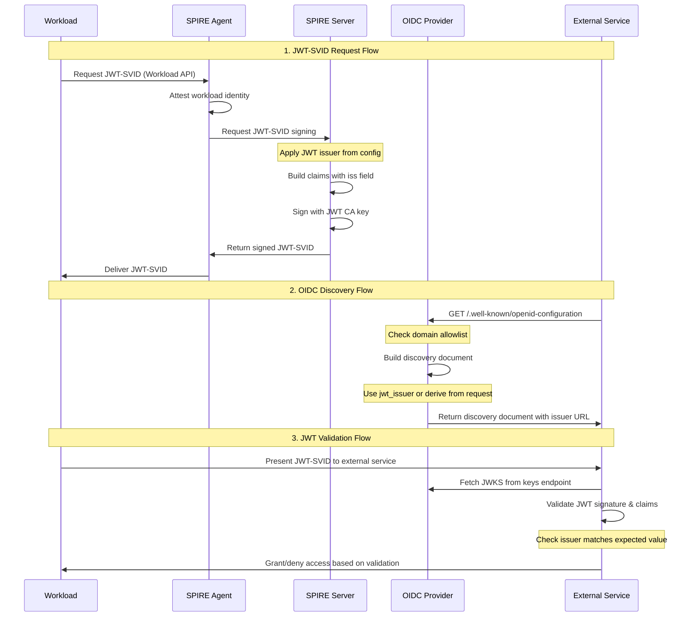
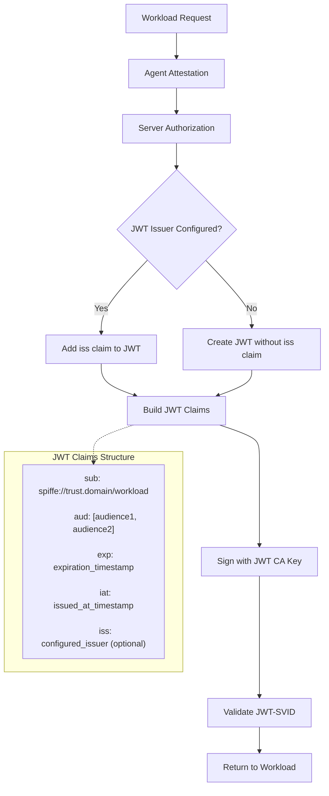
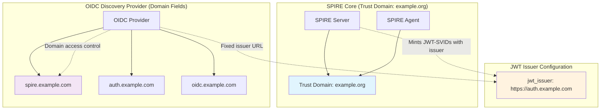
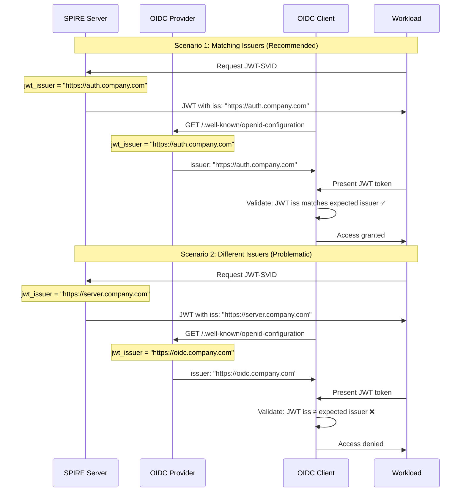
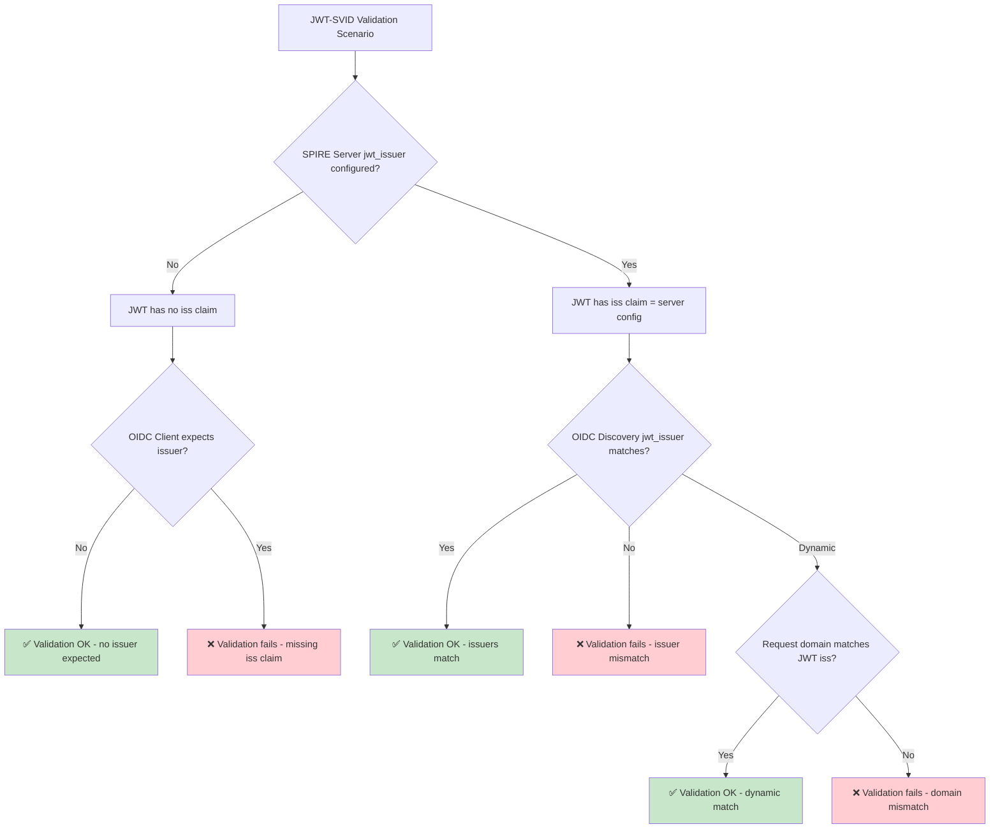
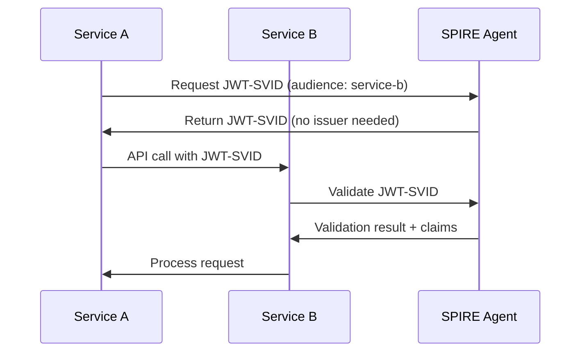
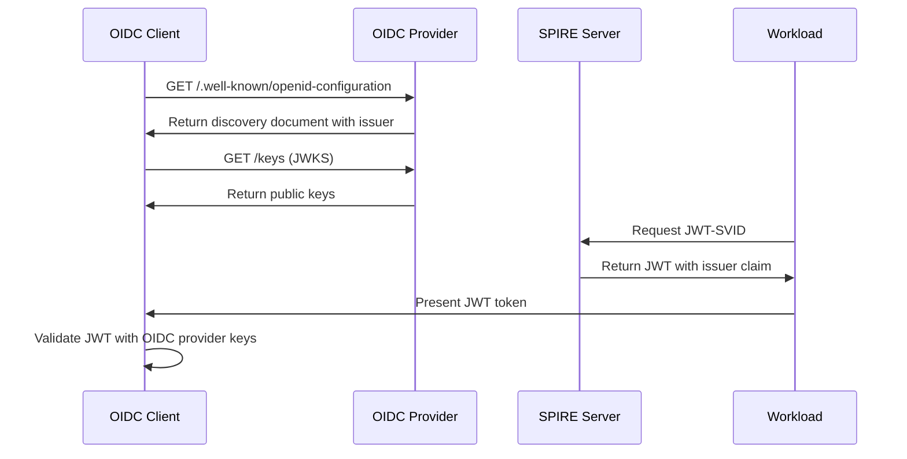
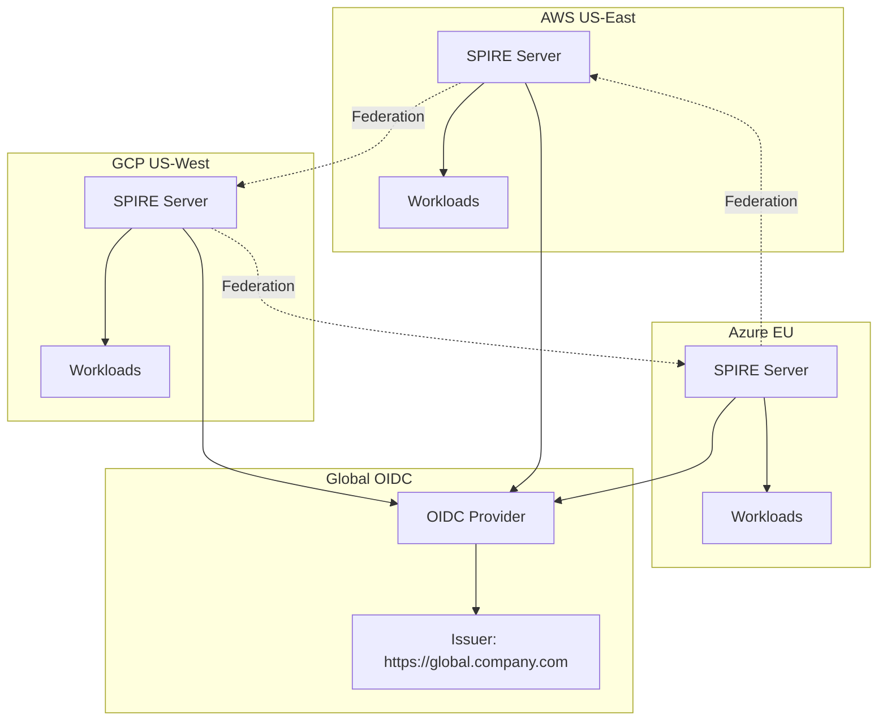
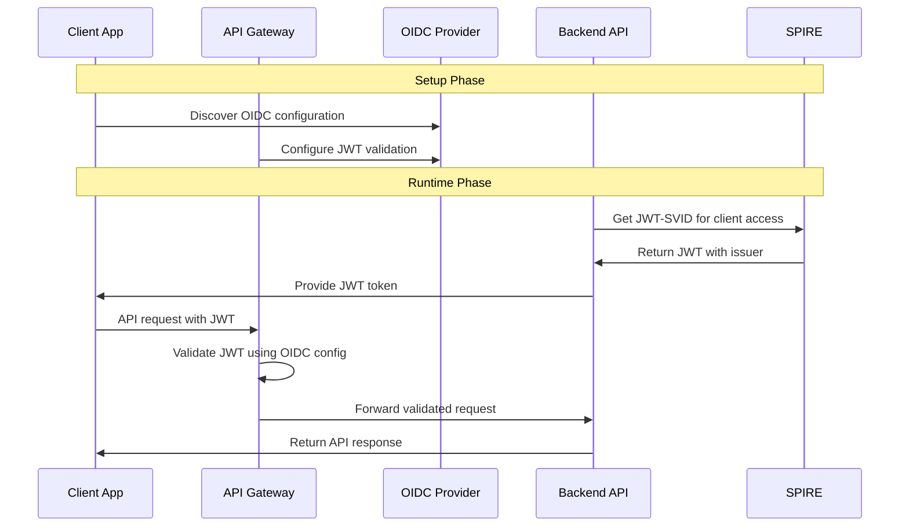
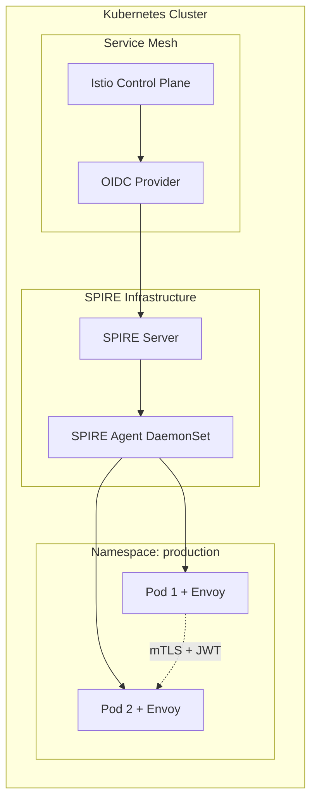

# SPIRE JWT Issuer Complete Guide

A comprehensive guide to understanding and implementing JWT Issuer functionality in SPIRE (SPIFFE Runtime Environment).

## Table of Contents

1. [Overview](#overview)
2. [Architecture & Flow](#architecture--flow)
3. [JWT Issuer vs Domain Relationship](#jwt-issuer-vs-domain-relationship)
4. [Do JWT Issuers Need to Match?](#do-jwt-issuers-need-to-match)
5. [Configuration](#configuration)
6. [Use Cases](#use-cases)
7. [Examples](#examples)
8. [Security Considerations](#security-considerations)
9. [Troubleshooting](#troubleshooting)

## Overview

JWT Issuer in SPIRE serves multiple critical functions in the identity and authentication ecosystem:

### What is JWT Issuer?

The **JWT Issuer** (`iss` claim) is an optional but important field in JWT-SVIDs (JWT-based SPIFFE Verifiable Identity Documents) that:

- **Identifies the token issuer**: Specifies which entity created and signed the JWT
- **Enables OIDC integration**: Provides compatibility with standard OIDC/OAuth2 flows
- **Supports federation**: Helps distinguish tokens across multiple SPIRE deployments
- **Enhances auditability**: Improves logging and debugging capabilities

### Key Components

1. **SPIRE Server**: Mints JWT-SVIDs with issuer claims
2. **OIDC Discovery Provider**: Serves OIDC discovery documents
3. **Workload API**: Provides JWT-SVIDs to workloads
4. **Trust Domains**: Define security boundaries (separate from domain fields)

## Architecture & Flow

### Complete JWT-SVID Lifecycle



### JWT-SVID Creation Process



### Trust Domain vs Domain Field Architecture



## JWT Issuer vs Domain Relationship

### Conceptual Differences

| Aspect | Trust Domain | Domain Field (OIDC) | JWT Issuer |
|--------|--------------|-------------------|------------|
| **Purpose** | SPIFFE identity boundary | Access control | Token identification |
| **Scope** | Entire SPIRE deployment | OIDC endpoints only | JWT claims only |
| **Example** | `example.org` | `["spire.example.com"]` | `https://auth.example.com` |
| **Security Role** | Identity namespace | Request filtering | Token authenticity |

### Interaction Scenarios

#### Scenario 1: Default Dynamic Issuer
```hcl
# OIDC Discovery Provider
domains = ["spire.example.com", "auth.example.com"]
# jwt_issuer not set - derived from request Host header
```

**Result**: 
- Request to `spire.example.com` → Issuer: `https://spire.example.com`
- Request to `auth.example.com` → Issuer: `https://auth.example.com`

#### Scenario 2: Fixed Issuer Override
```hcl
# OIDC Discovery Provider  
domains = ["spire.example.com", "auth.example.com"]
jwt_issuer = "https://identity.example.com"
```

**Result**:
- All requests → Issuer: `https://identity.example.com` (regardless of request domain)
- Better for OIDC client consistency
- Requires careful domain/issuer coordination

#### Scenario 3: Multi-Domain Federation
```hcl
# OIDC Discovery Provider
domains = ["spire.us-east.com", "spire.us-west.com", "spire.eu.com"]
jwt_issuer = "https://global-identity.example.com"
```

**Result**:
- Multiple regions can access OIDC endpoints
- Single consistent issuer for all federated services
- Complex but highly flexible setup

## Do JWT Issuers Need to Match?

### **Answer: Not always, but it depends on your use case!**

The relationship between SPIRE Server and OIDC Discovery Provider JWT issuers is more nuanced than a simple "must match" rule.

### Understanding the Two Issuer Configurations

#### **SPIRE Server `jwt_issuer`**
```hcl
server {
    jwt_issuer = "https://auth.company.com"  # Goes into JWT tokens as 'iss' claim
}
```
- **Purpose**: Added to the `iss` claim in actual JWT-SVID tokens
- **Impact**: What validation clients will see in the JWT

#### **OIDC Discovery Provider `jwt_issuer`**  
```hcl
# OIDC Provider config
jwt_issuer = "https://auth.company.com"  # Returned in discovery document
```
- **Purpose**: Tells OIDC clients what issuer to expect
- **Impact**: What validation clients expect to see

### Configuration Scenarios



### Issuer Matching Scenarios

#### **Scenario 1: Both Configured - MUST MATCH** ✅
```hcl
# SPIRE Server
server {
    jwt_issuer = "https://auth.company.com"
}

# OIDC Provider  
jwt_issuer = "https://auth.company.com"  # Same value
```

**Result**: JWT validation works perfectly because:
- JWT tokens contain: `"iss": "https://auth.company.com"`  
- OIDC clients expect: `"iss": "https://auth.company.com"`

#### **Scenario 2: Different Values - BREAKS VALIDATION** ❌
```hcl
# SPIRE Server
server {
    jwt_issuer = "https://server.company.com"  # Different!
}

# OIDC Provider
jwt_issuer = "https://oidc.company.com"       # Different!
```

**Result**: JWT validation fails because issuer mismatch

#### **Scenario 3: Only SPIRE Server Configured** ⚠️
```hcl
# SPIRE Server
server {
    jwt_issuer = "https://auth.company.com"
}

# OIDC Provider - no jwt_issuer set
domains = ["auth.company.com"]
```

**Result**: Works only if requests come to `auth.company.com` because:
- JWT tokens contain: `"iss": "https://auth.company.com"`
- OIDC discovery dynamically returns: `"issuer": "https://auth.company.com"` (from request host)

#### **Scenario 4: Neither Configured - Internal Use Only** ✅
```hcl
# SPIRE Server - no jwt_issuer

# OIDC Provider - no jwt_issuer  
domains = ["spire.internal.com"]
```

**Result**: Works for internal validation that doesn't check issuer claims

### When They DON'T Need to Match

#### **1. Internal Service-to-Service Communication**
```hcl
# SPIRE Server (no issuer needed)
server {
    trust_domain = "internal.company.com"
    # jwt_issuer not set
}
```
- Workloads validate JWTs directly via Workload API
- No external OIDC integration
- Issuer claims are ignored

#### **2. Dynamic Multi-Domain Scenarios**
```hcl
# SPIRE Server  
server {
    jwt_issuer = "https://global.company.com"
}

# OIDC Provider (no fixed issuer)
domains = [
    "auth.us.company.com",
    "auth.eu.company.com", 
    "auth.asia.company.com"
]
```

**Works if**: All requests are proxied/rewritten to use the global issuer URL

#### **3. Development/Testing**
```hcl
# SPIRE Server
server {
    jwt_issuer = "https://dev.company.com"
}

# OIDC Provider
domains = ["localhost"]
insecure_addr = ":8080"
# No jwt_issuer - uses request host
```

**Works if**: Development clients are configured to expect the server's issuer

### Decision Matrix

| Use Case | SPIRE Server `jwt_issuer` | OIDC Provider `jwt_issuer` | Must Match? |
|----------|---------------------------|----------------------------|-------------|
| **Internal only** | Not needed | Not needed | N/A |
| **OIDC Integration** | Required | Required | **YES** |
| **Multi-domain** | Required | Optional (dynamic) | Domain must align |
| **Federation** | Required | Required | **YES** |
| **Development** | Optional | Optional | If both set: **YES** |

### Validation Flow Decision Tree



### Best Practice Recommendations

#### **Recommended: Explicit Matching Configuration**
```hcl
# SPIRE Server
server {
    trust_domain = "company.com"
    jwt_issuer = "https://identity.company.com"
}

# OIDC Discovery Provider  
domains = ["identity.company.com", "auth.company.com"]
jwt_issuer = "https://identity.company.com"  # Explicit match
```

#### **Alternative: Domain-Based Dynamic Issuer**
```hcl
# SPIRE Server
server {
    trust_domain = "company.com"
    jwt_issuer = "https://auth.company.com"
}

# OIDC Discovery Provider (no explicit issuer)
domains = ["auth.company.com"]  # Must match server issuer domain
# jwt_issuer not set - derived from request
```

### Key Takeaways

- ✅ **Match them**: For OIDC/OAuth2 integration, API gateways, external validation
- ⚠️ **Can differ**: In complex multi-domain setups with proper proxy configuration  
- ✅ **Omit both**: For pure internal service-to-service communication

**The key principle**: **SPIRE Server issuer goes into JWT tokens**, while **OIDC Provider issuer tells clients what to expect**. For JWT validation to succeed, these must align!

## Configuration

### SPIRE Server Configuration

```hcl
server {
    trust_domain = "example.org"
    
    # JWT Issuer for all minted JWT-SVIDs
    jwt_issuer = "https://identity.example.com"
    
    # JWT key configuration
    jwt_key_type = "ec-p256"
    default_jwt_svid_ttl = "5m"
}
```

### OIDC Discovery Provider Configuration

```hcl
# Basic Configuration
domains = ["spire.example.com"]
jwt_issuer = "https://identity.example.com"

# Server API source
server_api {
    address = "unix:///tmp/spire-server/private/api.sock"
}

# HTTPS with ACME (Let's Encrypt)
acme {
    cache_dir = "/var/lib/spire/oidc-cache"
    email = "admin@example.com"
    tos_accepted = true
}
```

### Advanced Multi-Domain Configuration

```hcl
# Production setup with multiple domains
domains = [
    "spire.production.com",
    "auth.production.com", 
    "identity.internal.com"
]

# Fixed issuer for consistency
jwt_issuer = "https://identity.production.com/spire"

# Custom JWKS URI for load balancing
jwks_uri = "https://keys.production.com/.well-known/jwks.json"

# Path prefix for reverse proxy
server_path_prefix = "/auth/v1"

# Health checks
health_checks {
    bind_port = 8080
    ready_path = "/ready"
    live_path = "/live"
}
```

## Use Cases

### 1. Internal Service-to-Service Authentication

**Scenario**: Microservices within the same trust domain communicating securely.



**Configuration**:
```hcl
# SPIRE Server - no jwt_issuer needed
server {
    trust_domain = "internal.company.com"
    default_jwt_svid_ttl = "5m"
}
```

### 2. External OIDC Integration

**Scenario**: Integrating with external identity providers and OIDC clients.



**Configuration**:
```hcl
# SPIRE Server
server {
    trust_domain = "company.com"
    jwt_issuer = "https://auth.company.com"
}

# OIDC Discovery Provider
domains = ["auth.company.com"]
jwt_issuer = "https://auth.company.com"
server_api {
    address = "unix:///tmp/spire-server/private/api.sock"
}
```

### 3. Multi-Cloud Federation

**Scenario**: Services across different cloud providers and regions.



**Configuration**:
```hcl
# Each SPIRE Server
server {
    trust_domain = "region.company.com"  # Different per region
    jwt_issuer = "https://global.company.com"  # Same global issuer
}

# Global OIDC Provider
domains = [
    "spire-aws.company.com",
    "spire-gcp.company.com", 
    "spire-azure.company.com"
]
jwt_issuer = "https://global.company.com"
```

### 4. API Gateway Integration

**Scenario**: Using JWT-SVIDs with API gateways for request authentication.



### 5. Kubernetes Service Mesh

**Scenario**: SPIRE with Istio/Envoy for service mesh authentication.



## Examples

### Example 1: Simple Internal Setup

```hcl
# spire-server.conf
server {
    bind_address = "0.0.0.0"
    bind_port = "8081"
    trust_domain = "internal.company.com"
    data_dir = "/opt/spire/data/server"
    
    # No JWT issuer - for internal use only
    default_jwt_svid_ttl = "5m"
}

plugins {
    DataStore "sql" {
        plugin_data {
            database_type = "sqlite3"
            connection_string = "/opt/spire/data/server/datastore.sqlite3"
        }
    }
    
    KeyManager "disk" {
        plugin_data {
            keys_path = "/opt/spire/data/server/keys.json"
        }
    }
    
    NodeAttestor "join_token" {
        plugin_data {}
    }
}
```

### Example 2: OIDC Integration Setup

```hcl
# spire-server.conf
server {
    bind_address = "0.0.0.0"
    bind_port = "8081"
    trust_domain = "company.com"
    data_dir = "/opt/spire/data/server"
    
    # JWT issuer for OIDC integration
    jwt_issuer = "https://auth.company.com"
    default_jwt_svid_ttl = "15m"
    jwt_key_type = "ec-p256"
}

# ... plugins config ...
```

```hcl
# oidc-discovery-provider.conf
domains = ["auth.company.com"]
jwt_issuer = "https://auth.company.com"

server_api {
    address = "unix:///opt/spire/sockets/api.sock"
}

acme {
    cache_dir = "/opt/spire/oidc-cache"
    email = "admin@company.com"
    tos_accepted = true
}

health_checks {
    bind_port = 8080
    ready_path = "/ready"
    live_path = "/live"
}
```

### Example 3: Multi-Domain Production Setup

```hcl
# oidc-discovery-provider.conf
log_level = "INFO"
log_format = "json"

# Multiple domains for different access patterns
domains = [
    "auth.company.com",      # Main authentication endpoint
    "spire.internal.com",    # Internal access
    "identity.api.com"       # API gateway integration
]

# Fixed issuer for consistency across all domains
jwt_issuer = "https://identity.company.com"

# Custom JWKS URI for CDN/load balancer
jwks_uri = "https://cdn.company.com/auth/keys"

# Path prefix for reverse proxy setup
server_path_prefix = "/spire/v1"

# Production server API
server_api {
    address = "unix:///var/run/spire/sockets/api.sock"
    poll_interval = "5s"
}

# HTTPS with custom certificates
serving_cert_file {
    cert_file_path = "/etc/ssl/certs/spire.crt"
    key_file_path = "/etc/ssl/private/spire.key"
}

# Comprehensive health checks
health_checks {
    bind_port = 8080
    ready_path = "/health/ready"
    live_path = "/health/live"
}
```

### Example 4: Federation Configuration

```hcl
# Primary trust domain server
server {
    trust_domain = "company.com"
    jwt_issuer = "https://global-auth.company.com"
    
    federation {
        bundle_endpoint {
            address = "0.0.0.0"
            port = 8443
        }
        
        federates_with "partner.com" {
            bundle_endpoint_url = "https://spire.partner.com:8443"
            bundle_endpoint_profile "https_web"
        }
    }
}
```

### Example 5: Development/Testing Setup

```hcl
# Development OIDC provider (insecure)
domains = ["localhost"]
insecure_addr = ":8080"
allow_insecure_scheme = true

# No JWT issuer - will use request host
server_api {
    address = "unix:///tmp/spire-server/private/api.sock"
}

log_level = "DEBUG"
log_requests = true
```

## Security Considerations

### 1. Issuer Validation
- **Always validate issuer claims** in consuming applications
- **Use HTTPS for issuer URLs** to prevent man-in-the-middle attacks
- **Implement issuer allowlists** in client applications

### 2. Domain Security
```hcl
# Good: Specific domain allowlist
domains = ["auth.company.com", "spire.company.com"]

# Avoid: Overly broad domains
# domains = ["*.company.com"]  # Not supported and risky
```

### 3. Key Management
- **Rotate JWT signing keys regularly**
- **Use hardware security modules (HSM)** for production
- **Monitor key usage and expiration**

### 4. Network Security
```hcl
# Production: Always use HTTPS
acme {
    cache_dir = "/secure/cache"
    email = "security@company.com"
    tos_accepted = true
}

# Development only: HTTP allowed
insecure_addr = ":8080"
allow_insecure_scheme = true  # NEVER in production
```

### 5. Audit and Monitoring

```hcl
server {
    audit_log_enabled = true
    log_level = "INFO"
    log_format = "json"  # Better for log aggregation
}
```

## Troubleshooting

### Common Issues

#### 1. Domain Verification Fails
```
Error: domain "wrong.domain.com" is not allowed
```

**Solution**: Add domain to allowlist or fix client request headers:
```hcl
domains = ["correct.domain.com", "wrong.domain.com"]
```

#### 2. Issuer Mismatch
```
Error: token issuer "https://old.issuer.com" doesn't match expected "https://new.issuer.com"
```

**Root Cause**: SPIRE Server and OIDC Discovery Provider have different `jwt_issuer` configurations.

**Diagnostic Steps**:
```bash
# Check JWT token issuer
echo $JWT_SVID | cut -d'.' -f2 | base64 -d | jq .iss

# Check OIDC discovery document issuer  
curl https://auth.company.com/.well-known/openid-configuration | jq .issuer
```

**Solutions**:

**Option 1 - Make issuers match (Recommended)**:
```hcl
# SPIRE Server
server {
    jwt_issuer = "https://auth.company.com"
}

# OIDC Provider  
jwt_issuer = "https://auth.company.com"  # Same value
```

**Option 2 - Use dynamic domain-based issuer**:
```hcl
# SPIRE Server
server {
    jwt_issuer = "https://auth.company.com"
}

# OIDC Provider (remove explicit issuer)
domains = ["auth.company.com"]  # Must match server issuer domain
# jwt_issuer not set - derived from request host
```

**Option 3 - Update client expectations**:
Update OIDC client to expect the issuer that SPIRE Server actually provides.

#### 3. Missing Issuer Claim
```
Error: token missing issuer claim but issuer required
Error: OIDC client expects issuer but JWT has no iss claim
```

**Root Cause**: SPIRE Server doesn't have `jwt_issuer` configured but OIDC client expects one.

**Solution**: Add issuer to SPIRE Server configuration:
```hcl
server {
    trust_domain = "company.com"
    jwt_issuer = "https://auth.company.com"
}
```

#### 4. JWT Validation Fails
```
Error: failed to validate JWT: token has expired
```

**Solution**: Check TTL configuration and time synchronization:
```hcl
server {
    default_jwt_svid_ttl = "15m"  # Increase if needed
}
```

#### 5. OIDC Discovery Not Working
```
Error: 404 Not Found on /.well-known/openid-configuration
```

**Solution**: Verify OIDC provider configuration and paths:
```hcl
server_path_prefix = ""  # Remove if causing path issues
```

#### 6. Key Not Found
```
Error: public key "kid-123" not found in trust domain "company.com"
```

**Solution**: Check key rotation and JWKS endpoint:
- Ensure SPIRE server is running
- Verify OIDC provider can access SPIRE server API
- Check key rotation hasn't invalidated old keys

### Debugging Commands

```bash
# Check JWT-SVID content (full payload)
echo $JWT_SVID | base64 -d | jq .

# Check specific issuer claim in JWT
echo $JWT_SVID | cut -d'.' -f2 | base64 -d | jq .iss

# Check all JWT claims  
echo $JWT_SVID | cut -d'.' -f2 | base64 -d | jq '{iss, sub, aud, exp, iat}'

# Test OIDC discovery document
curl https://auth.company.com/.well-known/openid-configuration | jq

# Extract issuer from OIDC discovery
curl -s https://auth.company.com/.well-known/openid-configuration | jq -r .issuer

# Compare JWT issuer vs OIDC discovery issuer
echo "JWT Issuer: $(echo $JWT_SVID | cut -d'.' -f2 | base64 -d | jq -r .iss)"
echo "OIDC Issuer: $(curl -s https://auth.company.com/.well-known/openid-configuration | jq -r .issuer)"

# Fetch JWKS
curl https://auth.company.com/keys | jq

# Check SPIRE server logs for JWT signing
journalctl -u spire-server -f | grep -i jwt

# Check OIDC discovery provider logs  
journalctl -u oidc-discovery-provider -f

# Test domain access (should return 200)
curl -I https://auth.company.com/.well-known/openid-configuration

# Test with wrong domain (should return 400)
curl -I -H "Host: wrong.domain.com" https://auth.company.com/.well-known/openid-configuration

# Validate JWT manually (if validation endpoint exists)
curl -X POST https://auth.company.com/validate \
  -H "Content-Type: application/json" \
  -d '{"token": "'$JWT_SVID'", "audience": "my-service"}'
```

### Performance Tuning

```hcl
server {
    # Adjust TTLs based on security vs performance needs
    default_jwt_svid_ttl = "15m"  # Longer = fewer renewals
    
    # Rate limiting
    ratelimit {
        attestation = true
        signing = true  # Limits JWT signing requests
    }
}

# OIDC provider caching
server_api {
    poll_interval = "10s"  # Balance freshness vs load
}
```

---

## Conclusion

JWT Issuer in SPIRE provides powerful capabilities for:
- **Identity integration** with existing OIDC/OAuth2 systems
- **Multi-domain deployments** with consistent token identification  
- **Federation scenarios** across trust boundaries
- **Enhanced security** through proper token attribution

### Key Implementation Principles

1. **Understanding the Two Issuers**:
   - **SPIRE Server `jwt_issuer`** → Goes into JWT token `iss` claims
   - **OIDC Provider `jwt_issuer`** → Tells clients what issuer to expect

2. **When Issuers Must Match**:
   - ✅ OIDC/OAuth2 integration scenarios
   - ✅ External API gateway validation
   - ✅ Federation with consistent token identification

3. **When Issuers Can Differ or Be Omitted**:
   - ✅ Internal service-to-service communication
   - ✅ Dynamic multi-domain setups with proxy rewriting
   - ✅ Development/testing environments

4. **Critical Success Factors**:
   - Understand the relationship between trust domains (security boundary), domain fields (access control), and JWT issuers (token identification)
   - Configure them appropriately for your specific use case
   - Always test the complete authentication flow from token creation to validation

### Production Deployment Checklist

- ✅ **Explicit issuer matching** for OIDC integration scenarios
- ✅ **Proper domain allowlists** to prevent unauthorized access
- ✅ **HTTPS enforcement** for all production endpoints
- ✅ **Regular key rotation** and monitoring
- ✅ **Comprehensive logging** for troubleshooting
- ✅ **End-to-end validation testing** of the authentication flow

**Remember**: The key principle is that **SPIRE Server issuer goes into JWT tokens**, while **OIDC Provider issuer tells clients what to expect**. For JWT validation to succeed, these must align appropriately for your architecture! 