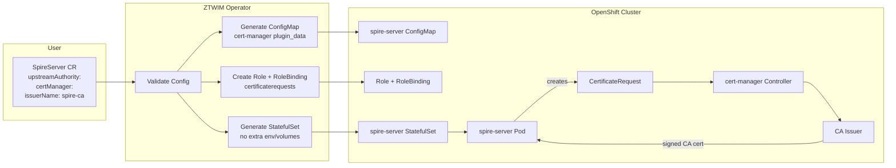
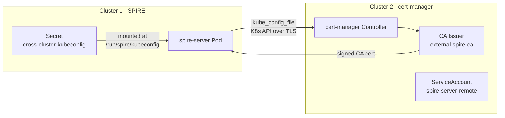
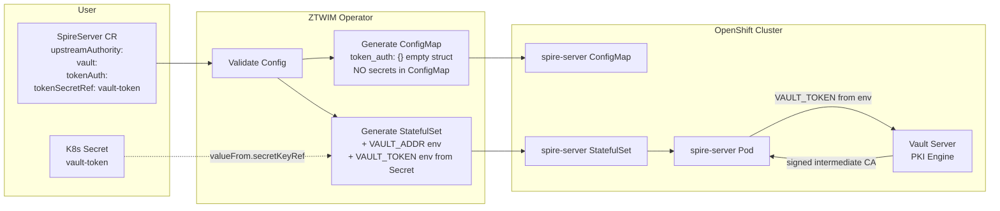
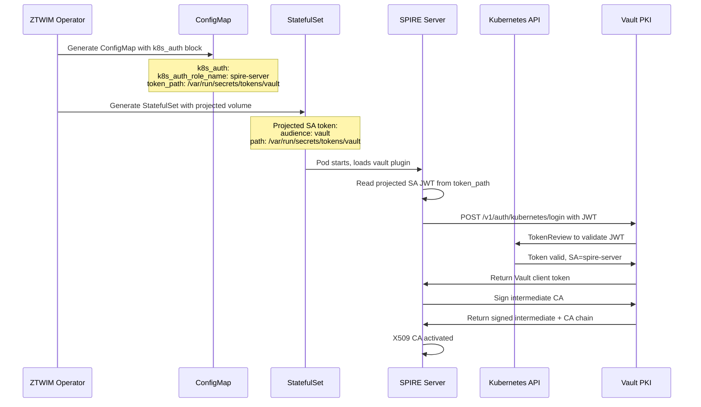
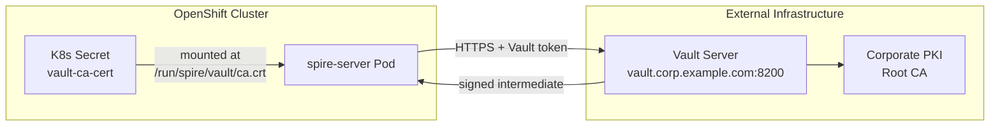
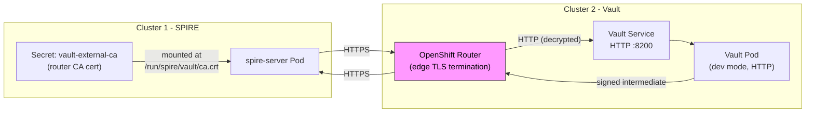
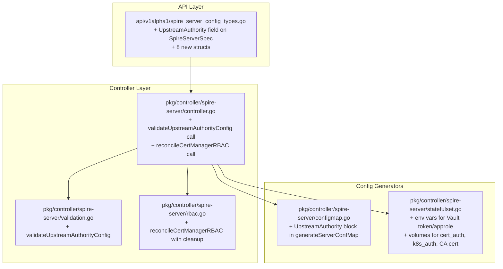
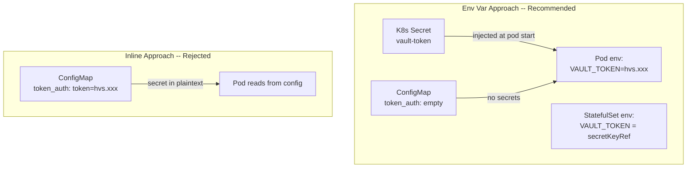
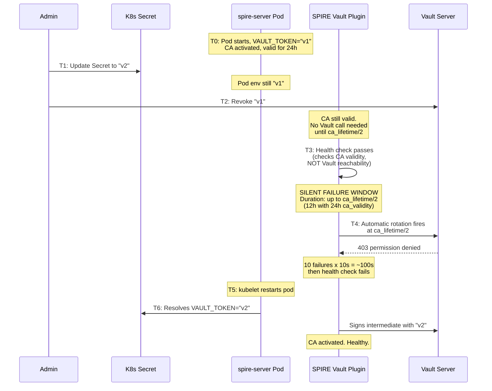
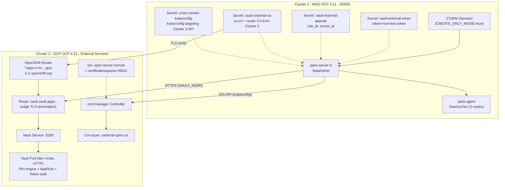

# ADR: Native UpstreamAuthority Plugin Support for ZTWIM

| Field | Value |
|-------|-------|
| **Authors** | ZTWIM Team |
| **Operator** | ZTWIM (Zero Trust Workload Identity Manager) v1.0.0+ |
| **SPIRE Version** | 1.13.x |
| **Upstream References** | [cert-manager plugin](https://github.com/spiffe/spire/blob/main/doc/plugin_server_upstreamauthority_cert_manager.md), [Vault plugin](https://github.com/spiffe/spire/blob/main/doc/plugin_server_upstreamauthority_vault.md) |

---

## Executive Summary

ZTWIM currently uses a self-signed CA for SPIRE. This ADR proposes adding **native** UpstreamAuthority plugin support to the operator, allowing the SPIRE intermediate CA to be signed by an external PKI -- either **cert-manager** (Red Hat operator) or **HashiCorp Vault** (PKI secrets engine). The feature is configured declaratively via the `SpireServer` CR and reconciled natively by the operator (no CREATE_ONLY_MODE required).

**Nine** configurations have been validated end-to-end on OCP 4.21 with ZTWIM v1.0.0, including **cross-cluster** scenarios: external Vault exposed via OpenShift Route (edge-terminated, both insecure and secure TLS), and cross-cluster cert-manager via `kube_config_file`. A critical upstream limitation was confirmed: the SPIRE Vault plugin does **not** support file-path-based credentials (`token_path`) for `token_auth` or `approle_auth`, meaning env-var injection (frozen at pod start) is the only option for these methods. The operator mitigates credential staleness via secret-hash annotations (v1.1). `k8s_auth` is the only auth method with true auto-refresh via projected SA tokens. This ADR covers the API changes (with detailed credential injection rationale), reconciliation design, deployment scenarios, edge cases, alternatives, and risks.

---

## What

This document proposes changes to the ZTWIM operator to:

1. Add a new optional `upstreamAuthority` field to the `SpireServer` Custom Resource spec
2. Modify the operator reconciliation loop to generate the SPIRE `UpstreamAuthority` plugin block in `server.conf` (ConfigMap)
3. Inject environment variables, volumes, and RBAC resources based on the chosen plugin and authentication method
4. Support two UpstreamAuthority plugins:
   - **cert-manager** -- zero-secret integration using an in-cluster Kubernetes client and cert-manager Issuer/ClusterIssuer
   - **Vault** -- four authentication methods: `token_auth`, `approle_auth`, `k8s_auth`, `cert_auth`
5. Reconcile the feature natively without CREATE_ONLY_MODE -- the operator owns the ConfigMap, StatefulSet, and RBAC lifecycle

### Components Touched

| Component | Change |
|-----------|--------|
| `api/v1alpha1/spire_server_config_types.go` | New `UpstreamAuthority` field + 8 new Go structs |
| `pkg/controller/spire-server/controller.go` | 2 new reconciliation steps (validation + cert-manager RBAC) |
| `pkg/controller/spire-server/configmap.go` | `UpstreamAuthority` block generation in `generateServerConfMap()` |
| `pkg/controller/spire-server/statefulset.go` | Conditional env vars, volumes, mounts for Vault auth methods |
| `pkg/controller/spire-server/validation.go` | New `validateUpstreamAuthorityConfig()` |
| `pkg/controller/spire-server/rbac.go` | `reconcileCertManagerRBAC()` with cleanup on removal |

---

## Why

### Motivation

Enterprises deploying SPIRE in production require the SPIRE CA to be chained to a corporate root CA. This is driven by:

- **Compliance requirements** -- regulated industries mandate that all X.509 certificates trace back to a known, audited root CA
- **Operational consistency** -- organizations with existing PKI (cert-manager or Vault) want SPIRE to participate in their certificate hierarchy rather than maintaining a separate root of trust
- **Audit trails** -- a self-signed SPIRE CA cannot be tied into enterprise certificate lifecycle management and revocation workflows

### Present Circumstances

- The SPIRE server self-signs its X.509 CA. This is acceptable for development and testing but insufficient for production PKI integration.
- Customers already have cert-manager or Vault deployed in their infrastructure and need SPIRE to chain to those systems.
- The **only current workaround** is to enable `CREATE_ONLY_MODE=true` on the operator (via Subscription patch), then manually edit the `spire-server` ConfigMap and StatefulSet. This is:
  - Not production-viable -- manual patching is error-prone and undocumented
  - Breaks reconciliation -- the operator cannot manage resources it does not own
  - Lost on upgrade -- any operator restart or OLM upgrade overwrites manual changes (unless CREATE_ONLY_MODE remains enabled, which prevents all reconciliation)
- Upstream SPIRE supports UpstreamAuthority plugins natively. ZTWIM should expose this capability declaratively, consistent with how it already exposes Federation and DataStore configuration.

### Why a Decision is Needed Now

The feature has been prototyped and validated end-to-end. The team needs consensus on the API surface, secret handling strategy, and scope boundaries before implementation begins. This ADR captures the design decisions, edge cases discovered during testing, and the rationale behind each choice.

---

## Goals

1. **Declarative configuration** via `SpireServer` CR -- no manual ConfigMap editing
2. **Zero secrets in ConfigMap** -- use the env var injection (empty struct) pattern for Vault `token_auth` and `approle_auth`
3. **Support cert-manager** `Issuer` and `ClusterIssuer` with the SPIRE server's in-cluster Kubernetes client
4. **Support Vault** with four auth methods: `token_auth`, `approle_auth`, `k8s_auth`, `cert_auth`
5. **Support external Vault instances** (outside the cluster) with TLS CA certificate verification
6. **Automated RBAC lifecycle** for cert-manager `CertificateRequest` permissions (create on enable, delete on removal)
7. **Rolling updates** on config change via the existing config hash annotation mechanism
8. **Clear operator status conditions** for misconfiguration and upstream CA failures
9. **Removal support** -- removing `upstreamAuthority` from the CR reverts SPIRE to self-signed CA

---

## Non-Goals

| Non-Goal | Rationale |
|----------|-----------|
| Nested SPIRE (`spire` UpstreamAuthority plugin) | Separate design doc; requires cross-cluster DaemonSet, Route, PSAT, and fundamentally different architecture |
| Auto-rotation of Vault tokens | Operator does not watch referenced Secrets; documented as requiring manual pod restart. Future enhancement. |
| Multiple UpstreamAuthority plugins simultaneously | SPIRE enforces `MaybeOne()` constraint (zero or one plugin) |
| Vault deployment/lifecycle management | Vault is a customer-managed external dependency |
| cert-manager operator installation | Prerequisite, not managed by ZTWIM |
| ~~External kubeconfig for cert-manager~~ | ~~Not needed for initial scope~~ -- **Updated:** Cross-cluster cert-manager validated via E2E Test 9. Now recommended for v1 scope as optional field (see H2). |
| Migrating old designs to this format | N/A |

---

## How

### H1. Deployment Scenarios and Edge Cases

The following 10 scenarios cover the range of configurations from simplest (cert-manager in-cluster) to most complex (external Vault Enterprise with namespaces). Each scenario documents the ConfigMap content, StatefulSet modifications, prerequisites, and edge cases.

---

#### Scenario 1: cert-manager In-Cluster, CA Issuer (Same Namespace)

**Overview:** Simplest integration path. No secrets, no env vars, no extra volumes.



**ConfigMap generated:**
```json
"UpstreamAuthority": [{
  "cert-manager": {
    "plugin_data": {
      "namespace": "zero-trust-workload-identity-manager",
      "issuer_name": "spire-ca-issuer",
      "issuer_kind": "Issuer",
      "issuer_group": "cert-manager.io",
      "kube_config_file": ""
    }
  }
}]
```

**StatefulSet modifications:** None.

**RBAC created by operator:**
```yaml
apiVersion: rbac.authorization.k8s.io/v1
kind: Role
metadata:
  name: spire-server-cert-manager
  namespace: zero-trust-workload-identity-manager
rules:
- apiGroups: ["cert-manager.io"]
  resources: ["certificaterequests"]
  verbs: ["get", "list", "create", "delete"]
---
apiVersion: rbac.authorization.k8s.io/v1
kind: RoleBinding
metadata:
  name: spire-server-cert-manager
  namespace: zero-trust-workload-identity-manager
subjects:
- kind: ServiceAccount
  name: spire-server
  namespace: zero-trust-workload-identity-manager
roleRef:
  kind: Role
  name: spire-server-cert-manager
  apiGroup: rbac.authorization.k8s.io
```

**Prerequisites:**
- Red Hat cert-manager operator installed
- Issuer created and in Ready state

**Test status:** **PASS** on OCP 4.21.6.

**Edge cases:**
- If Issuer is not Ready, the SPIRE plugin polls the CertificateRequest for ~1.25 min (300 iterations x 250ms), then returns `codes.Internal "request did not become ready in time"`. The SPIRE rotator retries every 10s. After 10 consecutive failures (~100s), liveness/readiness health check fails and kubelet restarts the pod.

---

#### Scenario 2: cert-manager In-Cluster, ClusterIssuer

Same as Scenario 1 except `issuerKind: ClusterIssuer`.

**ConfigMap generated:** Same structure with `"issuer_kind": "ClusterIssuer"`.

**Prerequisites:**
- ClusterIssuer created and in Ready state
- **CA Secret must exist in the `cert-manager` namespace** (not the operator namespace). ClusterIssuers always look for their backing Secret in the cert-manager controller's namespace.

**Test status:** **PASS** (after copying CA Secret to `cert-manager` namespace).

**Edge case:**
- If the CA Secret is missing from the `cert-manager` namespace, the ClusterIssuer stays NotReady. CertificateRequests time out. This is a common misconfiguration -- the operator cannot verify it because it does not have access to the cert-manager namespace Secrets. Documentation must call this out.

---

#### Scenario 3: cert-manager with External Kubeconfig (Cross-Cluster)

The upstream plugin supports `kube_config_file: "/path/to/kubeconfig"` to target a different cluster's cert-manager instance.

**Use case:** cert-manager runs on a management cluster; SPIRE server is on a workload cluster.

**Validated via E2E test (2026-03-20):** SPIRE server on Cluster 1 (AWS) successfully obtained a CA certificate from cert-manager running on Cluster 2 (GCP) using a ServiceAccount token-based kubeconfig mounted as a Secret volume.



**ConfigMap generated:**
```json
"UpstreamAuthority": [{
  "cert-manager": {
    "plugin_data": {
      "namespace": "zero-trust-workload-identity-manager",
      "issuer_name": "external-spire-ca",
      "issuer_kind": "Issuer",
      "issuer_group": "cert-manager.io",
      "kube_config_file": "/run/spire/kubeconfig/kubeconfig"
    }
  }
}]
```

**StatefulSet modifications:**
```yaml
volumes:
- name: cross-cluster-kubeconfig
  secret:
    secretName: cross-cluster-kubeconfig
containers:
- name: spire-server
  volumeMounts:
  - name: cross-cluster-kubeconfig
    mountPath: /run/spire/kubeconfig
    readOnly: true
```

**Prerequisites:**
- cert-manager operator installed on the remote cluster
- Issuer created and in Ready state on the remote cluster
- ServiceAccount on remote cluster with RBAC for `certificaterequests.cert-manager.io`
- Kubeconfig Secret on local cluster containing the SA token-based kubeconfig
- Network reachability from SPIRE server pod to the remote cluster's K8s API server

**Test status:** **PASS** on OCP 4.21 (Cluster 1 AWS -> Cluster 2 GCP). Bundle issuer changed to `ZTWIM External Cluster Root CA`.

**Edge cases:**
- Remote K8s API server must be reachable from the SPIRE server pod (firewall, egress policy)
- SA token in kubeconfig has an expiry. For long-lived tokens, use `kubernetes.io/service-account-token` Secret type. For short-lived tokens, projected SA tokens expire and require refresh.
- The cert-manager `CertificateRequest` approval flow checks `userInfo` from the kubeconfig identity. Custom approvers may need to allow the remote SA identity.

**Decision updated: Consider for v1 scope.** See Section H2 for updated rationale.

---

#### Scenario 4: Vault In-Cluster, token_auth (Env Var Injection)

**Overview:** Vault deployed in same cluster. Token provided via environment variable.



**ConfigMap generated (no secrets):**
```json
"UpstreamAuthority": [{
  "vault": {
    "plugin_data": {
      "pki_mount_point": "pki",
      "token_auth": {}
    }
  }
}]
```

`vault_addr` is omitted from ConfigMap. Both `VAULT_ADDR` and `VAULT_TOKEN` are injected as env vars.

**StatefulSet env vars added:**
```yaml
env:
- name: VAULT_ADDR
  value: "http://vault.vault.svc.cluster.local:8200"
- name: VAULT_TOKEN
  valueFrom:
    secretKeyRef:
      name: vault-token
      key: token
```

**Prerequisites:**
- Vault deployed with PKI engine enabled and configured
- K8s Secret `vault-token` with key `token` containing a valid Vault token
- Vault token must have `update` capability on `<pki_mount_point>/root/sign-intermediate`

**Test status:** **PASS**.

**Edge cases:**
- `token_path` inside `token_auth` is **NOT supported** by the upstream SPIRE Vault plugin. The plugin ignores the unknown field and reports `"token is empty"`. The operator must NEVER generate `token_path` in the `token_auth` block. This was confirmed via E2E testing (see Test Report, Section 7).
- The only valid approaches for token_auth are:
  | Approach | Works? | Secret in ConfigMap? |
  |----------|--------|---------------------|
  | `token_auth: {}` + `VAULT_TOKEN` env var | Yes | No |
  | `token_auth: {token: "actual-value"}` | Yes | **Yes** (unacceptable) |
  | `token_auth: {token_path: "/path"}` | **No** | N/A |

---

#### Scenario 5: Vault In-Cluster, approle_auth (Env Var Injection)

**ConfigMap generated (no secrets):**
```json
"UpstreamAuthority": [{
  "vault": {
    "plugin_data": {
      "pki_mount_point": "pki",
      "approle_auth": {}
    }
  }
}]
```

If `appRoleMountPoint` is set to a non-default value:
```json
"approle_auth": {
  "approle_auth_mount_point": "custom-approle"
}
```

**StatefulSet env vars added:**
```yaml
env:
- name: VAULT_ADDR
  value: "http://vault.vault.svc.cluster.local:8200"
- name: VAULT_APPROLE_ID
  valueFrom:
    secretKeyRef:
      name: vault-approle
      key: role_id
- name: VAULT_APPROLE_SECRET_ID
  valueFrom:
    secretKeyRef:
      name: vault-approle
      key: secret_id
```

**Test status:** **PASS**.

**Edge cases:**
- AppRole `secret_id` can be configured as single-use (wrapping token). If so, a pod restart will fail because the `secret_id` has already been consumed. Operator documentation must note: use non-wrapping `secret_id` for SPIRE, or configure the AppRole with `secret_id_num_uses=0` (unlimited).
- The same empty struct + env var pattern as `token_auth` applies.

---

#### Scenario 6: Vault In-Cluster, k8s_auth (Projected SA Token)

**Overview:** Zero static credentials. Uses Kubernetes native service account token for Vault authentication.



**ConfigMap generated:**
```json
"UpstreamAuthority": [{
  "vault": {
    "plugin_data": {
      "vault_addr": "http://vault.vault.svc.cluster.local:8200",
      "pki_mount_point": "pki",
      "k8s_auth": {
        "k8s_auth_role_name": "spire-server",
        "token_path": "/var/run/secrets/tokens/vault"
      }
    }
  }
}]
```

Note: `vault_addr` IS included in ConfigMap for `k8s_auth` (no sensitive values) and no VAULT env vars are needed.

**StatefulSet volumes added:**
```yaml
volumes:
- name: vault-projected-token
  projected:
    sources:
    - serviceAccountToken:
        path: vault
        expirationSeconds: 7200
        audience: vault
containers:
- name: spire-server
  volumeMounts:
  - name: vault-projected-token
    mountPath: /var/run/secrets/tokens
    readOnly: true
```

**Test status:** **PASS** (after fixing Vault prerequisites).

**Prerequisites (all three must be met):**

1. **Vault Kubernetes auth enabled and configured:**
   ```bash
   vault auth enable kubernetes
   vault write auth/kubernetes/config \
     kubernetes_host=https://$KUBERNETES_SERVICE_HOST:$KUBERNETES_SERVICE_PORT \
     kubernetes_ca_cert="$SA_CA" \
     token_reviewer_jwt="$SA_TOKEN"
   ```

2. **Vault SA granted `system:auth-delegator`:**
   ```bash
   oc create clusterrolebinding vault-auth-delegator \
     --clusterrole=system:auth-delegator \
     --serviceaccount=vault:vault
   ```

3. **Vault role with matching audience:**
   ```bash
   vault write auth/kubernetes/role/spire-server \
     bound_service_account_names=spire-server \
     bound_service_account_namespaces=zero-trust-workload-identity-manager \
     token_policies=spire-pki \
     audience=vault \
     ttl=1h
   ```

**Edge cases:**
- If any prerequisite is missing, SPIRE gets `403 permission denied` from Vault on every rotation attempt. The error surfaces only in SPIRE server logs, not in the operator.
- `token_path` inside `k8s_auth` IS valid and required (unlike `token_path` in `token_auth` which is not supported). This is a subtle but critical distinction in the upstream plugin schemas.

---

#### Scenario 7: Vault In-Cluster, cert_auth (mTLS File Mount)

**ConfigMap generated:**
```json
"UpstreamAuthority": [{
  "vault": {
    "plugin_data": {
      "vault_addr": "https://vault.vault.svc.cluster.local:8200",
      "pki_mount_point": "pki",
      "cert_auth": {
        "client_cert_path": "/run/spire/vault/tls.crt",
        "client_key_path": "/run/spire/vault/tls.key"
      }
    }
  }
}]
```

Optional fields: `cert_auth_mount_point`, `cert_auth_role_name`.

**StatefulSet volumes/mounts added:**
```yaml
volumes:
- name: vault-client-cert
  secret:
    secretName: vault-client-cert
containers:
- name: spire-server
  volumeMounts:
  - name: vault-client-cert
    mountPath: /run/spire/vault/tls.crt
    subPath: tls.crt
    readOnly: true
  - name: vault-client-cert
    mountPath: /run/spire/vault/tls.key
    subPath: tls.key
    readOnly: true
```

**Test status:** NOT tested E2E (design-only, based on upstream plugin schema).

**Edge cases:**
- Client certificate expiry causes auth failure. The operator does not watch the Secret -- certificate renewal requires a manual pod restart.
- Cert and key must be PEM-encoded. DER format is not supported by the upstream plugin.
- The Vault cert auth backend must be configured to trust the CA that signed the client certificate.

---

#### Scenario 8: Vault External to Cluster (Remote URL)



**CR example:**
```yaml
spec:
  upstreamAuthority:
    vault:
      vaultAddr: "https://vault.corp.example.com:8200"
      pkiMountPoint: pki
      caCertSecretRef:
        name: vault-ca-cert
        key: ca.crt
      tokenAuth:
        tokenSecretRef:
          name: vault-token
          key: token
```

**Requirements:**
- `caCertSecretRef` must reference a Secret containing the CA certificate that signed the Vault server's TLS certificate
- Network egress from SPIRE server pod to external Vault must be allowed (firewalls, NetworkPolicy, proxy)
- If CA cert is not provided and `insecureSkipVerify` is `false` (default), TLS verification falls back to the system CA pool. If Vault uses a private CA not in the system trust store, the connection fails.

**ConfigMap generated:** Adds `ca_cert_path: "/run/spire/vault/ca.crt"` to plugin_data.

**StatefulSet volumes added (CA cert):**
```yaml
volumes:
- name: vault-ca-cert
  secret:
    secretName: vault-ca-cert
containers:
- name: spire-server
  volumeMounts:
  - name: vault-ca-cert
    mountPath: /run/spire/vault/ca.crt
    subPath: ca.crt
    readOnly: true
```

**Test status:** **PASS** (2026-03-20). Tested with Vault on Cluster 2 (GCP), exposed via edge-terminated OpenShift Route, consumed by SPIRE server on Cluster 1 (AWS). Both `token_auth` and `approle_auth` validated with both `insecure_skip_verify: true` and `ca_cert_path` pointing to the OpenShift router CA certificate.

| Sub-test | Auth | TLS Mode | Result | Bundle Issuer |
|----------|------|----------|--------|--------------|
| Test 6 | token_auth | insecure_skip_verify | **PASS** | External Vault PKI Root CA |
| Test 7 | token_auth | caCertSecretRef (router CA) | **PASS** | External Vault PKI Root CA |
| Test 8 | approle_auth | caCertSecretRef (router CA) | **PASS** | External Vault PKI Root CA |

**Edge cases:**
- Vault URL changes (DNS/IP migration) require CR update. ConfigMap hash changes, triggering rolling update.
- `VAULT_ADDR` env var takes precedence over `vault_addr` in config (upstream `getEnvOrDefault` behavior). The operator should be consistent: set ONLY the env var for token/approle, include `vault_addr` in ConfigMap for k8s/cert auth.
- If Vault is behind a corporate firewall, `EgressNetworkPolicy` or `NetworkPolicy` must allow traffic from the SPIRE server namespace to the external Vault endpoint.
- **Edge-terminated Route TLS trust chain:** When Vault runs HTTP behind an OpenShift edge-terminated Route, the TLS certificate presented to clients is the OpenShift router's ingress certificate (signed by the `ingress-operator` self-signed CA). The `caCertSecretRef` must contain this **router CA**, not Vault's own CA. Extract via: `oc get secret router-ca -n openshift-ingress-operator -o jsonpath='{.data.tls\.crt}' | base64 -d`.

---

#### Scenario 9: Vault Behind Proxy / Ingress (OpenShift Route)

Validated via E2E test (2026-03-20) using an **edge-terminated OpenShift Route**:



**TLS trust chain for edge-terminated Routes:**

| Layer | Certificate | Signed By |
|-------|------------|-----------|
| OpenShift Router | `*.apps.<cluster>.example.com` | `ingress-operator` self-signed CA |
| Vault backend | HTTP (no TLS) | N/A |
| SPIRE `ca_cert_path` | Must trust the **router CA** | `router-ca` Secret in `openshift-ingress-operator` namespace |

- If proxy/Route **terminates** TLS: `caCertSecretRef` must trust the proxy/router's certificate CA, not Vault's
- If proxy **passes through** TLS: `caCertSecretRef` must trust Vault's certificate directly
- `insecureSkipVerify: true` can be used for testing but must NOT be used in production

The upstream Vault client uses standard Go `net/http` with TLS configuration set by the plugin. No special proxy support is built into the plugin -- standard `HTTP_PROXY`/`HTTPS_PROXY` environment variables would apply if set on the container.

**Test status:** **PASS** (edge-terminated Route with both insecure and secure TLS modes validated). See Scenario 8 sub-tests.

---

#### Scenario 10: Vault Enterprise with Namespaces

```yaml
spec:
  upstreamAuthority:
    vault:
      vaultAddr: "https://vault.corp.example.com:8200"
      vaultNamespace: "engineering/team-a"
      pkiMountPoint: pki
      k8sAuth:
        k8sAuthRoleName: spire-server
```

- `vaultNamespace` maps to `VAULT_NAMESPACE` env var or `namespace` in `plugin_data`
- Upstream behavior: env var `VAULT_NAMESPACE` takes precedence over config field (via `getEnvOrDefault`)
- All PKI and auth operations are scoped to that Vault namespace
- The Vault role and PKI engine must be configured within the specified namespace

**Test status:** NOT tested. Design based on upstream source (`vc.SetNamespace()` when non-empty).

---

### H2. The `kube_config_file` Decision

The upstream cert-manager plugin supports `kube_config_file`:
- Empty string (`""`) -- uses `rest.InClusterConfig()` (SPIRE server's ServiceAccount token)
- Non-empty path -- uses `clientcmd.BuildConfigFromFlags()` to load an external kubeconfig file

**Original decision: Omit external kubeconfig from v1.**

**Updated decision (2026-03-20): Cross-cluster cert-manager IS feasible and validated.** E2E Test 9 proved that SPIRE on Cluster 1 (AWS) can successfully use `kube_config_file` to reach cert-manager on Cluster 2 (GCP) and obtain CA certificates signed by the remote Issuer. The test used a `kubernetes.io/service-account-token` Secret-based kubeconfig with a dedicated ServiceAccount on the remote cluster.

| Concern | Original Assessment | Updated Assessment (Post-Testing) |
|---------|--------------------|------------------------------------|
| API surface | Adds `kubeConfigSecretRef` field | Confirmed: adds 1 optional field, 1 Secret volume, 1 mount. Manageable. |
| Cross-cluster networking | SPIRE pod must reach remote K8s API | **Validated:** AWS -> GCP cross-cloud API reachability worked out of the box. |
| Identity complications | Custom approvers may reject remote SA | Default cert-manager approver accepted the remote SA. Document for custom approver users. |
| Customer demand | No requests | Validated capability expands use cases (management cluster PKI, multi-cluster federation). |
| Tested coverage | In-cluster only | **Cross-cluster PASS** (AWS -> GCP, SA token kubeconfig, Issuer on remote cluster). |

**Recommendation:** Include `kubeConfigSecretRef` as an **optional** field in the `UpstreamAuthorityCertManager` struct. When set, the operator mounts the kubeconfig Secret as a volume and sets `kube_config_file` in the ConfigMap. When absent, `kube_config_file: ""` uses the in-cluster client.

```go
type UpstreamAuthorityCertManager struct {
    // ... existing fields ...

    // +kubebuilder:validation:Optional
    // When set, the operator mounts this Secret as a volume and sets
    // kube_config_file in the SPIRE server config to target an external
    // cluster's cert-manager instance.
    KubeConfigSecretRef *SecretKeyReference `json:"kubeConfigSecretRef,omitempty"`
}
```

---

### H3. SPIRE Server Behavior -- Edge Cases from Upstream Source

These behaviors are intrinsic to SPIRE and affect how the operator should handle UpstreamAuthority:

| Behavior | Detail | Operator Impact |
|----------|--------|----------------|
| **Plugin loading** | UpstreamAuthority loads once at SPIRE startup. Cannot be reloaded at runtime. | Config changes require pod restart. The existing config hash annotation mechanism handles this. |
| **CA rotation schedule** | Rotator runs every 10s. Prepares new CA at `lifetime/2` (capped at 30 days before expiry). Activates at `lifetime/6` (capped at 7 days). | No operator action needed -- SPIRE handles rotation internally. |
| **Upstream unreachable** | `MintX509CA` fails, rotator retries next cycle (10s). After 10 consecutive failures (~100s), liveness+readiness health check fails. Kubelet restarts the pod. | Expected behavior. Document for customers. Alerting on SPIRE health endpoint is recommended. |
| **Vault token renewal** | Plugin uses `LifetimeWatcher` for renewable tokens. On renewal failure (or non-renewable token), sets internal client to nil and re-authenticates lazily on next signing request. | Transparent to operator. If token is fully expired and cannot re-auth, rotation fails and health check eventually triggers restart. |
| **cert-manager timeout** | Plugin polls CertificateRequest status every 250ms for ~1.25 min. Returns error if not signed by then. | Issuer must be Ready before enabling UpstreamAuthority. Document this. |
| **Self-signed to upstream migration** | New upstream CA is prepared and activated. Bundle accumulates both old self-signed CA and new upstream CA. Old CA expires naturally. | No downtime. Agents receive updated bundle. Document the transition behavior. |
| **`ca_ttl` alignment** | `ca_ttl` in `server.conf` must be <= upstream CA's max TTL. Vault PKI `max-lease-ttl` constrains this. | Validation cannot enforce this (operator has no Vault access). Document the alignment requirement. |
| **Bundle accumulation** | Each new upstream CA is appended to the bundle. CAs are never removed automatically -- they expire naturally. | By design for trust chain continuity. Switching UpstreamAuthority multiple times will accumulate CAs. |
| **Mutually exclusive** | Self-signed and UpstreamAuthority are mutually exclusive (`upstreamClient != nil` vs `selfSignX509CA`). | When `upstreamAuthority` is set, self-signing stops. When removed, self-signing resumes. |

---

### H4. API Changes

Following existing ZTWIM patterns from `api/v1alpha1/spire_server_config_types.go`:
- Optional feature structs are pointer types (e.g., `Federation *FederationConfig`)
- Sensitive data uses Secret references, never inline values
- Kubebuilder validation markers enforce constraints at admission
- XValidation rules enforce one-of semantics

#### New Field on SpireServerSpec

```go
// upstreamAuthority configures the SPIRE server to use an external upstream CA.
// When set, SPIRE delegates CA signing to cert-manager or Vault instead of self-signing.
// Exactly one of certManager or vault must be set.
// +kubebuilder:validation:Optional
UpstreamAuthority *UpstreamAuthorityConfig `json:"upstreamAuthority,omitempty"`
```

#### UpstreamAuthorityConfig

```go
// +kubebuilder:validation:XValidation:rule="(has(self.certManager) && !has(self.vault)) || (!has(self.certManager) && has(self.vault))",message="exactly one of certManager or vault must be set"
type UpstreamAuthorityConfig struct {
    CertManager *UpstreamAuthorityCertManager `json:"certManager,omitempty"`
    Vault       *UpstreamAuthorityVault       `json:"vault,omitempty"`
}
```

#### cert-manager Struct

```go
type UpstreamAuthorityCertManager struct {
    // +kubebuilder:validation:Required
    // +kubebuilder:validation:MinLength=1
    // +kubebuilder:validation:MaxLength=63
    Namespace string `json:"namespace"`

    // +kubebuilder:validation:Required
    // +kubebuilder:validation:MinLength=1
    // +kubebuilder:validation:MaxLength=253
    IssuerName string `json:"issuerName"`

    // +kubebuilder:validation:Optional
    // +kubebuilder:validation:Enum=Issuer;ClusterIssuer
    // +kubebuilder:default:=Issuer
    IssuerKind string `json:"issuerKind,omitempty"`

    // +kubebuilder:validation:Optional
    // +kubebuilder:validation:MaxLength=253
    // +kubebuilder:default:=cert-manager.io
    IssuerGroup string `json:"issuerGroup,omitempty"`

    // +kubebuilder:validation:Optional
    // When set, the operator mounts this Secret as a kubeconfig volume
    // and sets kube_config_file to target an external cluster's cert-manager.
    // The Secret must contain a key with a valid kubeconfig YAML.
    // When absent, the SPIRE server uses its in-cluster Kubernetes client.
    // Validated via E2E cross-cluster test (AWS -> GCP).
    KubeConfigSecretRef *SecretKeyReference `json:"kubeConfigSecretRef,omitempty"`
}
```

#### Vault Struct

```go
// +kubebuilder:validation:XValidation:rule="(has(self.tokenAuth)?1:0) + (has(self.certAuth)?1:0) + (has(self.appRoleAuth)?1:0) + (has(self.k8sAuth)?1:0) == 1",message="exactly one auth method must be set"
type UpstreamAuthorityVault struct {
    // +kubebuilder:validation:Required
    // +kubebuilder:validation:Pattern=`^https?://.+`
    VaultAddr string `json:"vaultAddr"`

    // +kubebuilder:validation:Optional
    // +kubebuilder:default:="pki"
    PKIMountPoint string `json:"pkiMountPoint,omitempty"`

    // +kubebuilder:validation:Optional
    CACertSecretRef *SecretKeyReference `json:"caCertSecretRef,omitempty"`

    // +kubebuilder:validation:Optional
    // +kubebuilder:default:=false
    InsecureSkipVerify bool `json:"insecureSkipVerify,omitempty"`

    // +kubebuilder:validation:Optional
    VaultNamespace string `json:"vaultNamespace,omitempty"`

    TokenAuth   *VaultTokenAuthConfig   `json:"tokenAuth,omitempty"`
    CertAuth    *VaultCertAuthConfig    `json:"certAuth,omitempty"`
    AppRoleAuth *VaultAppRoleAuthConfig `json:"appRoleAuth,omitempty"`
    K8sAuth     *VaultK8sAuthConfig     `json:"k8sAuth,omitempty"`
}
```

#### Secret Reference Types

```go
// SecretKeyReference identifies a specific key within a named Kubernetes Secret.
// The operator resolves this reference during reconciliation:
//   - For env-var-based credentials (token_auth, approle_auth): injected as container env vars via secretKeyRef
//   - For file-based credentials (k8s_auth, cert_auth, caCert, kubeconfig): mounted as volumes
// This distinction matters for secret rotation -- see H12 for details.
type SecretKeyReference struct {
    // +kubebuilder:validation:Required
    // +kubebuilder:validation:MinLength=1
    Name string `json:"name"`
    // +kubebuilder:default:="ca.crt"
    Key string `json:"key,omitempty"`
}
```

```go
// VaultTokenAuthConfig injects the Vault token as the VAULT_TOKEN env var.
//
// Credential injection strategy: ENV VAR (secretKeyRef)
//   Upstream doc (token_auth): only field is `token` with default `${VAULT_TOKEN}`
//   Upstream source: genClientParams() calls getEnvOrDefault(envVaultToken, config.TokenAuth.Token)
//   Upstream struct: TokenAuthConfig { Token string `hcl:"token"` } -- NO token_path field
//   Env vars are frozen at pod start -- Secret changes require pod restart.
//   Operator mitigates this via secret-hash annotation (v1.1).
//
// Ref: https://github.com/spiffe/spire/blob/main/doc/plugin_server_upstreamauthority_vault.md#token-authentication
//
// Generated SPIRE config:
//   UpstreamAuthority "vault" { plugin_data { vault_addr = "..." token_auth = {} } }
//   (empty token_auth{} -- the plugin reads VAULT_TOKEN from env)
type VaultTokenAuthConfig struct {
    // +kubebuilder:validation:Required
    // Secret must contain the Vault token value.
    // Injected as: env VAULT_TOKEN via secretKeyRef
    TokenSecretRef SecretKeyReference `json:"tokenSecretRef"`
}
```

```go
// VaultAppRoleAuthConfig injects AppRole credentials as env vars.
//
// Credential injection strategy: ENV VAR (secretKeyRef)
//   Upstream doc (approle_auth): fields are approle_auth_mount_point, approle_id (default ${VAULT_APPROLE_ID}),
//     approle_secret_id (default ${VAULT_APPROLE_SECRET_ID})
//   Upstream source: genClientParams() calls getEnvOrDefault(envVaultAppRoleID, config.AppRoleAuth.RoleID)
//   Upstream struct: AppRoleAuthConfig { RoleID, SecretID, AppRoleMountPoint } -- NO *_path fields
//   Double-caching: AppRole → Vault client token → LifetimeWatcher renews.
//   Silent failure window = client_token_TTL + ca_ttl/2.
//   Same secret-hash annotation mitigation as token_auth.
//
// Ref: https://github.com/spiffe/spire/blob/main/doc/plugin_server_upstreamauthority_vault.md#approle-authentication
type VaultAppRoleAuthConfig struct {
    // +kubebuilder:validation:Optional
    // +kubebuilder:default:="approle"
    AppRoleMountPoint string `json:"appRoleMountPoint,omitempty"`
    // +kubebuilder:validation:Required
    AppRoleSecretRef VaultAppRoleSecretRef `json:"appRoleSecretRef"`
}

type VaultAppRoleSecretRef struct {
    // +kubebuilder:validation:Required
    // +kubebuilder:validation:MinLength=1
    Name string `json:"name"`
    // +kubebuilder:default:="role_id"
    // Injected as: env VAULT_APPROLE_ID via secretKeyRef
    RoleIDKey string `json:"roleIDKey,omitempty"`
    // +kubebuilder:default:="secret_id"
    // Injected as: env VAULT_APPROLE_SECRET_ID via secretKeyRef
    SecretIDKey string `json:"secretIDKey,omitempty"`
}
```

```go
// VaultK8sAuthConfig uses a projected ServiceAccount token for auth.
//
// Credential injection strategy: FILE (volume mount)
//   Upstream doc (k8s_auth): fields are k8s_auth_mount_point (default kubernetes),
//     k8s_auth_role_name (required), token_path (required)
//   Upstream source: os.ReadFile(c.clientParams.K8sAuthTokenPath) on every auth attempt
//   Upstream struct: K8sAuthConfig { K8sAuthMountPoint, K8sAuthRoleName, TokenPath }
//   Kubelet auto-refreshes projected SA token at ~80% of expiry.
//   This means the SPIRE plugin always gets a fresh token -- zero restarts.
//
// Ref: https://github.com/spiffe/spire/blob/main/doc/plugin_server_upstreamauthority_vault.md#kubernetes-authentication
//
// RECOMMENDED for in-cluster Vault: zero-credential, zero-downtime, auto-refresh.
//
// Generated SPIRE config:
//   UpstreamAuthority "vault" {
//     plugin_data {
//       vault_addr = "..."
//       k8s_auth {
//         k8s_auth_role_name = "..."
//         token_path = "/var/run/secrets/tokens/vault"
//       }
//     }
//   }
//
// Operator must also inject a projected SA token volume into the StatefulSet:
//   volumes:
//     - name: vault-sa-token
//       projected:
//         sources:
//           - serviceAccountToken:
//               path: vault
//               expirationSeconds: 600
//               audience: <audience>
type VaultK8sAuthConfig struct {
    // +kubebuilder:validation:Optional
    // +kubebuilder:default:="kubernetes"
    K8sAuthMountPoint string `json:"k8sAuthMountPoint,omitempty"`
    // +kubebuilder:validation:Required
    K8sAuthRoleName string `json:"k8sAuthRoleName"`
    // +kubebuilder:default:="/var/run/secrets/tokens/vault"
    // File-based: kubelet refreshes this automatically at ~80% of expirationSeconds
    TokenPath string `json:"tokenPath,omitempty"`
    // +kubebuilder:default:="vault"
    // Must match the bound_audiences configured in Vault's k8s auth role
    Audience string `json:"audience,omitempty"`
}
```

```go
// VaultCertAuthConfig uses TLS client certificates for Vault auth.
//
// Credential injection strategy: FILE (volume mount)
//   Upstream doc (cert_auth): fields are cert_auth_mount_point (default cert),
//     cert_auth_role_name, client_cert_path (default ${VAULT_CLIENT_CERT}),
//     client_key_path (default ${VAULT_CLIENT_KEY})
//   Upstream source: getEnvOrDefault(envVaultClientCert, config.CertAuth.ClientCertPath)
//   Upstream struct: CertAuthConfig { CertAuthMountPoint, CertAuthRoleName, ClientCertPath, ClientKeyPath }
//   Volume-mounted Secrets are auto-updated by kubelet (~60s).
//   CAVEAT: TLS config is loaded once at plugin Configure() time.
//   Even though files update, the running plugin holds stale TLS state.
//   Pod restart is still required for cert rotation to take effect.
//
// Ref: https://github.com/spiffe/spire/blob/main/doc/plugin_server_upstreamauthority_vault.md#client-certificate-authentication
type VaultCertAuthConfig struct {
    // +kubebuilder:validation:Optional
    // +kubebuilder:default:="cert"
    CertAuthMountPoint string `json:"certAuthMountPoint,omitempty"`
    CertAuthRoleName   string `json:"certAuthRoleName,omitempty"`
    // +kubebuilder:validation:Required
    // Mounted as file: /run/spire/vault/client-cert/<key>
    ClientCertSecretRef SecretKeyReference `json:"clientCertSecretRef"`
    // +kubebuilder:validation:Required
    // Mounted as file: /run/spire/vault/client-key/<key>
    ClientKeySecretRef SecretKeyReference `json:"clientKeySecretRef"`
}
```

#### Credential Injection Strategy Summary

| Auth Method | API Field | Injection Method | Generated Config | Auto-Refresh? | Rotation Mechanism |
|---|---|---|---|---|---|
| `token_auth` | `tokenSecretRef` | **Env var** (`VAULT_TOKEN` via `secretKeyRef`) | `token_auth = {}` (empty; reads env) | No | Secret-hash annotation → rolling update |
| `approle_auth` | `appRoleSecretRef` | **Env var** (`VAULT_APPROLE_ID`, `VAULT_APPROLE_SECRET_ID` via `secretKeyRef`) | `approle_auth { approle_mount_point = "..." }` (credentials from env) | No | Secret-hash annotation → rolling update |
| `k8s_auth` | `k8sAuthRoleName` | **File** (projected SA token at `tokenPath`) | `k8s_auth { token_path = "..." k8s_auth_role_name = "..." }` | **Yes** (kubelet) | Automatic -- no operator action needed |
| `cert_auth` | `clientCertSecretRef`, `clientKeySecretRef` | **File** (Secret volume mount) | `cert_auth { client_cert_path = "..." client_key_path = "..." }` | Files update, but TLS loaded once | Secret-hash annotation → rolling update |
| `caCertSecretRef` | `caCertSecretRef` | **File** (Secret volume mount) | `ca_cert_path = "/run/spire/vault/ca/ca.crt"` | Files update (~60s) | Automatic (SPIRE re-reads on next TLS handshake) |
| `kubeConfigSecretRef` | `kubeConfigSecretRef` | **File** (Secret volume mount) | `kube_config_file = "/run/spire/kubeconfig/kubeconfig"` | Files update (~60s) | May need restart if SPIRE caches the K8s client |

#### Key Design Decisions

| Decision | Rationale |
|----------|-----------|
| `SecretKeyReference` struct (new type) | Existing pattern (`TLSSecretName string`) lacks key-level granularity. UpstreamAuthority needs multiple keys from potentially different Secrets. Aligns with upstream K8s `secretKeyRef` patterns. |
| UpstreamAuthority is removable | Unlike Federation (which uses `XValidation` to prevent removal once set), UpstreamAuthority should be removable to allow reverting to self-signed CA. |
| No inline secret values in CR | The CR should never contain a Vault token or other credential. All secrets are referenced by name and injected as env vars or file mounts. |
| Env vars for `token_auth`/`approle_auth` | Upstream SPIRE plugin only reads these credentials from env vars or inline config. No `*_path` alternative exists. This is an **upstream limitation**, not a design choice. The operator mitigates the staleness problem with the secret-hash annotation pattern. |
| File mount for `k8s_auth` | Upstream SPIRE plugin reads `token_path` on every re-auth attempt. Combined with kubelet's projected SA token refresh, this provides fully automatic zero-downtime credential rotation. **Preferred for in-cluster Vault.** |
| File mount for `cert_auth` | Upstream SPIRE plugin reads `client_cert_path` / `client_key_path`. Although files auto-update, TLS config is loaded once -- restart still needed. Operator uses secret-hash annotation for this case too. |
| `k8s_auth` as recommended default | Only auth method with true auto-refresh. Zero-credential (no secrets to manage). Zero-downtime (no restart on rotation). Validated via E2E. |

#### Example CR YAMLs

**cert-manager with CA Issuer (in-cluster):**
```yaml
apiVersion: operator.openshift.io/v1alpha1
kind: SpireServer
metadata:
  name: cluster
spec:
  upstreamAuthority:
    certManager:
      namespace: zero-trust-workload-identity-manager
      issuerName: spire-ca-issuer
      issuerKind: Issuer
      issuerGroup: cert-manager.io
# Operator generates: UpstreamAuthority "cert-manager" { plugin_data { issuer_name = "spire-ca-issuer" ... } }
# No secrets needed -- SPIRE uses in-cluster ServiceAccount for cert-manager API.
# RBAC: Operator creates ClusterRole/ClusterRoleBinding for CertificateRequest permissions.
```

**cert-manager with cross-cluster kubeconfig (validated):**
```yaml
spec:
  upstreamAuthority:
    certManager:
      namespace: zero-trust-workload-identity-manager
      issuerName: external-spire-ca
      issuerKind: Issuer
      issuerGroup: cert-manager.io
      kubeConfigSecretRef:
        name: cross-cluster-kubeconfig
        key: kubeconfig
# Injection: FILE -- Secret mounted as volume at /run/spire/kubeconfig/kubeconfig
# Operator generates: kube_config_file = "/run/spire/kubeconfig/kubeconfig"
# Kubelet refreshes volume-mounted Secret (~60s sync). SPIRE may cache K8s client.
```

**Vault token_auth -- env var injection (upstream limitation):**
```yaml
spec:
  upstreamAuthority:
    vault:
      vaultAddr: "https://vault.example.com:8200"
      pkiMountPoint: pki
      tokenAuth:
        tokenSecretRef:
          name: vault-token
          key: token
# Injection: ENV VAR -- VAULT_TOKEN injected via secretKeyRef
# Operator generates: token_auth = {} (empty block; plugin reads VAULT_TOKEN env)
# WARNING: Env vars freeze at pod start. Secret rotation requires pod restart.
#          Operator v1.1 mitigates with secret-hash annotation on StatefulSet PodTemplate.
# NOTE: token_path is NOT supported in token_auth (upstream does not implement it).
```

**Vault approle_auth -- env var injection (upstream limitation):**
```yaml
spec:
  upstreamAuthority:
    vault:
      vaultAddr: "https://vault.example.com:8200"
      pkiMountPoint: pki
      appRoleAuth:
        appRoleMountPoint: approle
        appRoleSecretRef:
          name: vault-approle-creds
          roleIDKey: role_id
          secretIDKey: secret_id
# Injection: ENV VAR -- VAULT_APPROLE_ID, VAULT_APPROLE_SECRET_ID via secretKeyRef
# Operator generates: approle_auth { approle_mount_point = "approle" } (credentials from env)
# WARNING: Double-caching -- secret_id used once to get Vault client token,
#          then LifetimeWatcher renews client token. Silent failure window =
#          client_token_TTL + ca_ttl/2.
```

**Vault k8s_auth -- file-based, auto-refresh (RECOMMENDED for in-cluster):**
```yaml
spec:
  upstreamAuthority:
    vault:
      vaultAddr: "https://vault.vault.svc.cluster.local:8200"
      pkiMountPoint: pki
      caCertSecretRef:
        name: vault-ca
        key: ca.crt
      k8sAuth:
        k8sAuthRoleName: spire-server
        k8sAuthMountPoint: kubernetes
        tokenPath: /var/run/secrets/tokens/vault
        audience: vault
# Injection: FILE -- projected SA token at tokenPath, auto-refreshed by kubelet
# Operator generates: k8s_auth { k8s_auth_role_name = "spire-server" token_path = "/var/run/secrets/tokens/vault" }
# Operator also injects projected SA token volume into StatefulSet:
#   volumes:
#     - name: vault-sa-token
#       projected:
#         sources:
#           - serviceAccountToken: { path: vault, expirationSeconds: 600, audience: vault }
#   volumeMounts:
#     - name: vault-sa-token
#       mountPath: /var/run/secrets/tokens
# ZERO-CREDENTIAL, ZERO-DOWNTIME: kubelet refreshes token at ~80% expiry,
# SPIRE re-reads token_path on re-auth. No secrets to manage. No restarts.
```

**Vault cert_auth -- file-based (restart needed for cert rotation):**
```yaml
spec:
  upstreamAuthority:
    vault:
      vaultAddr: "https://vault.example.com:8200"
      pkiMountPoint: pki
      certAuth:
        certAuthMountPoint: cert
        certAuthRoleName: spire
        clientCertSecretRef:
          name: vault-client-cert
          key: tls.crt
        clientKeySecretRef:
          name: vault-client-key
          key: tls.key
# Injection: FILE -- Secrets mounted as volumes
#   /run/spire/vault/client-cert/tls.crt and /run/spire/vault/client-key/tls.key
# Operator generates: cert_auth { client_cert_path = "..." client_key_path = "..." }
# CAVEAT: Kubelet updates files (~60s), but SPIRE loads TLS config once at startup.
# Cert rotation still requires pod restart. Operator v1.1 mitigates with secret-hash annotation.
```

**Vault with external instance + CA cert (validated cross-cluster):**
```yaml
spec:
  upstreamAuthority:
    vault:
      vaultAddr: "https://vault-vault.apps.remote-cluster.example.com"
      pkiMountPoint: pki
      caCertSecretRef:
        name: vault-external-ca
        key: ca.crt
      appRoleAuth:
        appRoleSecretRef:
          name: vault-external-approle
          roleIDKey: role_id
          secretIDKey: secret_id
# caCertSecretRef injection: FILE -- mounted at /run/spire/vault/ca/ca.crt
# appRoleSecretRef injection: ENV VAR -- VAULT_APPROLE_ID, VAULT_APPROLE_SECRET_ID
# For external Vault behind OpenShift Route (edge-terminated TLS):
#   caCertSecretRef must contain the Route's CA (router-ca from openshift-ingress-operator).
```

**Vault with external instance + insecureSkipVerify (testing only, validated):**
```yaml
spec:
  upstreamAuthority:
    vault:
      vaultAddr: "https://vault-vault.apps.remote-cluster.example.com"
      pkiMountPoint: pki
      insecureSkipVerify: true
      tokenAuth:
        tokenSecretRef:
          name: vault-external-token
          key: token
# insecureSkipVerify=true: Operator generates insecure_skip_verify = true in SPIRE config.
# WARNING: Skips TLS verification. For development/testing only. Not recommended for production.
```

---

### H5. Operator Reconciliation Design

#### File Change Summary



#### Reconciliation Loop Integration

The existing loop has 16 steps. Two new steps are inserted:

| Step | Existing/New | Function | Description |
|------|-------------|----------|-------------|
| 4 | Existing | `validateConfiguration()` | Validates common config, proxy, JWT issuer, federation |
| **4.5** | **New** | `validateUpstreamAuthorityConfig()` | Validates UpstreamAuthority: exactly one plugin, exactly one auth method, referenced Secrets exist |
| 7 | Existing | `reconcileRBAC()` | Reconciles SPIRE server RBAC |
| **7.5** | **New** | `reconcileCertManagerRBAC()` | Creates/updates cert-manager Role+RoleBinding if enabled; deletes if removed |
| 12 | Modified | `reconcileSpireServerConfigMap()` | Now conditionally adds `UpstreamAuthority` block |
| 15 | Modified | `reconcileStatefulSet()` | Now conditionally adds env vars, volumes for Vault |

#### Validation Logic

`validateUpstreamAuthorityConfig()` checks:

1. Exactly one of `certManager` or `vault` is set (belt-and-suspenders with XValidation)
2. cert-manager: `namespace` and `issuerName` are non-empty
3. Vault: `vaultAddr` is non-empty; exactly one auth method is set
4. Vault `token_auth`: `tokenSecretRef.name` is non-empty; referenced Secret exists in operator namespace
5. Vault `approle_auth`: `appRoleSecretRef.name` is non-empty; referenced Secret exists
6. Vault `cert_auth`: `clientCertSecretRef` and `clientKeySecretRef` names are non-empty; Secrets exist
7. Vault `k8s_auth`: `k8sAuthRoleName` is non-empty
8. If `caCertSecretRef` is set: referenced Secret exists

On failure: sets `ConfigurationValid` status condition to `False`, does not proceed with ConfigMap/StatefulSet generation.

#### RBAC Lifecycle

When `upstreamAuthority.certManager` is set:
- Operator creates Role + RoleBinding for `certificaterequests.cert-manager.io` in the configured namespace
- Follows existing RBAC reconciliation pattern: build desired, get existing, create-or-update

When `upstreamAuthority.certManager` is removed (or switched to Vault):
- Operator deletes the cert-manager Role and RoleBinding
- This is different from other RBAC resources which are only created/updated, never deleted. The cleanup is necessary because the cert-manager RBAC is in a user-specified namespace, not the operator namespace.

#### ConfigMap Generation

The `generateServerConfMap()` function is extended:

```go
if config.UpstreamAuthority != nil {
    ua := config.UpstreamAuthority
    var uaPlugin map[string]interface{}

    if ua.CertManager != nil {
        uaPlugin = buildCertManagerUA(ua.CertManager)
    } else if ua.Vault != nil {
        uaPlugin = buildVaultUA(ua.Vault)
    }

    if uaPlugin != nil {
        plugins := configMap["plugins"].(map[string]interface{})
        plugins["UpstreamAuthority"] = []map[string]interface{}{uaPlugin}
    }
}
```

When `upstreamAuthority` is removed, the `UpstreamAuthority` key is absent from the `plugins` map. The ConfigMap hash changes, triggering a rolling update that restarts SPIRE with self-signed CA.

#### StatefulSet Generation

After the existing db-certs volume logic:

```go
if config.UpstreamAuthority != nil && config.UpstreamAuthority.Vault != nil {
    vault := config.UpstreamAuthority.Vault
    addVaultEnvAndVolumes(vault, &spireServerVolumeMounts, &volumes, &spireServerEnvVars)
}

if config.UpstreamAuthority != nil && config.UpstreamAuthority.CertManager != nil {
    cm := config.UpstreamAuthority.CertManager
    if cm.KubeConfigSecretRef != nil {
        addKubeConfigVolume(cm.KubeConfigSecretRef, &spireServerVolumeMounts, &volumes)
    }
}
```

**`addVaultEnvAndVolumes` injection logic by auth method:**

```go
func addVaultEnvAndVolumes(vault *UpstreamAuthorityVault, mounts *[]corev1.VolumeMount,
    volumes *[]corev1.Volume, envVars *[]corev1.EnvVar) {

    // Always add VAULT_ADDR (non-secret, value from CR)
    *envVars = append(*envVars, corev1.EnvVar{
        Name: "VAULT_ADDR", Value: vault.VaultAddr,
    })

    // token_auth: ENV VAR injection (upstream limitation -- no token_path support)
    if vault.TokenAuth != nil {
        *envVars = append(*envVars, corev1.EnvVar{
            Name: "VAULT_TOKEN",
            ValueFrom: &corev1.EnvVarSource{
                SecretKeyRef: &corev1.SecretKeySelector{
                    LocalObjectReference: corev1.LocalObjectReference{Name: vault.TokenAuth.TokenSecretRef.Name},
                    Key: vault.TokenAuth.TokenSecretRef.Key,
                },
            },
        })
    }

    // approle_auth: ENV VAR injection (upstream limitation -- no *_path support)
    if vault.AppRoleAuth != nil {
        ref := vault.AppRoleAuth.AppRoleSecretRef
        *envVars = append(*envVars, corev1.EnvVar{
            Name: "VAULT_APPROLE_ID",
            ValueFrom: &corev1.EnvVarSource{
                SecretKeyRef: &corev1.SecretKeySelector{
                    LocalObjectReference: corev1.LocalObjectReference{Name: ref.Name},
                    Key: ref.RoleIDKey,
                },
            },
        }, corev1.EnvVar{
            Name: "VAULT_APPROLE_SECRET_ID",
            ValueFrom: &corev1.EnvVarSource{
                SecretKeyRef: &corev1.SecretKeySelector{
                    LocalObjectReference: corev1.LocalObjectReference{Name: ref.Name},
                    Key: ref.SecretIDKey,
                },
            },
        })
    }

    // k8s_auth: FILE injection (projected SA token -- auto-refreshes, zero-downtime)
    if vault.K8sAuth != nil {
        *volumes = append(*volumes, corev1.Volume{
            Name: "vault-sa-token",
            VolumeSource: corev1.VolumeSource{
                Projected: &corev1.ProjectedVolumeSource{
                    Sources: []corev1.VolumeProjection{{
                        ServiceAccountToken: &corev1.ServiceAccountTokenProjection{
                            Path:              "vault",
                            ExpirationSeconds: ptr.To(int64(600)),
                            Audience:          vault.K8sAuth.Audience,
                        },
                    }},
                },
            },
        })
        *mounts = append(*mounts, corev1.VolumeMount{
            Name: "vault-sa-token", MountPath: "/var/run/secrets/tokens", ReadOnly: true,
        })
    }

    // cert_auth: FILE injection (Secret volumes -- files update but TLS loaded once)
    if vault.CertAuth != nil {
        *volumes = append(*volumes, corev1.Volume{
            Name: "vault-client-cert",
            VolumeSource: corev1.VolumeSource{
                Secret: &corev1.SecretVolumeSource{SecretName: vault.CertAuth.ClientCertSecretRef.Name},
            },
        }, corev1.Volume{
            Name: "vault-client-key",
            VolumeSource: corev1.VolumeSource{
                Secret: &corev1.SecretVolumeSource{SecretName: vault.CertAuth.ClientKeySecretRef.Name},
            },
        })
        *mounts = append(*mounts,
            corev1.VolumeMount{Name: "vault-client-cert", MountPath: "/run/spire/vault/client-cert", ReadOnly: true},
            corev1.VolumeMount{Name: "vault-client-key", MountPath: "/run/spire/vault/client-key", ReadOnly: true},
        )
    }

    // caCertSecretRef: FILE injection (Secret volume -- for TLS verification)
    if vault.CACertSecretRef != nil {
        *volumes = append(*volumes, corev1.Volume{
            Name: "vault-ca-cert",
            VolumeSource: corev1.VolumeSource{
                Secret: &corev1.SecretVolumeSource{SecretName: vault.CACertSecretRef.Name},
            },
        })
        *mounts = append(*mounts, corev1.VolumeMount{
            Name: "vault-ca-cert", MountPath: "/run/spire/vault/ca", ReadOnly: true,
        })
    }

    // v1.1: Secret-hash annotation for automated rotation of env-var-based credentials
    // if vault.TokenAuth != nil || vault.AppRoleAuth != nil || vault.CertAuth != nil {
    //     hash := computeSecretHash(referencedSecrets...)
    //     podTemplate.Annotations["vault-secret-hash"] = hash
    // }
}
```

**Why env vars for `token_auth`/`approle_auth` and not file mounts:**

Per the [upstream Vault plugin documentation](https://github.com/spiffe/spire/blob/main/doc/plugin_server_upstreamauthority_vault.md) and source code (`spire/pkg/server/plugin/upstreamauthority/vault/vault.go`):

- `TokenAuthConfig` has only `Token string` (HCL: `token`). Default `${VAULT_TOKEN}`. **No `token_path` field.**
- `AppRoleAuthConfig` has `RoleID` (HCL: `approle_id`, default `${VAULT_APPROLE_ID}`) and `SecretID` (HCL: `approle_secret_id`, default `${VAULT_APPROLE_SECRET_ID}`). **No `*_path` fields.**
- Both resolve credentials via `getEnvOrDefault()` once at `Configure()` time.

In contrast, `K8sAuthConfig` has `TokenPath string` (HCL: `token_path`, **required**). The plugin calls `os.ReadFile(c.clientParams.K8sAuthTokenPath)` on **every re-authentication attempt**, which is why file-based auto-refresh works for `k8s_auth` but not for the other methods.

When `upstreamAuthority` is removed, all Vault-related env vars and volumes are absent from the desired StatefulSet. The `needsUpdate()` function detects the diff and updates the StatefulSet.

---

### H6. Secret Strategy Per Auth Method

| Auth Method | ConfigMap Content | StatefulSet Env Vars | StatefulSet Volumes | Secrets in ConfigMap? | Injection Type | Auto-Refresh? | Why This Injection? |
|---|---|---|---|---|---|---|---|
| cert-manager | `cert-manager` plugin_data (issuer info, `kube_config_file: ""`) | None | `kubeConfigSecretRef` (if cross-cluster) | No | File (if kubeconfig) | ~60s (kubelet sync) | cert-manager uses K8s API client; kubeconfig is a file path |
| Vault token_auth | `token_auth: {}` (empty struct) | `VAULT_ADDR` (value), `VAULT_TOKEN` (secretKeyRef) | None | No | **Env var** | **No** | Upstream plugin reads `VAULT_TOKEN` env; no `token_path` field exists |
| Vault approle_auth | `approle_auth: { approle_mount_point }` | `VAULT_ADDR` (value), `VAULT_APPROLE_ID` (secretKeyRef), `VAULT_APPROLE_SECRET_ID` (secretKeyRef) | None | No | **Env var** | **No** | Upstream plugin reads `VAULT_APPROLE_ID`/`VAULT_APPROLE_SECRET_ID` env; no `*_path` fields |
| Vault k8s_auth | `k8s_auth: {role_name, token_path}` | None | Projected SA token (audience from CR) | No | **File** | **Yes** (kubelet) | Upstream reads `token_path` on every re-auth; kubelet refreshes projected SA token at ~80% expiry |
| Vault cert_auth | `cert_auth: {cert_path, key_path}` | None | Secret (client cert + key) | No | **File** | Files update, TLS loaded once | Upstream reads `client_cert_path`/`client_key_path`; TLS config cached at startup |
| Vault caCertSecretRef | `ca_cert_path: "/run/spire/vault/ca/ca.crt"` | None | Secret (CA cert) | No | **File** | ~60s (kubelet sync) | Upstream reads `ca_cert_path` for TLS verification |

**Security analysis:**



| Aspect | Env Var (Empty Struct) | Inline (Value in Config) |
|--------|----------------------|--------------------------|
| ConfigMap content | `token_auth: {}` -- no secrets | `token_auth: {token: "hvs.xxx"}` -- secret exposed |
| Secret visibility | Only in Pod env (not in ConfigMap, not in etcd) | In ConfigMap (viewable via `oc get cm -o yaml`) |
| GitOps safety | ConfigMap can be committed to Git | ConfigMap CANNOT be committed |
| Audit trail | Secret access tracked via K8s Secret RBAC | ConfigMap access = secret access |
| Rotation | Update Secret, restart pod | Update ConfigMap, restart pod |

---

### H7. Testing Strategy

#### Unit Tests (Go)

| Test | What It Validates |
|------|------------------|
| `TestValidateUpstreamAuthority_CertManager_Valid` | Valid cert-manager config passes validation |
| `TestValidateUpstreamAuthority_Vault_TokenAuth_Valid` | Valid Vault token_auth config passes |
| `TestValidateUpstreamAuthority_MutualExclusion` | Setting both certManager and vault fails validation |
| `TestValidateUpstreamAuthority_Vault_NoAuthMethod` | Vault config without any auth method fails |
| `TestValidateUpstreamAuthority_Vault_MultipleAuth` | Setting multiple Vault auth methods fails |
| `TestValidateUpstreamAuthority_MissingSecret` | Referenced Secret does not exist -- fails validation |
| `TestBuildCertManagerUA` | ConfigMap JSON matches expected SPIRE format |
| `TestBuildVaultUA_TokenAuth` | Empty struct pattern in ConfigMap JSON |
| `TestBuildVaultUA_K8sAuth` | role_name and token_path in ConfigMap JSON |
| `TestBuildVaultUA_CertAuth` | cert/key paths in ConfigMap JSON |
| `TestBuildVaultUA_AppRoleAuth` | Empty struct or custom mount_point |
| `TestAddVaultEnvAndVolumes_TokenAuth` | VAULT_ADDR + VAULT_TOKEN env vars present |
| `TestAddVaultEnvAndVolumes_K8sAuth` | Projected SA volume present, no env vars |
| `TestAddVaultEnvAndVolumes_CertAuth` | Secret volume + 2 mount paths |
| `TestAddVaultEnvAndVolumes_CACert` | CA cert volume + mount when caCertSecretRef is set |
| `TestConfigHash_ChangesOnUpstreamAuthority` | Hash differs when UpstreamAuthority is added/modified/removed |

#### Integration Tests

| Test | What It Validates |
|------|------------------|
| cert-manager RBAC created | Role + RoleBinding exist in configured namespace when certManager is set |
| cert-manager RBAC deleted | Role + RoleBinding removed when certManager is removed from CR |
| StatefulSet env/volumes for each Vault method | Correct env vars and volumes per auth method |
| StatefulSet cleanup on removal | Env vars and volumes removed when upstreamAuthority is removed |

#### E2E Tests (OCP Cluster)

| Test | Plugin | Auth Method | Expected Outcome | Validated? |
|------|--------|-------------|-----------------|-----------|
| cert-manager CA Issuer | cert-manager | In-cluster K8s client | Bundle issuer changes, agents connected | **PASS** |
| cert-manager ClusterIssuer | cert-manager | In-cluster K8s client | Bundle issuer changes | **PASS** |
| Vault token_auth | vault | token_auth (env var) | Bundle issuer changes, no secrets in ConfigMap | **PASS** |
| Vault approle_auth | vault | approle_auth (env var) | Bundle issuer changes | **PASS** |
| Vault k8s_auth | vault | k8s_auth (projected SA) | Bundle issuer changes, zero static credentials | **PASS** |
| Vault external + insecureSkipVerify | vault | token_auth + insecure | TLS skipped, bundle issuer changes | **PASS** |
| Vault external + caCertSecretRef (token) | vault | token_auth + CA cert | TLS verified against router CA, bundle changes | **PASS** |
| Vault external + caCertSecretRef (approle) | vault | approle_auth + CA cert | TLS verified, bundle changes | **PASS** |
| Cross-cluster cert-manager | cert-manager | kube_config_file | Remote issuer signs CA, bundle changes | **PASS** |
| Remove UpstreamAuthority | N/A | N/A | Reverts to self-signed, rolling update triggered | Not yet |
| Invalid config | N/A | N/A | Operator sets condition, does not generate broken ConfigMap | Not yet |

---

### H8. How Will You Test and Verify?

1. **Unit tests:** Run `go test ./pkg/controller/spire-server/... -count=1` -- validates all ConfigMap/StatefulSet/Validation logic
2. **Integration tests:** envtest-based tests that spin up a fake K8s API and reconcile SpireServer CRs
3. **E2E tests on OCP:** Deploy ZTWIM, create SpireServer CR with each UpstreamAuthority config, verify:
   - `spire-server bundle show` shows upstream CA
   - `spire-server healthcheck` is healthy
   - ConfigMap contains no secrets
   - Agents remain connected after CA rotation
4. **Negative tests:** Invalid CRs rejected at admission (Kubebuilder markers), missing Secrets reported via status condition

### H9. Migration and Compatibility

- **No breaking changes.** The `upstreamAuthority` field is optional. Existing CRs without it continue to work with self-signed CA.
- **No downtime during enable.** Adding `upstreamAuthority` triggers a config change, rolling update, and CA rotation. Bundle accumulates both old and new CAs. Agents are not disrupted.
- **No downtime during disable.** Removing `upstreamAuthority` triggers a config change, rolling update, and revert to self-signed CA. Same bundle accumulation behavior.
- **Upgrade path:** Customers currently using CREATE_ONLY_MODE + manual ConfigMap patching can migrate by:
  1. Adding `upstreamAuthority` to their SpireServer CR
  2. Removing `CREATE_ONLY_MODE=true` from the Subscription
  3. The operator reconciles the ConfigMap/StatefulSet to match the CR

### H10. Who Will Run the Solution?

- The ZTWIM operator reconciliation loop manages the full lifecycle
- Customers provide: cert-manager Issuer/ClusterIssuer OR Vault server with PKI engine + auth backend
- Customers create: K8s Secrets for Vault credentials (token, approle, certs, CA cert)
- The operator creates: ConfigMap, StatefulSet modifications, cert-manager RBAC

### H11. Open Questions (Known Unknowns)

| # | Question | Current Answer | Impact |
|---|----------|---------------|--------|
| 1 | Should the operator watch referenced Secrets for rotation? | **Yes (v1.1).** E2E validated that secret-hash annotation triggers automatic rolling update in ~16s. Implement Secret watch + hash annotation. See H12. | **High** -- silent failure window of up to `ca_ttl/2` without it |
| 2 | Should `cert_auth` be included in v1? | Design-only, not E2E tested | Low -- can be added later, schema is defined |
| 3 | Should Vault Enterprise namespace be in v1? | Design-only, not tested | Low -- simple config field, no extra logic |
| 4 | Should the operator validate Vault connectivity at CR apply time? | No -- operator has no Vault client | Low -- errors surface in SPIRE logs |
| 5 | Should UpstreamAuthority be immutable once set (like Federation)? | No -- allow removal to revert to self-signed | Medium -- need to handle RBAC cleanup |
| 6 | Should cross-cluster cert-manager (`kubeConfigSecretRef`) be in v1? | **Yes (updated 2026-03-20).** E2E validated. | Low -- 1 optional field, well-tested |
| 7 | How to handle SA token expiry in cross-cluster kubeconfig? | Use `kubernetes.io/service-account-token` Secret type (non-expiring). Document. | Medium -- token expiry causes cert-manager auth failure |
| 8 | Should the operator extract/trust router CA automatically for external Vault behind Route? | No (v1). Customer provides CA cert via `caCertSecretRef`. | Low -- document extraction steps |
| 9 | Can we use file-path (volume mount) instead of env vars for `token_auth`/`approle_auth` to enable auto-refresh? | **No (upstream limitation).** The SPIRE Vault plugin does not implement `token_path` for `token_auth` or any `*_path` fields for `approle_auth`. Only `k8s_auth` (`token_path`) and `cert_auth` (`client_cert_path`/`client_key_path`) support file-based credentials. See H12 for detailed analysis. | **High** -- this is why secret-hash annotation is necessary for `token_auth`/`approle_auth` |
| 10 | Should we contribute `token_path` to upstream SPIRE for `token_auth`? | **Future (v2+).** Would allow volume-mounted token files with auto-refresh. Non-trivial: requires upstream review, potential security concerns with file-based tokens. For now, secret-hash annotation is the pragmatic solution. | Medium -- would eliminate restart for token_auth rotation |

---

### H12. Secret Rotation Behavior and Recommendations (E2E Validated 2026-03-23)

This section documents the observed behavior when Vault credentials referenced by K8s Secrets are rotated, validated via E2E testing on OCP 4.21 with ZTWIM v1.0.0.

#### The Core Problem

Kubernetes resolves `secretKeyRef` environment variables **once at pod creation time**. If the underlying K8s Secret is updated, the running pod retains the old value in its process environment. This affects `token_auth` and `approle_auth` which use env var injection.

#### Why Not Use File-Path (Volume Mount) Instead of Env Vars?

Volume-mounted Secrets are auto-updated by kubelet (~60s sync), which would eliminate the need for pod restarts. However, the **upstream SPIRE Vault plugin does not support file-path-based credentials** for `token_auth` or `approle_auth`.

**Upstream documentation reference:** [plugin_server_upstreamauthority_vault.md](https://github.com/spiffe/spire/blob/main/doc/plugin_server_upstreamauthority_vault.md)

Per the upstream documentation, each auth method accepts these fields:

| Auth Method | Upstream Config Fields (from doc) | Default / Env Fallback | File Path (`*_path`) Support? | Volume Mount Viable? |
|---|---|---|---|---|
| `token_auth` | `token` (string) | `${VAULT_TOKEN}` | **No** -- only `token` field exists. No `token_path`. | **Not possible** (upstream limitation) |
| `approle_auth` | `approle_auth_mount_point`, `approle_id`, `approle_secret_id` | `${VAULT_APPROLE_ID}`, `${VAULT_APPROLE_SECRET_ID}` | **No** -- no `*_path` fields exist | **Not possible** (upstream limitation) |
| `k8s_auth` | `k8s_auth_mount_point`, `k8s_auth_role_name` (required), `token_path` (required) | mount default: `kubernetes` | **Yes** -- `token_path` reads file on every re-auth | **Yes** -- this is exactly why `k8s_auth` auto-refreshes |
| `cert_auth` | `cert_auth_mount_point`, `cert_auth_role_name`, `client_cert_path`, `client_key_path` | `${VAULT_CLIENT_CERT}`, `${VAULT_CLIENT_KEY}` | **Yes** -- `client_cert_path` / `client_key_path` | **Partially** -- files update, but TLS config is loaded once at plugin `Configure()` time; restart needed |

**Verification from upstream SPIRE source code** (`spire/pkg/server/plugin/upstreamauthority/vault/vault.go`):

The `TokenAuthConfig` struct has only one field -- no `token_path`:
```go
// TokenAuthConfig represents parameters for token auth method
type TokenAuthConfig struct {
    // Token string to set into "X-Vault-Token" header
    Token string `hcl:"token" json:"token"`
}
```

The `AppRoleAuthConfig` struct similarly has no `*_path` fields:
```go
// AppRoleAuthConfig represents parameters for AppRole auth method.
type AppRoleAuthConfig struct {
    AppRoleMountPoint string `hcl:"approle_auth_mount_point" json:"approle_auth_mount_point"`
    RoleID            string `hcl:"approle_id" json:"approle_id"`
    SecretID          string `hcl:"approle_secret_id" json:"approle_secret_id"`
}
```

In contrast, `K8sAuthConfig` has `token_path` which is read via `os.ReadFile()` on every auth attempt:
```go
type K8sAuthConfig struct {
    K8sAuthMountPoint string `hcl:"k8s_auth_mount_point" json:"k8s_auth_mount_point"`
    K8sAuthRoleName   string `hcl:"k8s_auth_role_name" json:"k8s_auth_role_name"`
    TokenPath         string `hcl:"token_path" json:"token_path"`
}
```

The credential resolution in `genClientParams()` shows how each method gets its credentials:
```go
switch method {
case TOKEN:
    // Reads VAULT_TOKEN env var, falls back to config.TokenAuth.Token
    cp.Token = p.getEnvOrDefault(envVaultToken, config.TokenAuth.Token)
case APPROLE:
    // Reads VAULT_APPROLE_ID / VAULT_APPROLE_SECRET_ID env vars, falls back to inline config
    cp.AppRoleID = p.getEnvOrDefault(envVaultAppRoleID, config.AppRoleAuth.RoleID)
    cp.AppRoleSecretID = p.getEnvOrDefault(envVaultAppRoleSecretID, config.AppRoleAuth.SecretID)
case K8S:
    // Uses file path -- os.ReadFile(tokenPath) on every re-auth attempt
    cp.K8sAuthTokenPath = config.K8sAuth.TokenPath
case CERT:
    // Uses file paths, but TLS config is constructed once
    cp.ClientCertPath = p.getEnvOrDefault(envVaultClientCert, config.CertAuth.ClientCertPath)
    cp.ClientKeyPath = p.getEnvOrDefault(envVaultClientKey, config.CertAuth.ClientKeyPath)
}
```

**Key observation:** `getEnvOrDefault()` resolves the env var **once** during `Configure()`, not on every request. For `token_auth` and `approle_auth`, this means the credential value is captured at plugin startup and never re-read. For `k8s_auth`, `os.ReadFile(tokenPath)` is called **on every authentication attempt**, so file updates are picked up automatically.

**Implication for the operator:** Since the upstream plugin does not support file-path credentials for `token_auth` and `approle_auth`, the operator has two options:
1. **Secret-hash annotation** (recommended, validated) -- operator watches Secrets, triggers rolling update on change
2. **Upstream contribution** (future) -- submit PR to upstream SPIRE to add `token_path` support in `token_auth`, then mount Secrets as volumes

This is a key reason why **`k8s_auth` is the recommended auth method for in-cluster Vault** -- it is the only method that uses file-path credentials (`token_path`) and benefits from kubelet's automatic volume refresh.

#### Test Results Summary

| Scenario | Auth Method | Secret Updated | Old Credential Revoked | Env Auto-Updated? | SPIRE Impact | Recovery Method |
|----------|------------|----------------|----------------------|-------------------|-------------|----------------|
| A1 | `token_auth` | Yes | No | **No** | None (old token valid) | N/A |
| A2 | `token_auth` | Yes | Yes | **No** | **Silent failure** -- healthy until next rotation attempt, then 403 | Pod restart (manual or annotation) |
| A3 | `token_auth` | Yes | N/A | After restart: **Yes** | None after restart | Manual pod delete |
| B1 | `approle_auth` | Yes | No | **No** | None (old secret_id valid + cached Vault client token) | N/A |
| B3 | `approle_auth` | Yes | N/A | After restart: **Yes** | None after restart | Manual pod delete |
| C2 | `k8s_auth` | N/A (auto) | N/A | **Yes (auto)** | **Zero impact** -- kubelet refreshes token, SPIRE re-auths transparently | None needed |
| D | `token_auth` | Yes | N/A | After annotation: **Yes** | None -- rolling update picks up new Secret | Secret-hash annotation change |

#### Critical Finding: Silent Failure Window

The most dangerous scenario is **A2** (Secret updated, old token revoked):



**Key finding:** The failure window between token revocation and pod restart can be **up to `ca_validity / 2`** (e.g., 12 hours with 24h CA validity). During this window:
- SPIRE reports **healthy** (health check only validates current CA, not upstream connectivity)
- Agents remain **connected** (they use the current CA, not the upstream)
- No errors in logs until automatic rotation fires
- When rotation finally fires, it fails 10 times over ~100s, then health check fails, kubelet restarts

#### `approle_auth` Double-Caching Behavior

AppRole adds an additional caching layer:

```
Credential Lifecycle:
  1. Pod start: VAULT_APPROLE_ID + VAULT_APPROLE_SECRET_ID from env vars
  2. SPIRE authenticates to Vault → receives Vault client token (TTL=1h)
  3. LifetimeWatcher renews client token automatically
  4. secret_id is NOT used again until re-authentication is needed
  5. Re-auth only happens when client token renewal fails

Implication: Even if old secret_id is invalidated in Vault:
  - SPIRE keeps working for the client token's TTL (e.g., 1h)
  - Failure surfaces only when client token expires AND re-auth with stale secret_id fails
  - Total silent failure window: client_token_TTL + ca_rotation_delay
```

#### `k8s_auth` Auto-Refresh Behavior (CONFIRMED)

```
Projected SA Token Lifecycle (observed):
  T+0:    Token issued (iat=09:54:15), expires at T+600s (10:04:15)
  T+480s: Kubelet refreshes token file (~80% lifetime)
          New token written to /var/run/secrets/tokens/vault
          iat=10:02:15, new exp=10:12:15
  T+???:  SPIRE Vault plugin's LifetimeWatcher detects client token near expiry
          Sets vaultClient=nil
          Next MintX509CA → re-reads token_path → gets FRESH projected token
          Authenticates to Vault with new JWT → new client token → signs CA
          
  Result: Zero downtime. Zero restarts. Fully automatic.
```

#### Secret-Hash Annotation Pattern (VALIDATED)

The operator can automate pod restarts on Secret changes using a hash annotation:

```go
// Pseudocode for operator enhancement
func (r *Reconciler) reconcileStatefulSet(ctx context.Context, config *SpireServerConfig) error {
    // ... existing StatefulSet generation ...

    // Compute hash of all referenced Vault Secrets
    if config.UpstreamAuthority != nil && config.UpstreamAuthority.Vault != nil {
        secretHash, err := computeVaultSecretHash(ctx, r.Client, config)
        if err != nil {
            return err
        }
        // Add annotation to PodTemplate (triggers rolling update on change)
        statefulSet.Spec.Template.Annotations["vault-secret-hash"] = secretHash
    }
    // ... existing needsUpdate() + apply logic ...
}
```

**E2E validated behavior:**
1. K8s Secret updated with new token
2. Operator computes new hash, patches StatefulSet PodTemplate annotation
3. StatefulSet controller triggers automatic rolling update (~16s observed)
4. New pod resolves `secretKeyRef` → picks up new token from Secret
5. SPIRE authenticates with new token, CA rotation succeeds

#### Recommendation Matrix

| Auth Method | Injection Type | Credential Source | Auto-Refresh? | Silent Failure Risk | Why This Injection? | Recommendation |
|---|---|---|---|---|---|---|
| `k8s_auth` | **File** (projected SA token) | `token_path` → kubelet-managed file | **Yes** (kubelet refreshes at ~80% expiry) | **None** | Upstream plugin reads `token_path` on every re-auth | **Preferred for in-cluster Vault.** Zero-credential, zero-downtime. |
| `token_auth` | **Env var** (`secretKeyRef`) | `VAULT_TOKEN` env var | **No** (frozen at pod start) | **High** (up to `ca_ttl/2`) | Upstream has **no `token_path`** in `token_auth`; reads `os.Getenv("VAULT_TOKEN")` only | Requires operator Secret watch + hash annotation (v1.1) OR manual restart. |
| `approle_auth` | **Env var** (`secretKeyRef`) | `VAULT_APPROLE_ID` / `VAULT_APPROLE_SECRET_ID` env vars | **No** (frozen at pod start) | **High** (`client_token_TTL` + `ca_ttl/2`) | Upstream has **no `*_path`** fields in `approle_auth`; reads env vars only | Same as `token_auth`. Double-caching extends silent window. |
| `cert_auth` | **File** (Secret volume) | `client_cert_path` / `client_key_path` | Files update (~60s), but TLS loaded once | **Medium** | Upstream reads file paths, but caches TLS config at `Configure()` time | Requires restart for cert rotation. Secret-hash annotation (v1.1) handles this. |

#### Operator Enhancement Roadmap

| Version | Enhancement | Effort | Impact | Why Needed? |
|---------|------------|--------|--------|-------------|
| **v1** | Document manual restart requirement. Recommend `k8s_auth` for in-cluster Vault. Document that `token_auth`/`approle_auth` use env vars (upstream limitation). | Docs only | Low | Baseline user expectation setting |
| **v1.1** | Add Secret watch + hash annotation to StatefulSet PodTemplate. When referenced Secret changes, operator computes new hash → rolling update picks up new credentials. Applies to `token_auth`, `approle_auth`, and `cert_auth` (all methods where upstream does not auto-refresh). | 2-3 days | **High** -- eliminates silent failure window for all env-var-based auth methods | Upstream SPIRE does not support `token_path` in `token_auth`/`approle_auth`, so file-based auto-refresh is not possible. Secret-hash annotation is the only operator-level mitigation. |
| **v2** | Add `SecretRotation` status condition that shows last-known-good credential timestamp. Alert when Secret is older than configured threshold. | 1 week | Medium -- observability enhancement | Allows monitoring/alerting on stale credentials |
| **v2+** | Contribute `token_path` to upstream SPIRE `token_auth`. If accepted, switch from env var injection to volume mount for Vault tokens, enabling kubelet-level auto-refresh. | 2-3 weeks (upstream PR + review) | **High** -- would make `token_auth` zero-downtime like `k8s_auth` | Eliminates restart requirement entirely for `token_auth` |

---

## Alternatives

### Alternative 1: Manual ConfigMap + CREATE_ONLY_MODE (Current Workaround)

- **Pros:** Works today, no operator code changes needed
- **Cons:** Not production-viable. Operator cannot reconcile. Manual patching is error-prone. No validation, no RBAC automation. Any operator restart or upgrade wipes the manual changes (unless CREATE_ONLY_MODE remains enabled, which prevents all reconciliation).
- **Verdict:** Unacceptable for a shipped product.

### Alternative 2: Mutating Admission Webhook

- **Pros:** Decouples UpstreamAuthority injection from reconciliation loop
- **Cons:** Adds architectural complexity (webhook deployment, HA, failure mode). Does not solve RBAC automation. Does not handle StatefulSet env/volume injection cleanly. Requires webhook availability for any ConfigMap update.
- **Verdict:** Over-engineered for this use case. The reconciliation loop is the natural place for this logic.

### Alternative 3: External Secrets Operator (ESO) for Vault Credentials

- **Pros:** Handles secret rotation automatically (syncs from Vault to K8s Secret)
- **Cons:** Adds ESO as a hard dependency. Not all customers use ESO. Operator should be self-contained.
- **Verdict:** Document as an optional complement (customers can use ESO to manage the K8s Secrets that the operator references), but do not require it.

### Alternative 4: Inline Secrets in ConfigMap

- **Pros:** Simpler operator code -- just put the token value in the ConfigMap
- **Cons:** Secrets visible in ConfigMap (etcd, `oc get cm -o yaml`, GitOps). Violates zero-secret-in-ConfigMap principle. Upstream SPIRE documents env var fallback specifically to avoid this.
- **Verdict:** Rejected. Empty struct + env var is the only acceptable pattern for `token_auth` and `approle_auth`.

### Alternative 5: External Kubeconfig for cert-manager from Day 1

- **Pros:** Covers cross-cluster cert-manager scenario. **Validated via E2E Test 10** (Cluster 1 AWS -> Cluster 2 GCP, SA token kubeconfig).
- **Cons:** Adds 1 optional field, 1 Secret volume, 1 mount path. Cross-cluster network dependency (SPIRE pod must reach remote K8s API). Identity/approval-flow may need documentation for custom cert-manager approvers.
- **Updated verdict (2026-03-20):** **Recommended for v1 as optional field.** Testing proved cross-cluster cert-manager works reliably with minimal operator complexity. The implementation is a straightforward extension of the in-cluster path (add volume mount when `kubeConfigSecretRef` is set).

### Impact of Not Doing This

- SPIRE CA cannot chain to enterprise PKI
- Customers must use CREATE_ONLY_MODE (breaks operator reconciliation)
- Blocks production adoption in enterprises with existing PKI infrastructure
- Manual patching approach has no upgrade path and no validation

---

## Risks

### Execution Risks

| Risk | Detail | Mitigation |
|------|--------|-----------|
| `token_path` unsupported in `token_auth` | The upstream SPIRE Vault plugin ignores `token_path` in `token_auth` and fails with "token is empty". Confirmed via E2E testing. | Operator MUST use empty struct + env var. Validation rejects any CR that would cause `token_path` generation in `token_auth`. |
| Vault k8s_auth prerequisites | Three Vault-side prerequisites must be met (CA cert, token reviewer, auth-delegator). If any is missing, SPIRE gets 403 on every rotation attempt. | Operator docs must clearly enumerate prerequisites. Operator status condition should reference SPIRE logs for auth errors. |
| `cert_auth` and Vault Enterprise not E2E tested | These configurations are design-only based on upstream schema. Edge cases may surface during E2E testing. | Mark as Tech Preview or defer to next release. Run E2E before GA. |

### Operational Risks

| Risk | Detail | Mitigation |
|------|--------|-----------|
| Secret rotation requires manual restart | Operator does not watch referenced Secrets. If a Vault token is rotated in the K8s Secret, the SPIRE pod continues using the old token (from env var at startup). | Document this behavior. Future enhancement: add Secret watch with hash annotation to trigger rolling updates. |
| SPIRE CrashLoopBackOff on upstream outage | SPIRE health check fails after 10 consecutive rotation failures (~100s). If upstream CA is down, pod enters CrashLoopBackOff. | Expected SPIRE behavior. Document for customers. Recommend alerting on SPIRE health endpoint. |
| `ca_ttl` vs upstream CA max TTL mismatch | If SPIRE's `ca_ttl` exceeds Vault PKI `max-lease-ttl`, signing fails or TTL is silently truncated. | Document alignment requirement. Validation cannot enforce this (operator has no Vault access). |
| Vault `IPC_LOCK` capability on OpenShift | Vault deployed on OpenShift requires `privileged` SCC for the `IPC_LOCK` capability. This is a Vault deployment concern, not a ZTWIM concern. | Document as a Vault prerequisite for customers deploying Vault on OpenShift. |

### Customer Risks

| Risk | Detail | Mitigation |
|------|--------|-----------|
| CA rotation on feature enable | Switching from self-signed to UpstreamAuthority triggers CA rotation. All agents receive new trust bundle. | No downtime (bundle accumulates both CAs). Document transition behavior. |
| CA rotation on feature disable | Removing UpstreamAuthority reverts to self-signed CA. Another CA rotation. | Document this is by design (unlike Federation which is immutable once set). |
| ClusterIssuer CA Secret namespace | ClusterIssuer requires its CA Secret in the `cert-manager` namespace. Operator cannot verify this. | Document this prerequisite. cert-manager documentation also covers this. |
| AppRole single-use `secret_id` | If AppRole is configured with wrapping tokens / single-use `secret_id`, pod restart consumes the credential. | Document: use `secret_id_num_uses=0` for SPIRE or ensure `secret_id` is renewable. |

### External Dependency Risks

| Risk | Detail | Mitigation |
|------|--------|-----------|
| cert-manager not installed | If cert-manager operator is not installed, the Issuer/ClusterIssuer does not exist. CertificateRequests are never signed. | Operator validates Secret references but cannot verify cert-manager availability. Status condition and documentation. |
| External Vault unreachable | Network egress, TLS, DNS -- any failure prevents SPIRE from signing. | Document network prerequisites. SPIRE health check triggers pod restart, which retries. |

---

## Risk Summary

| Category | Risk | Impact | Likelihood | Mitigation |
|----------|------|--------|-----------|-----------|
| Execution | `token_path` unsupported in `token_auth` | SPIRE fails to start | Low (operator prevents it) | Validation rejects; never generate `token_path` |
| Execution | `cert_auth` / Vault Enterprise not tested | Undiscovered edge cases | Medium | E2E before GA |
| Execution | Cross-cluster cert-manager kubeconfig expiry | SA token expires, cert-manager plugin fails | Low (long-lived tokens recommended) | Document token rotation; use `kubernetes.io/service-account-token` Secret type |
| Execution | Edge Route TLS trust chain misconfigured | SPIRE fails TLS to external Vault (wrong CA) | Medium | Document: extract router CA from `openshift-ingress-operator`, not Vault's own CA |
| Operational | Vault token expires, no auto-restart | **Silent failure** for up to `ca_ttl/2`, then CA rotation fails until restart | **High** | v1: Document + recommend k8s_auth; v1.1: Secret hash annotation (E2E validated) |
| Operational | `ca_ttl` > Vault `max-lease-ttl` | Silent TTL truncation or error | Medium | Document alignment requirement |
| Operational | Upstream CA outage >100s | SPIRE CrashLoopBackOff | Medium | Expected behavior; alerting |
| Customer | CA rotation on enable/disable | Bundle accumulates CAs | Low impact (by design) | Document transition |
| Customer | ClusterIssuer CA Secret namespace | CertificateRequest times out | Medium | Document prerequisite |
| Customer | AppRole single-use `secret_id` | Pod restart fails | Low | Document `secret_id_num_uses=0` |
| Dependency | cert-manager not installed | Plugin fails to load | Low | Prerequisite docs, status condition |
| Dependency | External Vault unreachable | SPIRE health fails after 100s | Medium | Alerting, network prerequisites |

---

## Business Impacts

| Impact | Detail |
|--------|--------|
| **Unblocks production adoption** | Enterprises with existing PKI (cert-manager or Vault) can integrate SPIRE into their certificate hierarchy |
| **Upstream alignment** | Feature maps directly to upstream SPIRE UpstreamAuthority plugins -- no proprietary divergence |
| **Reduced support burden** | Eliminates manual ConfigMap patching workaround that generates support tickets |
| **Competitive parity** | Other SPIRE distributions (Helm chart, spire-controller-manager) already expose UpstreamAuthority configuration |

---

## Mitigations

| Category | Mitigation |
|----------|-----------|
| **Admission validation** | Comprehensive Kubebuilder markers prevent invalid configurations at CR apply time (XValidation for one-of, Required fields, Pattern for URL, Enum for issuerKind) |
| **Runtime validation** | `validateUpstreamAuthorityConfig()` checks Secret existence before generating ConfigMap/StatefulSet |
| **Status conditions** | Operator sets `ConfigurationValid=False` with descriptive message on misconfiguration |
| **Config hash rollout** | Existing `spireServerConfigMapHash` annotation triggers rolling update on any config change, including UpstreamAuthority add/modify/remove |
| **E2E test coverage** | 9 of 10 configurations validated on OCP 4.21 with ZTWIM v1.0.0 (including 4 cross-cluster tests) |
| **Documentation** | All prerequisites, gotchas, and edge cases discovered during testing are documented in this ADR and referenced design docs |
| **Secret rotation** | E2E validated: `k8s_auth` auto-refreshes with zero downtime; secret-hash annotation enables automatic rolling update for `token_auth`/`approle_auth` (~16s). See H12. |
| **Incremental scope** | `cert_auth` and Vault Enterprise namespaces deferred to future releases, reducing v1 risk. External kubeconfig for cert-manager promoted to v1 scope after successful E2E validation. |

---

## Appendix A: E2E Test Results Summary

### Phase 1: In-Cluster Tests (OCP 4.21, ZTWIM v1.0.0, CREATE_ONLY_MODE=true)

| # | Test | Plugin | Auth Method | Result | Bundle Issuer Changed? |
|---|------|--------|-------------|--------|----------------------|
| 1 | cert-manager CA Issuer | cert-manager | In-cluster K8s client | **PASS** | Yes -- `ZTWIM Test Root CA` |
| 2 | cert-manager ClusterIssuer | cert-manager | In-cluster K8s client | **PASS** | Yes -- `ZTWIM Cluster Root CA` |
| 3 | Vault token_auth (env var) | vault | token_auth | **PASS** | Yes -- `Vault PKI Root CA` |
| 4 | Vault token_auth (token_path) | vault | token_auth | **FAIL** | N/A (not supported upstream) |
| 5 | Vault approle_auth (env var) | vault | approle_auth | **PASS** | Yes -- `Vault PKI Root CA` |
| 6 | Vault k8s_auth | vault | k8s_auth | **PASS** | Yes -- `Vault PKI Root CA` |

### Phase 2: Cross-Cluster Tests (2026-03-20, Cluster 1: AWS OCP 4.21, Cluster 2: GCP OCP 4.21)

| # | Test | Plugin | Auth Method | TLS Mode | Result | Bundle Issuer Changed? |
|---|------|--------|-------------|----------|--------|----------------------|
| 7 | External Vault token_auth + insecureSkipVerify | vault | token_auth | `insecure_skip_verify: true` | **PASS** | Yes -- `External Vault PKI Root CA` |
| 8 | External Vault token_auth + caCertSecretRef | vault | token_auth | `ca_cert_path` (router CA) | **PASS** | Yes -- `External Vault PKI Root CA` |
| 9 | External Vault approle_auth + caCertSecretRef | vault | approle_auth | `ca_cert_path` (router CA) | **PASS** | Yes -- `External Vault PKI Root CA` |
| 10 | Cross-cluster cert-manager (kube_config_file) | cert-manager | External kubeconfig | N/A (K8s API TLS) | **PASS** | Yes -- `ZTWIM External Cluster Root CA` |

**Cross-cluster test topology:**
- Cluster 1 (AWS): ZTWIM v1.0.0 + operands, CREATE_ONLY_MODE enabled, SPIRE server consumes external services
- Cluster 2 (GCP): Vault v1.15 (dev mode) exposed via edge-terminated OpenShift Route; cert-manager operator with CA Issuer
- Vault Route: `vault-vault.apps.ci-ln-08sv8bk-72292.gcp-2.ci.openshift.org` (edge TLS, router CA)
- Cross-cluster cert-manager: ServiceAccount token kubeconfig from Cluster 2 mounted on Cluster 1 SPIRE server

Full details: [UPSTREAM-AUTHORITY-SECRET-INJECTION-TEST-REPORT.md](UPSTREAM-AUTHORITY-SECRET-INJECTION-TEST-REPORT.md)

### Phase 3: Secret Rotation Tests (2026-03-23, GCP OCP 4.21)

| # | Scenario | Auth Method | What Was Done | Result | Key Finding |
|---|----------|------------|---------------|--------|-------------|
| A1 | Secret update, old token valid | token_auth | Updated K8s Secret with new token; old token not revoked | Env var **NOT** updated. SPIRE healthy (old token still valid). | Env vars resolved once at pod creation |
| A2 | Secret update + old token revoked | token_auth | Revoked old token in Vault after updating Secret | **Silent failure.** SPIRE stays healthy because current CA is valid. `403` only on next forced CA prepare. Health check does NOT detect upstream auth failure until automatic rotation fires. | Silent failure window = up to `ca_ttl/2` |
| A3 | Manual pod restart | token_auth | Deleted pod after updating Secret | Pod picked up new token. CA rotation succeeded. | Manual restart resolves env var staleness |
| B1 | New secret_id, old still valid | approle_auth | Generated new secret_id, updated Secret | Env var NOT updated. SPIRE healthy (cached Vault client token + old secret_id). | Double-caching: client token + secret_id |
| B3 | Manual pod restart | approle_auth | Deleted pod | Pod picked up new secret_id. Re-auth succeeded. | Same as A3 |
| C2 | Projected SA token refresh | k8s_auth | Set 600s token TTL, monitored kubelet refresh | Token auto-refreshed at ~80% lifetime (480s). SPIRE healthy throughout. **Zero restarts.** | **Only auth method with automatic credential refresh** |
| D | Secret-hash annotation | token_auth | Updated Secret, then changed StatefulSet PodTemplate annotation | StatefulSet triggered rolling update in ~16s. New pod got new token. | **Viable operator enhancement pattern** |

## Appendix B: Issues Encountered During Testing

### Phase 1 Issues

| # | Issue | Root Cause | Resolution |
|---|-------|-----------|-----------|
| 1 | `token_path` in `token_auth` fails | Not a valid upstream config field | Use `VAULT_TOKEN` env var (empty struct pattern) |
| 2 | ClusterIssuer not Ready | CA Secret in wrong namespace | Copy Secret to `cert-manager` namespace |
| 3 | Vault k8s_auth 403 | Missing CA cert + token reviewer JWT + auth-delegator RBAC | Configure all three on Vault + K8s |
| 4 | Vault pod SCC issue | `IPC_LOCK` capability requires `privileged` SCC on OpenShift | Add `privileged` SCC to Vault SA |
| 5 | ZTWIM subscription channel | ZTWIM uses `stable-v1` not `stable` | Patch subscription to `stable-v1` |

### Phase 2 Issues (Cross-Cluster)

| # | Issue | Root Cause | Resolution |
|---|-------|-----------|-----------|
| 6 | Vault pod CrashLoopBackOff | `CAP_SETFCAP` capability blocked even with `privileged` SCC on `default` SA | Create dedicated SA `vault`, grant SCC to it, set `securityContext.privileged: true` |
| 7 | Edge Route requires specific CA trust | Edge-terminated Route presents OpenShift router's TLS cert, not Vault's | Extract router CA from `router-ca` Secret in `openshift-ingress-operator` namespace; mount as `ca_cert_path` |
| 8 | Cross-cluster cert-manager SA lacks Issuer list permission | RBAC Role only grants `certificaterequests` verbs, not `issuers` | Not an issue -- SPIRE plugin only needs `certificaterequests` CRUD. SA verification showed `can-i create certificaterequests = yes` |

### Phase 3 Issues (Secret Rotation)

| # | Issue | Root Cause | Resolution |
|---|-------|-----------|-----------|
| 9 | Env var not updated after K8s Secret change | Kubernetes resolves `secretKeyRef` once at pod creation. No live-reload. | By design. Pod restart required to pick up new env var. |
| 10 | SPIRE stays healthy after Vault token revocation | Health check validates current CA validity, NOT upstream Vault connectivity. SPIRE only contacts Vault at `ca_lifetime/2` for rotation. | **Silent failure.** Operator should implement Secret hash annotation to trigger rolling update proactively. |
| 11 | approle_auth has double-caching delay | After initial auth, SPIRE caches a Vault client token (TTL=1h). secret_id only used on re-auth. | Extended silent failure window: `client_token_TTL` + `ca_rotation_delay`. Recommend `k8s_auth` for in-cluster Vault. |

## Appendix C: Upstream Plugin Environment Variable Reference

### Vault Plugin

| Config Field | Env Var Fallback | Precedence |
|-------------|-----------------|-----------|
| `vault_addr` | `VAULT_ADDR` | Env wins if set |
| `ca_cert_path` | `VAULT_CACERT` | Env wins if set |
| `namespace` | `VAULT_NAMESPACE` | Env wins if set |
| `token` (in `token_auth`) | `VAULT_TOKEN` | Env wins if set |
| `client_cert_path` (in `cert_auth`) | `VAULT_CLIENT_CERT` | Env wins if set |
| `client_key_path` (in `cert_auth`) | `VAULT_CLIENT_KEY` | Env wins if set |
| `approle_id` (in `approle_auth`) | `VAULT_APPROLE_ID` | Env wins if set |
| `approle_secret_id` (in `approle_auth`) | `VAULT_APPROLE_SECRET_ID` | Env wins if set |
| `k8s_auth_role_name` (in `k8s_auth`) | None | Config only, required |
| `token_path` (in `k8s_auth`) | None | Config only, required |

### cert-manager Plugin

| Config Field | Env Var Fallback | Precedence |
|-------------|-----------------|-----------|
| `kube_config_file` | None | Config only. Empty = in-cluster |
| `namespace` | None | Config only, required |
| `issuer_name` | None | Config only, required |
| `issuer_kind` | None | Config only, default `Issuer` |
| `issuer_group` | None | Config only, default `cert-manager.io` |

## Appendix D: External Vault Deployment Topology (Validated)

This appendix documents the cross-cluster Vault topology validated during Phase 2 testing (2026-03-20).

### Topology Diagram



### TLS Trust Chain: Edge-Terminated Route

When Vault runs HTTP (dev mode or non-TLS) behind an OpenShift **edge-terminated** Route:

```
SPIRE Server Pod
  │
  ├─ VAULT_ADDR = https://vault-vault.apps.<cluster>.example.com
  │
  ├─ TLS Handshake with OpenShift Router
  │   └─ Router presents: *.apps.<cluster>.example.com certificate
  │       └─ Signed by: ingress-operator@<timestamp> (self-signed CA)
  │
  ├─ ca_cert_path = /run/spire/vault/ca.crt
  │   └─ Contains: ingress-operator CA certificate
  │       └─ Extracted from: oc get secret router-ca -n openshift-ingress-operator
  │
  └─ TLS verification: router cert chain validates against router CA ✓
```

**How to extract the router CA:**
```bash
oc --kubeconfig=<cluster2-kubeconfig> get secret router-ca \
  -n openshift-ingress-operator \
  -o jsonpath='{.data.tls\.crt}' | base64 -d > /tmp/cluster2-router-ca.crt
```

### Cross-Cluster cert-manager: Kubeconfig Setup

```
Cluster 2 (Remote):
  1. Create ServiceAccount: spire-server-remote
  2. Create Role: certificaterequests CRUD in target namespace
  3. Create RoleBinding: SA -> Role
  4. Create long-lived SA token Secret (kubernetes.io/service-account-token)
  5. Build kubeconfig YAML with:
     - server: Cluster 2 K8s API URL
     - certificate-authority-data: Cluster 2 CA
     - user token: SA token from step 4

Cluster 1 (SPIRE):
  1. Create Secret from kubeconfig YAML
  2. Mount as volume on spire-server StatefulSet
  3. Set kube_config_file in ConfigMap plugin_data
```
