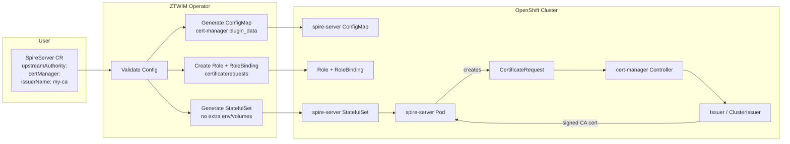
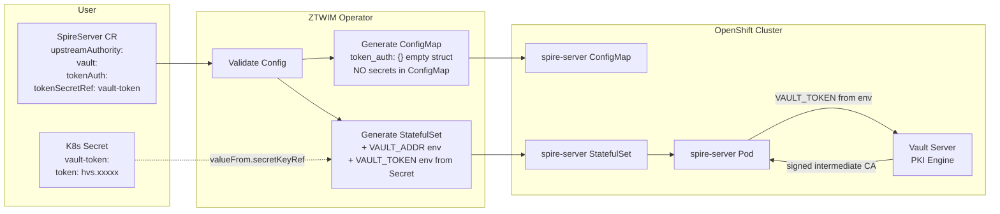
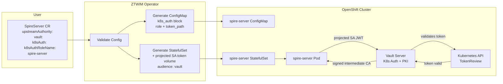
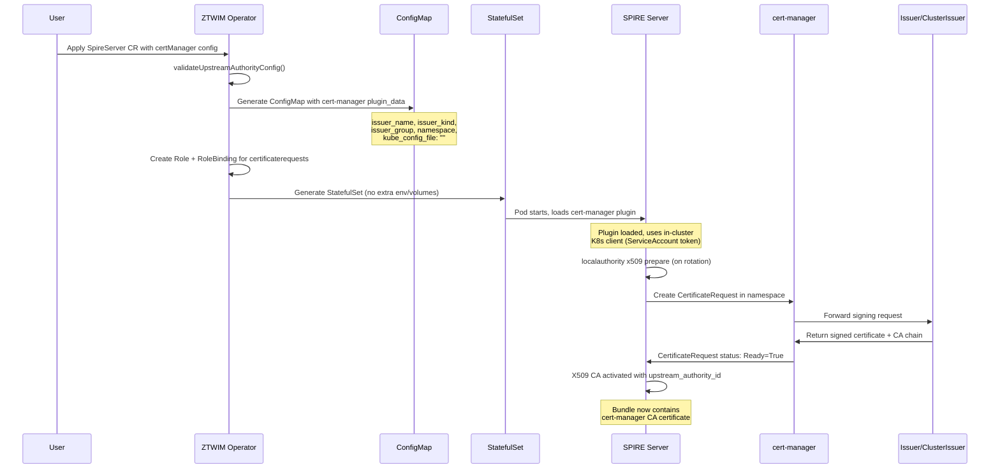
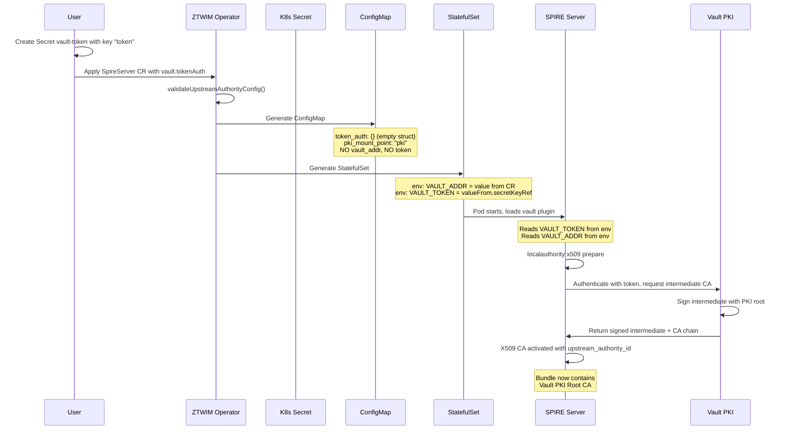
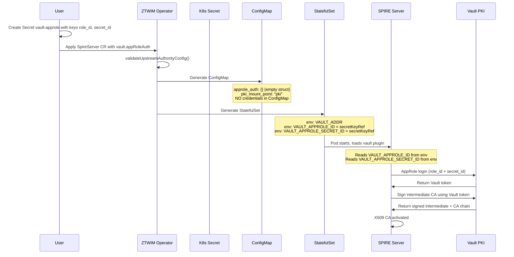
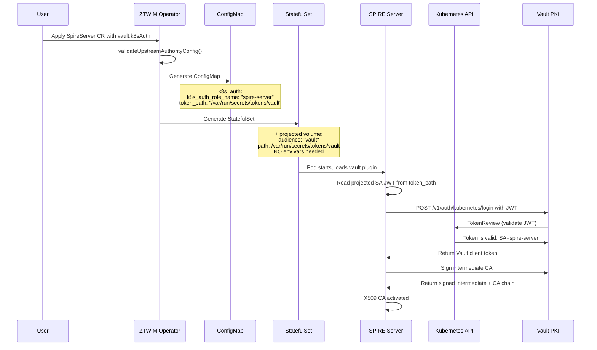
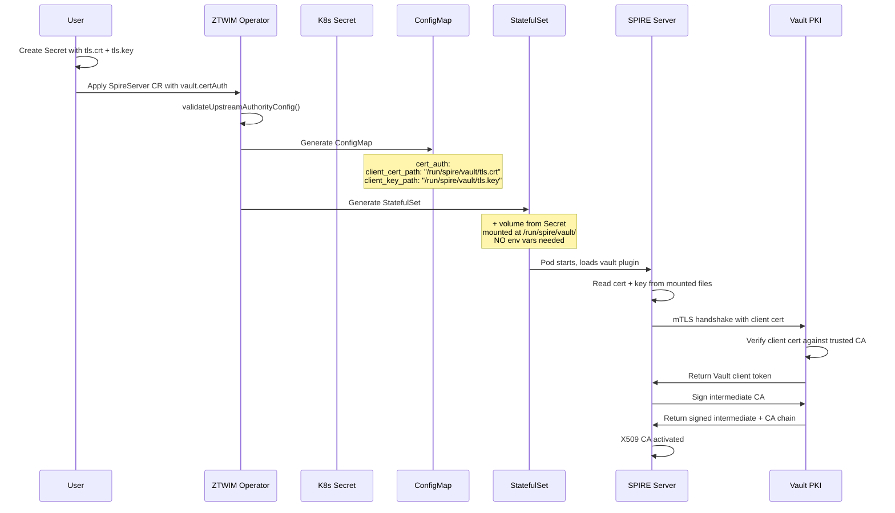
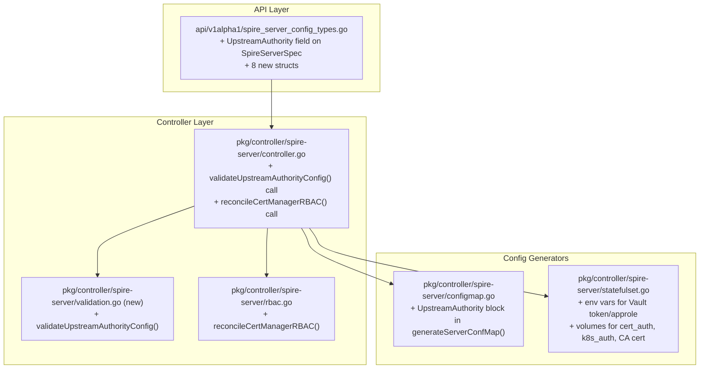
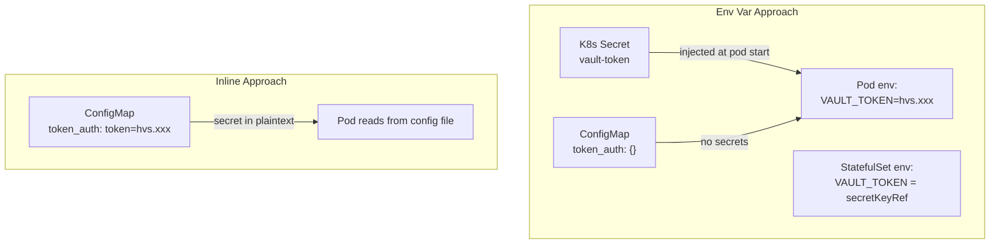

# cert-manager and Vault UpstreamAuthority Plugin Design

**Upstream References:**
- [cert-manager plugin](https://github.com/spiffe/spire/blob/main/doc/plugin_server_upstreamauthority_cert_manager.md)
- [Vault plugin](https://github.com/spiffe/spire/blob/main/doc/plugin_server_upstreamauthority_vault.md)

---

## 1. Overview

The SPIRE server supports UpstreamAuthority plugins that delegate CA signing to an external authority instead of using a self-signed CA. This document covers the design for integrating two plugins into the ZTWIM operator:

| Plugin | Purpose | External Dependency |
|--------|---------|---------------------|
| **cert-manager** | Uses a cert-manager Issuer or ClusterIssuer as the signing CA | cert-manager operator |
| **vault** | Uses HashiCorp Vault PKI secrets engine as the signing CA | Vault server |

### 1.1 Test Summary

All configurations were tested on OCP 4.21.6 with ZTWIM v1.0.0 and `CREATE_ONLY_MODE=true`:

| Test | Result |
|------|--------|
| cert-manager CA Issuer | **PASS** |
| cert-manager ClusterIssuer | **PASS** |
| Vault token_auth (env var, empty struct) | **PASS** |
| Vault token_auth (token_path file mount) | **FAIL** (not supported upstream) |
| Vault approle_auth (env var, empty struct) | **PASS** |
| Vault k8s_auth (projected SA token) | **PASS** |

---

## 2. Architecture Flow Diagrams

### 2.1 cert-manager Flow



### 2.2 Vault Flow (Env Var Injection — Recommended)



### 2.3 Vault Flow (Kubernetes Auth — Zero Credentials)



---

## 3. Sequence Diagrams

### 3.1 cert-manager — CA Issuance



### 3.2 Vault token_auth — Env Var Injection (Recommended)



### 3.3 Vault approle_auth — Env Var Injection



### 3.4 Vault k8s_auth — Projected SA Token



### 3.5 Vault cert_auth — Client Certificate



---

## 4. API Changes

### 4.1 Design Principles

Following existing ZTWIM patterns from `api/v1alpha1/spire_server_config_types.go`:

- Optional feature structs are pointer types (e.g. `Federation *FederationConfig`)
- Sensitive data uses Secret references, never inline values
- Kubebuilder validation markers enforce constraints at admission
- XValidation rules enforce one-of semantics

### 4.2 New Field on SpireServerSpec

```go
// In api/v1alpha1/spire_server_config_types.go, add to SpireServerSpec:

// upstreamAuthority configures the SPIRE server to use an external upstream CA.
// When set, SPIRE delegates CA signing to cert-manager or Vault instead of self-signing.
// Exactly one of certManager or vault must be set.
// +kubebuilder:validation:Optional
UpstreamAuthority *UpstreamAuthorityConfig `json:"upstreamAuthority,omitempty"`
```

### 4.3 UpstreamAuthorityConfig

```go
// UpstreamAuthorityConfig holds configuration for one of the supported UpstreamAuthority plugins.
// Exactly one of CertManager or Vault must be set.
// +kubebuilder:validation:XValidation:rule="(has(self.certManager) && !has(self.vault)) || (!has(self.certManager) && has(self.vault))",message="exactly one of certManager or vault must be set"
type UpstreamAuthorityConfig struct {
    CertManager *UpstreamAuthorityCertManager `json:"certManager,omitempty"`
    Vault       *UpstreamAuthorityVault       `json:"vault,omitempty"`
}
```

### 4.4 cert-manager Struct

```go
// UpstreamAuthorityCertManager configures the cert-manager UpstreamAuthority plugin.
// The plugin uses the SPIRE server's in-cluster Kubernetes client to create
// CertificateRequest resources in the specified namespace.
// No secrets or env vars are needed — only RBAC for certificaterequests.
type UpstreamAuthorityCertManager struct {
    // namespace where CertificateRequest resources are created.
    // +kubebuilder:validation:Required
    // +kubebuilder:validation:MinLength=1
    // +kubebuilder:validation:MaxLength=63
    Namespace string `json:"namespace"`

    // issuerName is the name of the cert-manager Issuer or ClusterIssuer.
    // +kubebuilder:validation:Required
    // +kubebuilder:validation:MinLength=1
    // +kubebuilder:validation:MaxLength=253
    IssuerName string `json:"issuerName"`

    // issuerKind is the kind of the issuer.
    // +kubebuilder:validation:Optional
    // +kubebuilder:validation:Enum=Issuer;ClusterIssuer
    // +kubebuilder:default:=Issuer
    IssuerKind string `json:"issuerKind,omitempty"`

    // issuerGroup is the API group of the issuer.
    // +kubebuilder:validation:Optional
    // +kubebuilder:validation:MaxLength=253
    // +kubebuilder:default:=cert-manager.io
    IssuerGroup string `json:"issuerGroup,omitempty"`
}
```

### 4.5 Vault Structs

```go
// UpstreamAuthorityVault configures the Vault UpstreamAuthority plugin.
// Exactly one of TokenAuth, CertAuth, AppRoleAuth, or K8sAuth must be set.
// +kubebuilder:validation:XValidation:rule="(has(self.tokenAuth)?1:0) + (has(self.certAuth)?1:0) + (has(self.appRoleAuth)?1:0) + (has(self.k8sAuth)?1:0) == 1",message="exactly one auth method must be set"
type UpstreamAuthorityVault struct {
    // vaultAddr is the Vault server URL (e.g. https://vault.example.com:8200).
    // Injected as VAULT_ADDR env var on the spire-server container.
    // +kubebuilder:validation:Required
    // +kubebuilder:validation:Pattern=`^https?://.+`
    VaultAddr string `json:"vaultAddr"`

    // pkiMountPoint is the Vault PKI secrets engine mount path.
    // +kubebuilder:validation:Optional
    // +kubebuilder:validation:MaxLength=255
    // +kubebuilder:default:="pki"
    PKIMountPoint string `json:"pkiMountPoint,omitempty"`

    // caCertSecretRef references a Secret containing the CA certificate for Vault TLS.
    // Mounted at /run/spire/vault/ca.crt; path set in plugin_data.ca_cert_path.
    // +kubebuilder:validation:Optional
    CACertSecretRef *SecretKeyReference `json:"caCertSecretRef,omitempty"`

    // insecureSkipVerify disables TLS verification for Vault (not for production).
    // +kubebuilder:validation:Optional
    // +kubebuilder:default:=false
    InsecureSkipVerify bool `json:"insecureSkipVerify,omitempty"`

    // vaultNamespace is the Vault enterprise namespace.
    // +kubebuilder:validation:Optional
    // +kubebuilder:validation:MaxLength=255
    VaultNamespace string `json:"vaultNamespace,omitempty"`

    TokenAuth   *VaultTokenAuthConfig   `json:"tokenAuth,omitempty"`
    CertAuth    *VaultCertAuthConfig    `json:"certAuth,omitempty"`
    AppRoleAuth *VaultAppRoleAuthConfig `json:"appRoleAuth,omitempty"`
    K8sAuth     *VaultK8sAuthConfig     `json:"k8sAuth,omitempty"`
}

// SecretKeyReference references a key in a Secret in the operator namespace.
type SecretKeyReference struct {
    // name of the Secret.
    Name string `json:"name"`
    // key within the Secret data.
    // +kubebuilder:validation:Optional
    // +kubebuilder:default:="ca.crt"
    Key string `json:"key,omitempty"`
}

// VaultTokenAuthConfig configures Vault token authentication via env var injection.
// The ConfigMap uses the empty struct pattern: token_auth {} — SPIRE reads VAULT_TOKEN at runtime.
// NOTE: token_path inside token_auth is NOT supported by the upstream plugin (tested, confirmed).
type VaultTokenAuthConfig struct {
    // tokenSecretRef references a Secret containing the Vault token.
    // Injected as VAULT_TOKEN env var via valueFrom.secretKeyRef.
    // +kubebuilder:validation:Required
    TokenSecretRef SecretKeyReference `json:"tokenSecretRef"`
}

// VaultCertAuthConfig configures Vault client certificate authentication.
// Cert and key are mounted as files from Secrets (PEM files must be on disk).
type VaultCertAuthConfig struct {
    // certAuthMountPoint is the Vault auth mount point (defaults to "cert").
    // +kubebuilder:validation:Optional
    CertAuthMountPoint string `json:"certAuthMountPoint,omitempty"`
    // certAuthRoleName is the Vault role name.
    // +kubebuilder:validation:Optional
    CertAuthRoleName string `json:"certAuthRoleName,omitempty"`
    // clientCertSecretRef references a Secret with the client certificate PEM.
    // Mounted at /run/spire/vault/tls.crt.
    // +kubebuilder:validation:Required
    ClientCertSecretRef SecretKeyReference `json:"clientCertSecretRef"`
    // clientKeySecretRef references a Secret with the client private key PEM.
    // Mounted at /run/spire/vault/tls.key.
    // +kubebuilder:validation:Required
    ClientKeySecretRef SecretKeyReference `json:"clientKeySecretRef"`
}

// VaultAppRoleAuthConfig configures Vault AppRole authentication via env var injection.
// The ConfigMap uses the empty struct pattern: approle_auth {} — SPIRE reads
// VAULT_APPROLE_ID and VAULT_APPROLE_SECRET_ID from environment at runtime.
type VaultAppRoleAuthConfig struct {
    // appRoleMountPoint is the Vault auth mount point (defaults to "approle").
    // +kubebuilder:validation:Optional
    AppRoleMountPoint string `json:"appRoleMountPoint,omitempty"`
    // appRoleSecretRef references a Secret containing role_id and secret_id.
    // +kubebuilder:validation:Required
    AppRoleSecretRef VaultAppRoleSecretRef `json:"appRoleSecretRef"`
}

// VaultAppRoleSecretRef references a Secret with AppRole credentials.
type VaultAppRoleSecretRef struct {
    Name string `json:"name"`
    // +kubebuilder:default:="role_id"
    RoleIDKey string `json:"roleIDKey,omitempty"`
    // +kubebuilder:default:="secret_id"
    SecretIDKey string `json:"secretIDKey,omitempty"`
}

// VaultK8sAuthConfig configures Vault Kubernetes authentication.
// Uses a projected ServiceAccount token — no Secret mount needed.
type VaultK8sAuthConfig struct {
    // k8sAuthMountPoint is the Vault auth mount point (defaults to "kubernetes").
    // +kubebuilder:validation:Optional
    K8sAuthMountPoint string `json:"k8sAuthMountPoint,omitempty"`
    // k8sAuthRoleName is the Vault role name. Required.
    // +kubebuilder:validation:Required
    K8sAuthRoleName string `json:"k8sAuthRoleName"`
    // tokenPath is the path to the projected SA token file.
    // +kubebuilder:validation:Optional
    // +kubebuilder:default:="/var/run/secrets/tokens/vault"
    TokenPath string `json:"tokenPath,omitempty"`
    // audience is the audience for the projected SA token.
    // +kubebuilder:validation:Optional
    // +kubebuilder:default:="vault"
    Audience string `json:"audience,omitempty"`
}
```

### 4.6 Example CR YAMLs

**cert-manager with CA Issuer:**

```yaml
apiVersion: operator.openshift.io/v1alpha1
kind: SpireServer
metadata:
  name: cluster
spec:
  # ... existing fields ...
  upstreamAuthority:
    certManager:
      namespace: zero-trust-workload-identity-manager
      issuerName: spire-ca-issuer
      issuerKind: Issuer
      issuerGroup: cert-manager.io
```

**cert-manager with ClusterIssuer:**

```yaml
spec:
  upstreamAuthority:
    certManager:
      namespace: zero-trust-workload-identity-manager
      issuerName: my-cluster-ca
      issuerKind: ClusterIssuer
```

**Vault token_auth (env var — recommended):**

```yaml
spec:
  upstreamAuthority:
    vault:
      vaultAddr: "https://vault.example.com:8200"
      pkiMountPoint: pki
      tokenAuth:
        tokenSecretRef:
          name: vault-token
          key: token
```

**Vault approle_auth (env var):**

```yaml
spec:
  upstreamAuthority:
    vault:
      vaultAddr: "https://vault.example.com:8200"
      pkiMountPoint: pki
      appRoleAuth:
        appRoleSecretRef:
          name: vault-approle
          roleIDKey: role_id
          secretIDKey: secret_id
```

**Vault k8s_auth (projected SA token):**

```yaml
spec:
  upstreamAuthority:
    vault:
      vaultAddr: "https://vault.example.com:8200"
      pkiMountPoint: pki
      k8sAuth:
        k8sAuthRoleName: spire-server
        tokenPath: /var/run/secrets/tokens/vault
        audience: vault
```

**Vault cert_auth (file mount):**

```yaml
spec:
  upstreamAuthority:
    vault:
      vaultAddr: "https://vault.example.com:8200"
      pkiMountPoint: pki
      certAuth:
        clientCertSecretRef:
          name: vault-client-cert
          key: tls.crt
        clientKeySecretRef:
          name: vault-client-cert
          key: tls.key
```

---

## 5. Operator Changes Required

### 5.1 File Change Summary



### 5.2 api/v1alpha1/spire_server_config_types.go

**Change:** Add `UpstreamAuthority *UpstreamAuthorityConfig` field to `SpireServerSpec` (currently at line 30). Add all structs from Section 4.

**Location:** After the existing `Federation *FederationConfig` field.

### 5.3 pkg/controller/spire-server/controller.go — Reconcile()

**Change:** Insert two new steps in the reconciliation loop (currently at line 86):

```go
// After line 148 (after validateConfiguration):

// Validate UpstreamAuthority configuration
if server.Spec.UpstreamAuthority != nil {
    if err := r.validateUpstreamAuthorityConfig(ctx, &server, statusMgr); err != nil {
        return ctrl.Result{}, nil
    }
}

// After line 167 (after reconcileRBAC):

// Reconcile cert-manager RBAC if needed
if server.Spec.UpstreamAuthority != nil && server.Spec.UpstreamAuthority.CertManager != nil {
    if err := r.reconcileCertManagerRBAC(ctx, &server, statusMgr, createOnlyMode); err != nil {
        return ctrl.Result{}, err
    }
}
```

### 5.4 pkg/controller/spire-server/configmap.go — generateServerConfMap()

**Change:** Add UpstreamAuthority plugin block generation at the end of the `plugins` map (after the `Notifier` block, currently at line 306).

The new code generates plugin_data differently per plugin type:

```go
// After existing plugins block (line 306), before returning configMap:

if config.UpstreamAuthority != nil {
    ua := config.UpstreamAuthority
    var uaPlugin map[string]interface{}

    if ua.CertManager != nil {
        uaPlugin = buildCertManagerUA(ua.CertManager)
    } else if ua.Vault != nil {
        uaPlugin = buildVaultUA(ua.Vault)
    }

    if uaPlugin != nil {
        plugins := configMap["plugins"].(map[string]interface{})
        plugins["UpstreamAuthority"] = []map[string]interface{}{uaPlugin}
    }
}
```

Helper functions (see Section 6 for full logic):

- `buildCertManagerUA()` — returns `{"cert-manager": {"plugin_data": {...}}}`
- `buildVaultUA()` — returns `{"vault": {"plugin_data": {...}}}` with auth-method-specific sub-blocks

### 5.5 pkg/controller/spire-server/statefulset.go — GenerateSpireServerStatefulSet()

**Change:** After the existing database TLS volume/mount logic (line 138), add conditional volumes, mounts, and env vars based on the Vault auth method:

```go
// After db-certs volume logic (line 138):

if config.UpstreamAuthority != nil && config.UpstreamAuthority.Vault != nil {
    vault := config.UpstreamAuthority.Vault
    addVaultEnvAndVolumes(vault, &spireServerVolumeMounts, &volumes, &spireServerEnvVars)
}
```

The `addVaultEnvAndVolumes()` function adds resources per auth method (see Section 7).

### 5.6 New: Validation Function

New function `validateUpstreamAuthorityConfig()` verifying:

- Exactly one of certManager/vault is set (XValidation handles this at admission, but belt-and-suspenders in controller)
- cert-manager: namespace and issuerName are non-empty
- vault: vaultAddr is non-empty; exactly one auth method set
- vault token_auth: tokenSecretRef.name is non-empty; referenced Secret exists
- vault approle_auth: appRoleSecretRef.name is non-empty; referenced Secret exists
- vault cert_auth: clientCertSecretRef and clientKeySecretRef names non-empty; Secrets exist
- vault k8s_auth: k8sAuthRoleName is non-empty

On failure: set `ConfigurationValid` condition to False, do not proceed with config generation.

### 5.7 New: cert-manager RBAC Reconciliation

New function `reconcileCertManagerRBAC()` creating:

```yaml
apiVersion: rbac.authorization.k8s.io/v1
kind: Role
metadata:
  name: spire-server-cert-manager
  namespace: <certManager.namespace>
rules:
- apiGroups: ["cert-manager.io"]
  resources: ["certificaterequests"]
  verbs: ["get", "list", "create", "delete"]
---
apiVersion: rbac.authorization.k8s.io/v1
kind: RoleBinding
metadata:
  name: spire-server-cert-manager
  namespace: <certManager.namespace>
subjects:
- kind: ServiceAccount
  name: spire-server
  namespace: <operator-namespace>
roleRef:
  kind: Role
  name: spire-server-cert-manager
  apiGroup: rbac.authorization.k8s.io
```

When `upstreamAuthority.certManager` is removed, the operator should clean up (delete) the Role and RoleBinding.

---

## 6. ConfigMap Generation Logic

### 6.1 cert-manager

```go
func buildCertManagerUA(cm *UpstreamAuthorityCertManager) map[string]interface{} {
    pluginData := map[string]interface{}{
        "namespace":    cm.Namespace,
        "issuer_name":  cm.IssuerName,
        "issuer_kind":  cm.IssuerKind,   // default: "Issuer"
        "issuer_group": cm.IssuerGroup,  // default: "cert-manager.io"
        "kube_config_file": "",          // empty = in-cluster client
    }
    return map[string]interface{}{
        "cert-manager": map[string]interface{}{
            "plugin_data": pluginData,
        },
    }
}
```

Resulting `server.conf` fragment:
```json
"UpstreamAuthority": [{
  "cert-manager": {
    "plugin_data": {
      "namespace": "zero-trust-workload-identity-manager",
      "issuer_name": "spire-ca-issuer",
      "issuer_kind": "Issuer",
      "issuer_group": "cert-manager.io",
      "kube_config_file": ""
    }
  }
}]
```

### 6.2 Vault — token_auth (env var, recommended)

```go
func buildVaultUA(v *UpstreamAuthorityVault) map[string]interface{} {
    pluginData := map[string]interface{}{
        "pki_mount_point": v.PKIMountPoint,
    }
    if v.InsecureSkipVerify {
        pluginData["insecure_skip_verify"] = true
    }
    // vault_addr is OMITTED from config — comes from VAULT_ADDR env var

    if v.TokenAuth != nil {
        pluginData["token_auth"] = map[string]interface{}{} // EMPTY STRUCT
    }
    // ...
}
```

Resulting `server.conf`:
```json
"UpstreamAuthority": [{
  "vault": {
    "plugin_data": {
      "pki_mount_point": "pki",
      "token_auth": {}
    }
  }
}]
```

**No secrets. No vault_addr.** Both come from env vars.

### 6.3 Vault — approle_auth (env var)

```json
"UpstreamAuthority": [{
  "vault": {
    "plugin_data": {
      "pki_mount_point": "pki",
      "approle_auth": {}
    }
  }
}]
```

If `appRoleMountPoint` is set (non-default):
```json
"approle_auth": {
  "approle_auth_mount_point": "custom-approle"
}
```

### 6.4 Vault — k8s_auth

```json
"UpstreamAuthority": [{
  "vault": {
    "plugin_data": {
      "vault_addr": "https://vault.example.com:8200",
      "pki_mount_point": "pki",
      "k8s_auth": {
        "k8s_auth_role_name": "spire-server",
        "token_path": "/var/run/secrets/tokens/vault"
      }
    }
  }
}]
```

Note: `vault_addr` is included in ConfigMap for k8s_auth (no env var needed since there are no sensitive values).

### 6.5 Vault — cert_auth

```json
"UpstreamAuthority": [{
  "vault": {
    "plugin_data": {
      "vault_addr": "https://vault.example.com:8200",
      "pki_mount_point": "pki",
      "cert_auth": {
        "client_cert_path": "/run/spire/vault/tls.crt",
        "client_key_path": "/run/spire/vault/tls.key"
      }
    }
  }
}]
```

Optional fields: `cert_auth_mount_point`, `cert_auth_role_name`.

---

## 7. StatefulSet Changes Per Auth Method

### 7.1 Summary Table

| Auth Method | Env Vars Added | Volumes Added | Volume Mounts Added |
|-------------|---------------|---------------|---------------------|
| **cert-manager** | None | None | None |
| **Vault token_auth** | `VAULT_ADDR` (value), `VAULT_TOKEN` (secretKeyRef) | None | None |
| **Vault approle_auth** | `VAULT_ADDR` (value), `VAULT_APPROLE_ID` (secretKeyRef), `VAULT_APPROLE_SECRET_ID` (secretKeyRef) | None | None |
| **Vault k8s_auth** | None | Projected SA token (audience from CR) | `/var/run/secrets/tokens` |
| **Vault cert_auth** | None | Secret (clientCertSecretRef), Secret (clientKeySecretRef) | `/run/spire/vault/tls.crt`, `/run/spire/vault/tls.key` |
| **Vault caCertSecretRef** (any method) | None | Secret (caCertSecretRef) | `/run/spire/vault/ca.crt` |

### 7.2 Detailed Changes

**token_auth env vars:**

```yaml
containers:
- name: spire-server
  env:
  - name: PATH
    value: /opt/spire/bin:/bin
  - name: VAULT_ADDR                     # added
    value: "https://vault.example.com:8200"
  - name: VAULT_TOKEN                     # added
    valueFrom:
      secretKeyRef:
        name: vault-token
        key: token
```

**approle_auth env vars:**

```yaml
  env:
  - name: VAULT_ADDR
    value: "https://vault.example.com:8200"
  - name: VAULT_APPROLE_ID
    valueFrom:
      secretKeyRef:
        name: vault-approle
        key: role_id
  - name: VAULT_APPROLE_SECRET_ID
    valueFrom:
      secretKeyRef:
        name: vault-approle
        key: secret_id
```

**k8s_auth projected volume:**

```yaml
volumes:
- name: vault-projected-token            # added
  projected:
    sources:
    - serviceAccountToken:
        path: vault
        expirationSeconds: 7200
        audience: vault                   # from CR k8sAuth.audience

containers:
- name: spire-server
  volumeMounts:
  - name: vault-projected-token          # added
    mountPath: /var/run/secrets/tokens
    readOnly: true
```

**cert_auth file mounts:**

```yaml
volumes:
- name: vault-client-cert                # added
  secret:
    secretName: vault-client-cert        # from clientCertSecretRef.name
- name: vault-client-key                 # added (or same Secret)
  secret:
    secretName: vault-client-cert        # from clientKeySecretRef.name

containers:
- name: spire-server
  volumeMounts:
  - name: vault-client-cert              # added
    mountPath: /run/spire/vault/tls.crt
    subPath: tls.crt
    readOnly: true
  - name: vault-client-key               # added
    mountPath: /run/spire/vault/tls.key
    subPath: tls.key
    readOnly: true
```

**CA cert (any vault method with caCertSecretRef):**

```yaml
volumes:
- name: vault-ca-cert
  secret:
    secretName: vault-ca-cert            # from caCertSecretRef.name

containers:
- name: spire-server
  volumeMounts:
  - name: vault-ca-cert
    mountPath: /run/spire/vault/ca.crt
    subPath: ca.crt
    readOnly: true
```

---

## 8. Test Results and Findings

### 8.1 Results Matrix

| # | Test | ConfigMap Content | Secret Strategy | Result |
|---|------|-------------------|-----------------|--------|
| 1 | cert-manager CA Issuer | issuer config, no secrets | In-cluster K8s client | **PASS** |
| 2 | cert-manager ClusterIssuer | issuer config, no secrets | In-cluster K8s client | **PASS** |
| 3 | Vault token_auth (env var) | `token_auth: {}` (empty) | VAULT_TOKEN env from Secret | **PASS** |
| 4 | Vault token_auth (token_path) | `token_auth: {token_path: ...}` | File mount | **FAIL** |
| 5 | Vault approle_auth (env var) | `approle_auth: {}` (empty) | VAULT_APPROLE_ID/SECRET_ID env | **PASS** |
| 6 | Vault k8s_auth | `k8s_auth: {role, path}` | Projected SA token | **PASS** |

### 8.2 Key Finding: token_path NOT Supported

The `token_path` field inside `token_auth` is **not recognized** by the upstream SPIRE Vault plugin. When set, the plugin ignores it and fails with:

```
token is empty
```

The token file was correctly mounted and readable, but the plugin does not have a `token_path` field in its `token_auth` configuration schema. The only ways to provide a token are:

| Approach | Works? | Secret in ConfigMap? |
|----------|--------|---------------------|
| `"token_auth": {}` + `VAULT_TOKEN` env var | Yes | No |
| `"token_auth": {"token": "actual-value"}` | Yes | **Yes** (bad) |
| `"token_auth": {"token_path": "/path"}` | **No** | N/A |

**Operator implication:** Never generate `token_path` in `token_auth`. Always use the empty struct + env var pattern.

Note: `token_path` inside `k8s_auth` IS valid and works correctly (different config schema).

### 8.3 Vault k8s_auth Prerequisites

The k8s_auth test initially failed (403) until three Vault-side prerequisites were met:

1. Vault Kubernetes auth configured with K8s API CA cert and a token reviewer JWT
2. Vault ServiceAccount granted `system:auth-delegator` ClusterRoleBinding
3. `audience` field matching between the projected SA token and the Vault role

The operator documentation must clearly state these prerequisites.

---

## 9. Comparison: Env Var vs Inline Approach

### 9.1 Side-by-Side

| Aspect | Env Var (Empty Struct) | Inline (Value in Config) |
|--------|----------------------|--------------------------|
| **ConfigMap content** | `token_auth: {}` — no secrets | `token_auth: {token: "hvs.xxx"}` — secret exposed |
| **Secret visibility** | Only in Pod env (not in ConfigMap, not in etcd ConfigMap) | In ConfigMap (viewable via `oc get cm -o yaml`) |
| **GitOps safety** | ConfigMap can be committed to Git | ConfigMap CANNOT be committed |
| **Audit trail** | Secret access tracked via K8s Secret RBAC | ConfigMap access = secret access |
| **Rotation** | Update Secret, restart pod | Update ConfigMap, restart pod |
| **Operator complexity** | Medium (env var injection) | Low (just put value in config) |
| **Upstream alignment** | Documented env var fallback mechanism | Documented but not recommended |

### 9.2 Security Analysis



**Recommendation:** Always use the env var (empty struct) approach for `token_auth` and `approle_auth`. The operator should NOT support inline token values in the CR or ConfigMap.

### 9.3 Decision Summary

| Auth Method | Operator Strategy | Reason |
|-------------|-------------------|--------|
| **cert-manager** | In-cluster K8s client | No secrets, simplest integration |
| **Vault token_auth** | Empty struct + VAULT_TOKEN env | Only secure option (token_path not supported) |
| **Vault approle_auth** | Empty struct + VAULT_APPROLE_ID/SECRET_ID env | Consistent with token_auth pattern |
| **Vault k8s_auth** | Projected SA token volume | Zero static credentials, auto-rotating |
| **Vault cert_auth** | File mount from Secret | PEM files must be on disk per upstream |

---

## 10. Rollout and Lifecycle

### 10.1 Config Hash Drives Rollout

The existing `spireServerConfigMapHash` annotation on the StatefulSet pod template already triggers rolling updates when the ConfigMap changes. Adding UpstreamAuthority config to the ConfigMap means changes to issuer name, Vault mount point, or auth method will trigger a pod restart automatically.

### 10.2 Secret Changes

When a referenced Secret (e.g., `vault-token`) is updated:
- The env var value changes on the next pod restart
- The operator does not watch Secrets directly; the user must trigger a rollout (delete pod or annotate StatefulSet)
- Future enhancement: watch referenced Secrets and trigger rollout on change

### 10.3 Removing UpstreamAuthority

When `spec.upstreamAuthority` is removed from the SpireServer CR:
- Operator removes the `UpstreamAuthority` block from the ConfigMap
- Operator removes Vault-related env vars and volumes from the StatefulSet
- Operator deletes cert-manager Role/RoleBinding if they exist
- SPIRE server reverts to self-signed CA on next restart
- Config hash change triggers rolling update
